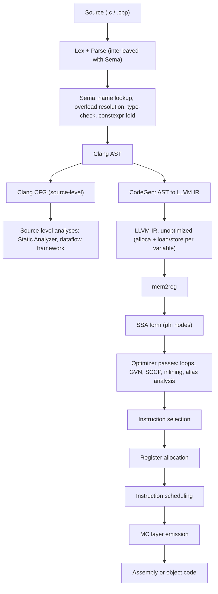

# 🏠 Home — a living book on compilers

The vault is one book spanning **theory → algorithm → LLVM → real-world use**. Folders are by **facet** (the kind of knowledge); chapters and source-tree views are **MOCs**; classification/correctness rules live in **`_meta/`**.

## 🗺️ Big picture — the whole pipeline in one graph

> [!abstract] Why this graph exists
> Every chapter below is a zoom into one node here. Keep the two halves straight: the **front end** (source → AST, Clang-specific, decides *meaning*) and the **middle/back end** (IR → machine code, LLVM-specific, transforms an already-fixed meaning). Nothing downstream of `CG` can change whether the program was well-formed — that door only swings one way.

**The whole pipeline, front end to back end**

Everything left of `AST` is Clang's front end (chapter [[Source-Level-Analysis.MOC|Front-End & Source-Level Analysis]]); everything from `CG` onward is the [[running-example|running example]]'s territory, traced concretely in its §2–§4.

| Stage | What happens | Note |
|---|---|---|
| Driver → `-cc1` | `clang foo.c` builds `Job`s and re-invokes itself as `clang -cc1`; the compiler runs *inside* that child | [[clang-driver]] |
| Preprocess + Lex | chars → one expanded token stream: the `Lexer` under the `Preprocessor` (`#include`, macros, `#if`) | [[clang-preprocessor]] |
| Parse + Sema (run by a FrontendAction) | build a type-checked AST, parsing interleaved with Sema; a `FrontendAction` hands the AST to an `ASTConsumer` | [[clang-frontend-pipeline]] · [[clang-frontend-actions]] |
| Clang AST (+ diagnostics) | the typed, sugar-preserving tree everything downstream reads; every node carries a `SourceLocation` | [[clang-ast]] · [[source-locations-and-diagnostics]] |
| Clang CFG + source-level analyses | analysis *before* lowering — Static Analyzer, `clang::dataflow`, LifetimeSafety | [[Source-Level-Analysis.MOC]] · [[clang-static-analyzer]] · [[clang-dataflow-framework]] · [[lifetime-safety]] |
| CodeGen (AST → IR) | walk the AST, emit naïve `alloca`-heavy IR; `if`/`while`/`switch` lower to blocks + terminators + `phi` | [[clang-codegen]] · [[control-flow-translation]] |
| Unoptimized IR → SSA | every local starts as an `alloca`; `mem2reg` promotes to `phi`-form SSA | [[mem2reg]] · [[ssa-form]] — see [[running-example#2. Front-end IR — everything is a stack slot|running example §2]] |
| Optimizer passes | loop opts, redundancy elimination, constant propagation, inlining, alias analysis, **vectorization** — the bulk of [[LLVM.MOC\|the LLVM chapter]] | [[Loop-Optimization.MOC]] · [[vectorization]] · [[Redundancy-Elimination.MOC]] · [[Constant-Propagation.MOC]] · [[Interprocedural-Analysis.MOC]] · [[pointer-alias-analysis]] |
| Backend | instruction selection → scheduling → register allocation (on [[liveness-analysis\|liveness]]) → **MC emission** | [[code-generation-overview]] · [[instruction-selection]] · [[instruction-scheduling]] · [[register-allocation]] · [[mc-layer]] · [[debug-info]] |
| Link-time (whole program) | defer optimization to the link: cross-module inlining/devirt over the *whole* program; under `-flto` a `.o` is LLVM bitcode | [[link-time-optimization]] · [[Interprocedural-Analysis.MOC]] |

> [!tip] Answering "where does pass/feature X plug in?"
> Find which node above it touches, then open that node's note or MOC. A flag that only changes the IR (most `-fsanitize=`, most `-O` behavior) plugs in at or after `CG`; a flag that changes whether code is well-formed, or a warning's text, plugs in at `Sema`. A flag that changes both (e.g. `-fwrapv`) has a foot in each side — `Sema`'s constexpr evaluator and `CG`'s codegen both have to agree with each other.

## 📖 Reading path — read it like a book

> [!tip] New here? Start with the two lines below, then read the chapters in order.
> **The folders are just storage (by *facet*) — the order to *read* in is this list.** Follow the links, not the directory tree.

**Chapter 0 · Orientation —** **[[running-example]]**: one tiny program (`accumulate`) carried through the whole pipeline — front-end IR → SSA → optimized → inlined. Read it first; every chapter below is a zoom into one stage of it.

**Part I — The representation**
1. **LLVM IR & object model** → [[LLVM-IR.MOC]] — what the IR is; Module→Function→BasicBlock→Instruction; GEP addressing. *(no prereq)*
2. **Control flow & dominance** → [[control-flow-graph]] then [[Dominance.MOC]] — the CFG and the dominance every analysis stands on. *(after 1)*
3. **SSA form** → [[SSA-Form.MOC]] — single-assignment values, φ-nodes, and **mem2reg** (how SSA is built). *(after 1–2)*

**Part II — Analysis & loops**
4. **Loops** → [[Loop-Optimization.MOC]] — LoopInfo & canonical form, scalar evolution, induction variables, the transforms. *(after 3)*
5. **Data-flow analysis** → [[Dataflow-Analysis.MOC]] — lattices, the worklist, SCCP: the analysis backbone. *(after 2)*

**Part III — The classic optimizations** *(after 3–5)*
6. **Memory** → [[Memory-Optimization.MOC]] · **Redundancy** → [[Redundancy-Elimination.MOC]] · **Constant/value propagation** → [[Constant-Propagation.MOC]] · **Dead code** → [[Dead-Code-Elimination.MOC]] · **CFG cleanup** → [[Control-Flow.MOC]] · **Peephole** → [[instruction-combining]] · **Value-range & constraints** → [[Range-Analysis.MOC|Value-Range & Constraint Reasoning]]
7. **Interprocedural** → [[Interprocedural-Analysis.MOC]] — inlining, devirtualization, IPSCCP.
8. **Alias analysis** → [[pointer-alias-analysis]] — the legality currency for memory optimizations.

**Part IV — Backend (real-world output)**
9. **Code generation** → [[Code-Generation.MOC]] — instruction selection → scheduling → register allocation → emission.

**Cross-cutting — the *other* level (front end)** → [[Source-Level-Analysis.MOC|Front-End & Source-Level Analysis]] — most of this book analyzes LLVM IR; this chapter covers analysis on the Clang **AST/CFG** *before* lowering (the [[clang-static-analyzer|Static Analyzer]], the [[clang-dataflow-framework|dataflow framework]]) and *when* source-level beats IR-level. *(read after 2 & 5)*

**Cross-cutting — security** → [[Memory-Safety-Hardening.MOC|Memory Safety & C/C++ Hardening]] — the features/analyses that eliminate whole classes of memory-safety bugs: bounds ([[fbounds-safety]], [[safe-buffers]]), lifetime ([[lifetime-safety]]), type ([[typed-allocators]]), control-flow ([[pointer-authentication]]), and scaling them ([[interprocedural-summaries]], [[scalable-static-analysis]]).

**Reference shelf** — theory: [[dataflow-foundations]], [[polyhedral-model]]; textbook crosswalks: [[muchnick.MOC|Muchnick]] · [[dragon-book-ch9.MOC|Dragon Book Ch.9]] (and Ch.6/8/10/11/12).

**Refresher shelf** — *"I know the concept, but how is it actually done — and what does LLVM really ship?"* Each note gives the textbook algorithm, then the delta against production code: [[dominator-tree-construction|dominator-tree construction]] (Semi-NCA, not Lengauer–Tarjan) · [[ssa-construction|SSA construction]] (Sreedhar–Gao, and *pruned* not minimal) · [[tarjan-scc|Tarjan SCC]] (batch to build, incremental to maintain) · [[switch-lowering|switch lowering]] (BST + an exact DP) · [[graph-coloring|graph coloring]] (which LLVM declines to use) · [[mark-and-sweep-reachability|mark-and-sweep]] · [[unification]]. See [[algorithm/_about|the layer's bar]] for what belongs here.

## Index — jump to anything
- **Ecosystems** — [[LLVM.MOC|LLVM]] (more to come: MLIR, Clang, Rust, Swift, JAX, PyTorch)
- **Chapters** — see the **📖 Reading path** above for the ordered concept-MOC curriculum.
- **Book bridges** — [[dragon-book-ch6.MOC|Dragon Book Ch.6 → LLVM]] (Intermediate-Code Generation) · [[dragon-book-ch8.MOC|Ch.8 → LLVM]] (Code Generation) · [[dragon-book-ch9.MOC|Ch.9]] (Machine-Indep. Optimizations) · [[dragon-book-ch10.MOC|Ch.10]] (Instruction-Level Parallelism) · [[dragon-book-ch11.MOC|Ch.11]] (Parallelism & Locality) · [[dragon-book-ch12.MOC|Ch.12]] (Interprocedural Analysis) · [[muchnick.MOC|Muchnick — Advanced Compiler Design]] (whole-book reading map)
- **The rulebook** — [[classification-protocol]] · [[controlled-vocabulary]] · [[callout-legend]] · [[source-hierarchy]] · [[chapter-bridge-pipeline]] · [[note-checklist]] · [[llvm-version]]

## The bookshelf (facets) — *storage, not reading order*
Where each note *lives* (one axis: the kind of knowledge). To *read*, use the path above — not these folders.
`concept/` techniques · `theory/` definitions & proofs · `algorithm/` procedures · `data-structure/` representations · `implementation/` system-specific realizations · `application/` real-world use & frontier. (See each folder's `_about` note.)

## How to extend
Add a note from `_templates/topic-note.md`, fill its frontmatter (facet · stage · ecosystem · concepts · src · prereqs · status), and it self-files into the indexes below. For a brand-new topic, follow [[classification-protocol]]; the confidence gate flags genuine novelty as `status: needs-review`.

## Needs attention

> [!warning] `unverified` is the vault's default state, not an anomaly
> On **2026-07-16** an audit found that `status: verified` had never meant anything: every note was born `verified` at authoring, and the one correctness pass that ran was *web*-verified — it edited [[dominator-tree]] and still left five wrong claims in it. Sampling 9 notes against LLVM source refuted **13 of 132 claims (9.8%)**; **8 of 9 notes** were wrong. So 69 notes were relabelled `unverified`, which is simply true: nobody has checked them against source yet.
>
> They are not *bad* — 84% of sampled claims were correct. They are **unchecked**. A note leaves this list only when every falsifiable claim in it has been read against LLVM source at the tag in [[llvm-version]] (see [[note-checklist]] §8).

```dataview
TABLE facet, stage, ecosystem, status, verified_on
FROM "concept" OR "data-structure" OR "theory" OR "algorithm" OR "implementation" OR "application"
WHERE status = "unverified" OR status = "needs-review" OR status = "stub" OR status = "migrated" OR status = "draft"
SORT status ASC, file.name ASC
```

## All notes by facet

```dataview
TABLE stage, ecosystem, status
FROM "concept" OR "data-structure" OR "theory" OR "algorithm" OR "implementation" OR "application"
SORT facet ASC, stage ASC
```
