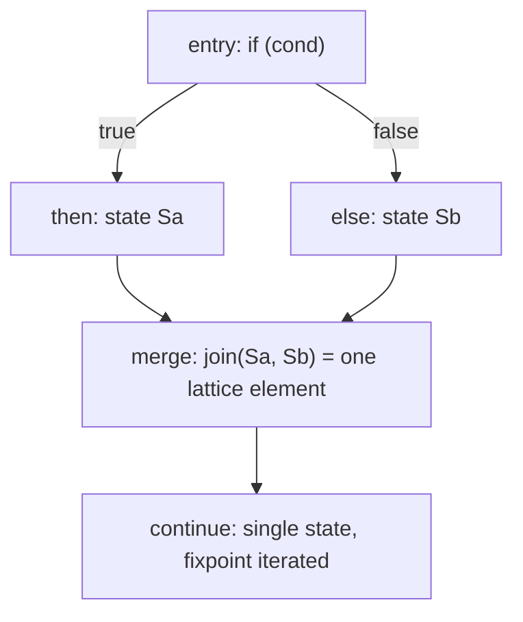

# Clang Dataflow Framework (clang::dataflow)

> 🧭 **Concept** · `concept · analysis · clang` · Index [[LLVM.MOC]]
> **Prerequisites:** [[clang-cfg|Clang CFG]], [[data-flow-analysis]] · **Related:** [[clang-static-analyzer]], [[source-level-analysis]] · **Worked example:** [[dataflow-worked-example]]

> [!abstract] Chapter map
> A reusable **flow-sensitive** dataflow engine that runs over the [[clang-cfg|Clang CFG]]: you supply a **lattice** and a **transfer** function, and the framework iterates to a fixpoint, **joining** states at CFG merges. It is the source-level cousin of classic [[data-flow-analysis|IR dataflow]] — and distinct from the path-sensitive [[clang-static-analyzer]], which forks execution paths symbolically. Its comments describe it explicitly as an instance of **abstract interpretation**.

---

### 1. Definition

> [!note] Definition
> The **Clang Dataflow Framework** (`clang::dataflow`, in `clang/include/clang/Analysis/FlowSensitive/`) is a reusable, **flow-sensitive** dataflow framework that runs over the [[clang-cfg|Clang CFG]] (an `AdornedCFG`). A client analysis provides a **lattice** element plus a **transfer** function over CFG elements; the framework iterates the transfer to a **fixpoint**, **joining** lattice states where control-flow edges merge. The header states its job directly: *"base types and functions for building dataflow analyses that run over Control-Flow Graphs (CFGs)"* (`DataflowAnalysis.h`).

It operates on **source-level** structures (the AST / Clang CFG), not [[llvm-basics|LLVM IR]] — see [[source-level-analysis]]. Comments name the theory outright: `Value.h` defines *"classes for values computed by abstract interpretation,"* and `StorageLocation.h` speaks of storage locations *"in abstract interpretation."*

> [!info] Attribution
> The framework was largely **Google-led** (Yitzhak Mandelbaum et al.), developed to support source-level bug-finding and refactoring; it is newer than the long-established Clang Static Analyzer.

### 2. Two source-level analyses, two engines

Clang ships **two** whole-program-agnostic, source-level analysis engines over the same [[clang-cfg|Clang CFG]]. They make opposite precision/scaling tradeoffs.

> [!info]+ Clang Static Analyzer vs. clang::dataflow
>
> | Axis | [[clang-static-analyzer]] | **clang::dataflow** |
> |---|---|---|
> | Engine | **Path-sensitive symbolic execution** | **Flow-sensitive dataflow** |
> | At branches | **Forks** a path per feasible branch | **Joins** states at the merge |
> | State space | `ExplodedGraph` (paths × symbolic states) | one lattice element per program point |
> | Convergence | bounded exploration (budget, loop unrolling) | monotone iteration to a **lattice fixpoint** |
> | Precision | keeps path correlations (fewer false negatives on path-specific bugs) | loses cross-path correlations at merges |
> | Scaling | path explosion; capped by an analysis budget | linear-ish in CFG size; no path blowup |
> | Substrate | source-level, over the Clang CFG | source-level, over the Clang CFG (`AdornedCFG`) |
>
> Rule of thumb: the analyzer chases **specific buggy paths**; clang::dataflow computes a **sound over-approximation at every point** and is cheaper to scale, at the cost of merge-induced imprecision.

### 3. How it's built

Same monotone-framework theory as [[data-flow-analysis]] — lattice, transfer, join, fixpoint — but the substrate is the **Clang CFG** and states model **source-level storage & values** rather than IR facts.

- **`DataflowAnalysis<Derived, Lattice>`** — the base class template. `Derived` supplies `initialElement()` and `transfer(const CFGElement&, Lattice&, Environment&)`; optionally `transferBranch(...)` for edge-specific facts. (`DataflowAnalysis.h`)
- **`DataflowLattice`** — base types for lattices; the `LatticeEffect { Unchanged, Changed }` enum drives fixpoint detection (a `join`/`widen` that returns `Changed` re-queues successors). (`DataflowLattice.h`)
- **`Environment`** — holds *"the state of the program (store and heap) at a given program point"*: maps declarations/expressions to **`StorageLocation`s** and **`Value`s**, with a `ValueModel::join(...)` hook that *"must obey the properties of a lattice join"* and an optional `widen(...)` for faster convergence. (`DataflowEnvironment.h`)
- **`AdornedCFG`** — the Clang CFG adorned with the data (e.g. statement-to-block map) analyses need; this is what the engine iterates over. (`AdornedCFG.h`)
- **`Arena`** — owns the modeling objects (`Value`, `StorageLocation`, `Atom`, `Formula`); boolean `Formula`s feed a SAT solver (`WatchedLiteralsSolver`) so the environment can reason about flow conditions. (`Arena.h`)
- **`CFGMatchSwitch` / `MatchSwitch`** — build a transfer function as a "switch" over CFG elements keyed by AST matchers, so a model matches syntactic patterns (e.g. `optional::value()` calls) and updates the environment. (`CFGMatchSwitch.h`)

### 4. Flow-sensitive join vs. path fork

**Figure — clang::dataflow joins two branch states into one at the merge.** Both incoming lattice states are combined by the lattice join; the analysis carries a single element past the merge (contrast: the [[clang-static-analyzer]] would instead keep two separate symbolic paths through the merge — no join, path count grows).

> [!warning] What the join costs you
> Joining at merges is what makes the framework scale, but it **discards correlations between paths**. If `then` established "x is engaged" and `else` did not, the joined state can only conclude "x may or may not be engaged" — the very information a path-sensitive analyzer would keep.

### 5. Where it's used

- **`UncheckedOptionalAccessModel`** — the flagship model: a dataflow analysis that *"detects unsafe uses of optional values"* — i.e. reading `*opt` / `opt.value()` without first checking `opt.has_value()`. Flow-sensitivity is exactly what's needed: the transfer function marks an optional "engaged" after a successful check and the join reconciles that across branches. (`Models/UncheckedOptionalAccessModel.h`) Sibling models include `UncheckedStatusOrAccessModel` and `ChromiumCheckModel`.
- **clang-tidy infrastructure** — the framework backs the `bugprone-unchecked-optional-access` check, letting a warning ride on top of a real fixpoint analysis rather than a syntactic heuristic.
- **Bug-finding & refactoring** — the general motivation: precise-enough, scalable source-level facts (nullability, lifetimes, invariants) usable by tooling.

### 6. Limitations & frontier

- **Flow- not path-sensitive** — merges lose path correlations (§4); for bugs that only manifest on a specific path, the [[clang-static-analyzer]] is the better fit.
- **Intra-procedural by default** — analyses run within a single function; an opt-in, bounded *context-sensitive* mode exists (`Environment::pushCall`, `ContextSensitiveOptions`), but there is no general whole-program/interprocedural propagation.
- **Newer, less mature** — the framework and its model catalogue are smaller and younger than the Static Analyzer's checker ecosystem; APIs still evolve (e.g. `LatticeJoinEffect` is deprecated in favor of `LatticeEffect`).
- **SAT-backed reasoning has a cost** — flow-condition reasoning via the `WatchedLiteralsSolver` adds solver overhead the classic bit-vector [[data-flow-analysis|IR dataflow]] passes don't pay.
- **Frontier** — expanding the model library (smart pointers, `StatusOr`) and hardening the framework as shared infrastructure for clang-tidy and refactoring tools; **Google-led** development continues upstream.

> [!summary] Remember
> `clang::dataflow` = a **flow-sensitive**, source-level dataflow engine over the **Clang CFG** (lattice + transfer → fixpoint, **join at merges**), an explicit **abstract interpretation**; its flagship use is catching **unchecked `std::optional` access**. It **joins** where the [[clang-static-analyzer]] **forks**.

> [!quote] Sources & confidence
> - **Source (tier 1, verified 2026-06-30):** `clang/include/clang/Analysis/FlowSensitive/` — `DataflowAnalysis.h` (base class, transfer, "runs over CFGs"), `DataflowLattice.h` (`LatticeEffect`), `DataflowEnvironment.h` (storage locations/values, lattice `join`), `AdornedCFG.h`, `Arena.h`, `Models/UncheckedOptionalAccessModel.h` ("detects unsafe uses of optional values"). "Abstract interpretation" confirmed in `Value.h` / `StorageLocation.h` comments.
> - **Doc:** [Clang doxygen — `clang::dataflow`](https://clang.llvm.org/doxygen/namespaceclang_1_1dataflow.html).
> - **Attribution** (Google-led, Y. Mandelbaum et al.): community/RFC context, not a source-file claim — treated as background, low precision on exact authorship.
> - **Contrast with theory:** same monotone framework as [[data-flow-analysis]] (Kildall/Cousot); path- vs flow-sensitivity contrast per [[clang-static-analyzer]].
