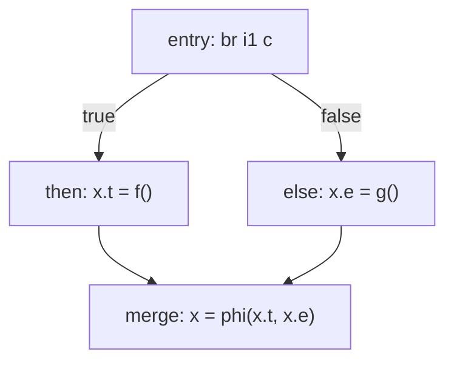
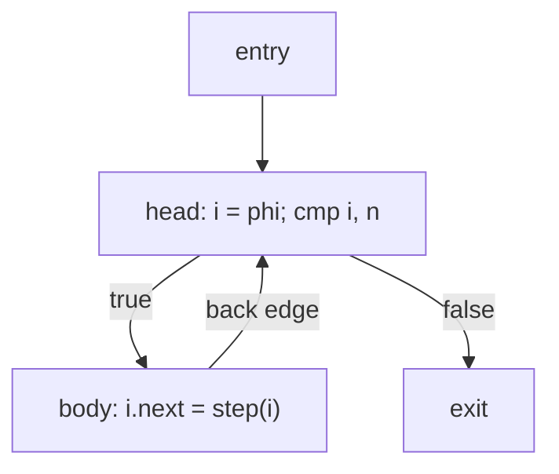

# Control Flow in LLVM (Lowering, Branches, φ)

> 🧭 **Concept** · `concept · ir · general+llvm` · Index [[LLVM.MOC]] · see also [[dragon-book-ch6.MOC|Dragon Ch.6]]
> **Prerequisites:** [[control-flow-graph]], [[three-address-code]] · **Produces:** a CFG in [[ssa-form]]

> [!abstract] Chapter map
> How LLVM represents control flow — **basic blocks ending in a terminator** — and how a front end lowers `if`/`while`/`&&`/`switch` into it, with worked IR. Plus the value-vs-jumping forms (`select`/`phi`) and why LLVM needs no *backpatching*.

> [!info] The model
> Every `BasicBlock` ends in exactly one **terminator** that names its successors: `br` (unconditional), `br i1` (conditional, two targets), `switch` (many), `ret`/`unreachable`. Control flow *is* the edges those terminators create — the [[control-flow-graph|CFG]].

> [!info] Source construct → LLVM control flow (at a glance)
> | Source | Lowers to |
> |---|---|
> | `if` / `else` | two-target `br i1` + a `phi` at the merge |
> | `while` / `for` | back-edge `br` + loop-header `phi` (→ [[loop-info]]) |
> | `a && b`, `a \|\| b` | short-circuit `br i1` chain — evaluate `b` only if needed |
> | `c ? p : q` | `select` (value form) or a diamond + `phi` (control form) |
> | `switch` | the `switch` instruction (table/tree chosen in codegen) |

---

## 1. `if` / `else` — worked

```c
if (c) x = f(); else x = g();
```
```llvm
  br i1 %c, label %then, label %else
then:
  %x.t = call i32 @f()
  br label %merge
else:
  %x.e = call i32 @g()
  br label %merge
merge:
  %x = phi i32 [ %x.t, %then ], [ %x.e, %else ]   ; value joins at the merge
```

**Figure — CFG of the `if/else` (a "diamond"; the `phi` sits at the merge).**



## 2. `while` — worked

```c
while (i < n) i = step(i);
```
```llvm
  br label %head
head:
  %i = phi i32 [ %i0, %entry ], [ %i.next, %body ]   ; loop-carried value
  %c = icmp slt i32 %i, %n
  br i1 %c, label %body, label %exit
body:
  %i.next = call i32 @step(i32 %i)
  br label %head
exit:
```

**Figure — CFG of the `while` (note the back-edge `body → head`).**



The `head`/`body`/`exit` shape is what [[loop-info|LoopInfo]] later recognizes as a natural loop — LLVM derives loops from this CFG, never from the `while` keyword.

## 3. Short-circuit `&&` / `||` — worked

`a && b` must evaluate `b` only when `a` is true, so it is **control flow**, not arithmetic:
```c
if (a < b && c < d) S;
```
```llvm
  %0 = icmp slt i32 %a, %b
  br i1 %0, label %rhs, label %end     ; if a<b false, skip c<d entirely
rhs:
  %1 = icmp slt i32 %c, %d
  br i1 %1, label %do, label %end
do:
  ; ... S ...
  br label %end
end:
```

## 4. Value form vs. jumping form

> [!info] Two encodings of a boolean
> Sometimes you want a boolean **value** (`%c = icmp slt i32 %a, %b` gives an `i1`); sometimes **jumping code** (`br i1 %c, ...`). A conditional *expression* `c ? p : q` can be either:
> ```llvm
> %r = select i1 %c, i32 %p, i32 %q        ; value form — no branches
> ```
> or a diamond CFG with `%r = phi i32 [ %p, %t ], [ %q, %f ]`. `zext i1 %c to i32` turns the flag into an integer. The optimizer moves between these forms freely.

## 5. `switch` — worked

```c
switch (x) { case 1: A(); break; case 2: B(); break; default: D(); }
```
```llvm
  switch i32 %x, label %default [ i32 1, label %c1
                                  i32 2, label %c2 ]
c1: call void @A() ... br label %end
c2: call void @B() ... br label %end
default: call void @D() ... br label %end
end:
```
LLVM keeps the high-level `switch`; the **code generator** later chooses a **jump table** (dense cases) or a **decision tree** (sparse cases) in `SwitchLowering`.

## 6. Why LLVM needs no backpatching

> [!tip] Builder + SSA, not label lists
> A classic *one-pass* code generator emits a jump before knowing its target and keeps `truelist`/`falselist` to fill in labels later (**backpatching**). LLVM doesn't: it creates `BasicBlock`s up front and branches to them by **pointer**, and resolves value merges with `phi` — or, more commonly, by emitting `alloca`/`load`/`store` and letting `mem2reg` insert φ at dominance frontiers (see [[three-address-code]], [[dominator-tree]]). So "patch the labels later" becomes "wire terminators + let SSA construction merge."

> [!summary] The one thing to remember
> LLVM control flow is just **basic blocks ending in terminators**. The front end lowers every source construct to branches and lets `phi` / `mem2reg` resolve the merges — which is why LLVM never needs the classic one-pass *backpatching*.

> [!quote] Further reading
> - **Dragon Book §6.6** (control flow & short-circuit), **§6.7** (backpatching — the one-pass technique LLVM forgoes), **§6.8** (switch translation).
> - [LangRef](https://llvm.org/docs/LangRef.html) — `br`, `switch`, `select`, `phi`, `icmp`.
