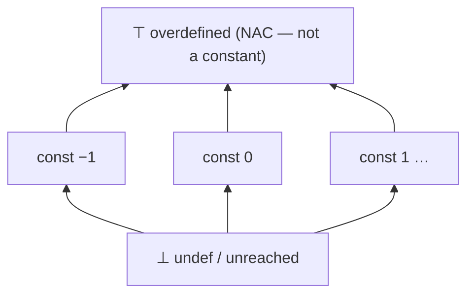
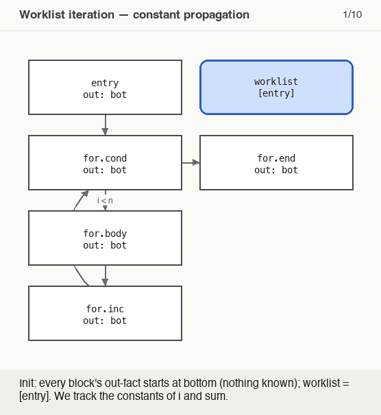

# Data-Flow Analysis

> 🧭 **Concept** · `concept · analysis · general+llvm+mlir` · Index [[LLVM.MOC]]
> **Prerequisites:** [[control-flow-graph]] · **Feeds:** [[value-numbering]], [[pointer-alias-analysis]] · **On-demand ranges:** [[lazy-value-info]]

> [!abstract] Chapter map
> The program-analysis backbone, as the arc *theory → algorithm → LLVM/MLIR → use → frontier*: a monotone-framework definition, the worklist that solves it, how LLVM and MLIR realize it, where it pays off, and where it runs out of road.

> [!info]+ From classic compiler theory → LLVM/MLIR
> | Classic concept | Realization |
> |---|---|
> | Monotone dataflow framework (Kildall) | iterate transfer functions to a fixpoint over the [[control-flow-graph|CFG]] |
> | Sparse constant lattice | **SCCP** (`Transforms/Scalar/SCCP.cpp`) |
> | Generic *sparse* solver | `AbstractLatticeFunction` / `SparseSolver` (`Analysis/SparsePropagation.h`) |
> | Reusable monotone framework | **MLIR** `DataFlowSolver` (`mlir/Analysis/DataFlow/`) — *not* in core LLVM |
> | Dataflow = abstract interpretation | a dataflow analysis is an AI over a chosen abstract domain (Cousot & Cousot) |

---

### 1. Definition

> [!note] Definition
> A **data-flow analysis** computes, at every program point, an element of a lattice that **over-approximates** the set of states reachable there, by propagating facts along CFG edges until a fixpoint. "Over-approximate" is the soundness contract: the computed fact must cover every real execution (it may also cover some that never happen).

### 2. Theory

> [!info] Monotone framework
> A finite-height lattice $(L,\sqsubseteq)$, a **monotone** transfer function $f_b:L\to L$ per block, and a meet/join to combine paths. Convergence is guaranteed because a monotone function on a finite-height lattice reaches a fixpoint (Kleene/Kildall iteration).

**Figure — the constant-propagation lattice (what SCCP uses).** A value starts at `⊥` (nothing known), rises to a specific constant, then to `⊤` (overdefined) once two different constants meet. Finite height ⇒ the worklist must terminate.

```mermaid
flowchart BT
  BOT["⊥ undef / unreached"]
  K1["const −1"]
  K0["const 0"]
  K2["const 1 …"]
  TOP["⊤ overdefined (NAC — not a constant)"]
  BOT --> K1 --> TOP
  BOT --> K0 --> TOP
  BOT --> K2 --> TOP
```

> [!question] Predict first
> `%p = phi i32 [ 0, %then ], [ 1, %else ]` — two different constants meet at a join point. Using the figure, what lattice value does `%p` get, and why is that answer still *sound* even though it forgets both constants?
>
> ⊤ (overdefined). Soundness only demands covering every real execution; ⊤ covers all of them. What is lost is precision, not correctness — the trade the rest of this note keeps returning to.

> [!info] MFP vs. MOP
> The iterative solution (**Maximal Fixed Point**) is *sound but possibly less precise* than the ideal **Meet-Over-all-Paths** solution. **MFP = MOP if the transfer functions are distributive** (sufficient, not necessary) (Kildall 1973); for non-distributive analyses (e.g. constant propagation) MFP $<$ MOP in precision. *Classic loss: one path sets `x=1, y=2`, the other `x=2, y=1`; every path has `x+y == 3`, but joining first drives both `x` and `y` to ⊤, so MFP misses the constant MOP would keep.*

> [!tip] As abstract interpretation
> A dataflow analysis *is* an abstract interpretation over a particular abstract domain; soundness = the abstract transfer over-approximates the concrete one through a Galois connection (Cousot & Cousot 1977). This is the bridge to relational numerical domains (intervals, octagons, polyhedra); the lattice/fixpoint theory is in [[dataflow-foundations]].

### 3. Algorithm

> [!info] Worklist iteration
> Initialize each point to the *optimistic* value — the identity of the combining operator: ⊥ when paths are combined with join (the figure's "nothing known yet" starting value), dually ⊤ when they are combined with meet, refining downward — and push all blocks on a worklist; pop a block, apply its transfer function, and if its out-fact changed, push its CFG successors (forward) or predecessors (backward). Iterate to fixpoint.
> - **Forward** (reaching defs, constant prop) vs **backward** (liveness, very-busy expressions).
> - **May** (join $=\cup$, "on some path") vs **must** (meet $=\cap$, "on all paths").

> [!figure]+ Animation — worklist iteration to fixpoint on [[running-example|the running example]]
> 
> Constant propagation solved block-by-block on the pre-mem2reg CFG: watch `i=0` meet `i=1` across the back edge and rise to overdefined (NAC), with the loop re-queued until the third visit to `for.cond` changes nothing — the fixpoint. (Regenerate: `_meta/anim/storyboards/data-flow-analysis-worklist.json`.)

> [!example] Three worklist steps on the running example
> Run the figure's constant lattice over `accumulate` after mem2reg and loop canonicalization ([[running-example#3. After mem2reg and loop opts]]), SCCP-style — the worklist holds SSA *values* and pushes their users (§4 explains why that is called *sparse*):
> 1. `%sum.05 = phi i32 [ 0, %for.body.preheader ], [ %add, %for.body ]` — first visit: only the preheader edge is executable yet, so the φ ignores the back-edge operand and joins only `0`: **const 0**. Its user `%add` goes on the worklist.
> 2. `%add = add nsw i32 %mul, %sum.05` — `%mul` multiplies a value loaded from memory by the unknown argument `%k`, so `%mul` is **⊤ (overdefined)**; add(⊤, const 0) = ⊤, and `%add`'s users (both φs) are pushed.
> 3. The exit branch tests against `%wide.trip.count`, derived from the unknown argument `%n`, so the condition is overdefined and *both* successors — including the back edge — become executable; `%sum.05` is revisited: join(const 0, ⊤) = **⊤**. Each value can only climb ⊥ → const → ⊤, so it is revisited at most twice — finite height is exactly what forces termination.
>
> Contrast `caller` ([[running-example#4. Interprocedural — inlining and constant folding]]): inlining substitutes the literal `4` for `%k`, so the multiplier's lattice value is **const 4** on every path — it never climbs — and the fact pays off as `mul → shl`.

### 4. In LLVM and MLIR

- **SCCP** — Sparse Conditional Constant Propagation (Wegman & Zadeck). *Sparse* = propagate along SSA def–use edges, revisiting only the users of a value whose fact changed, instead of pushing whole block states around the CFG (§3's dense scheme). Lattice `undef → constant → overdefined`, tracking block reachability simultaneously. `Transforms/Scalar/SCCP.cpp` (+ `Utils/SCCPSolver.cpp`). → [[sparse-conditional-constant-propagation]]
- **Generic sparse solver** — `SparsePropagation.h` exposes `AbstractLatticeFunction`; a client supplies the lattice and merge. Used by e.g. `CalledValuePropagation`.
- **Range/value facts** — `LazyValueInfo`, `ConstraintElimination`, known/demanded bits (`ValueTracking`).
- **Liveness** — `LiveVariables` / `LiveIntervals` in `lib/CodeGen` (backward, may), the input to register allocation ([[code-generation-overview]]).

> [!warning] Core LLVM has no single generic *monotone* dataflow framework for IR
> Beyond the **sparse** propagation solver, most IR-level analyses are hand-written (often bit-vector). The reusable, composable monotone framework lives in **MLIR**: the generic `DataFlowSolver` (`mlir/include/mlir/Analysis/DataFlow/`) with built-in `DeadCodeAnalysis`, `SparseConstantPropagation`, and `IntegerRangeAnalysis`.

### 5. Where it's used

Constant propagation & folding; dead-code elimination; available-expression CSE → [[value-numbering]]; integer-range bounds-check elimination; register-allocation liveness. *(Note: DataFlowSanitizer is dynamic taint instrumentation, not static dataflow.)*

### 6. Limitations & future

- **Precision ceiling**: MFP attains MOP only under distributivity; most useful analyses are non-distributive ⇒ conservative.
- **No relational numeric domains in core LLVM**: facts are non-relational (a range per value at best); relationships among variables (octagons, polyhedra) need external engines — **Crab** (AI on LLVM IR), **Apron**, or **Polly**'s polyhedral model.
- **Scale vs. context/path sensitivity**: precise interprocedural/path-sensitive dataflow is expensive; production passes are mostly intraprocedural, flow-sensitive, path-insensitive.
- **Frontier**: MLIR's `DataFlowSolver` as the converging home for reusable, composable analyses.

> [!danger] Source-unchecked — known-stale upstream doc
> The official MLIR tutorial *"Writing DataFlow Analyses in MLIR"* still documents the **old** `ForwardDataFlowAnalysis`/`LatticeElement` API; the current framework is the generic **`DataFlowSolver`** (added in D126751). Verify class names against current doxygen before relying on the tutorial. (This note records the discrepancy per [[source-hierarchy]].)

> [!quote] Sources & confidence
> - **Also in:** Muchnick *Advanced Compiler Design & Impl.* §8 — iterative & control-tree data-flow analysis.
> - **Source:** [`Transforms/Scalar/SCCP.cpp`](https://github.com/llvm/llvm-project/blob/main/llvm/lib/Transforms/Scalar/SCCP.cpp) · [`include/llvm/Analysis/SparsePropagation.h`](https://github.com/llvm/llvm-project/blob/main/llvm/include/llvm/Analysis/SparsePropagation.h)
> - Kildall 1973 (monotone framework, MFP/MOP) · Cousot & Cousot 1977 (abstract interpretation) · Wegman & Zadeck 1991 (SCCP) — *verified, canonical*.
> - `SparsePropagation.h` generic sparse solver — *verified against LLVM doxygen (2026-06)*.
> - "core LLVM has no generic monotone framework" — *inference from source layout; re-check if precision matters*.
