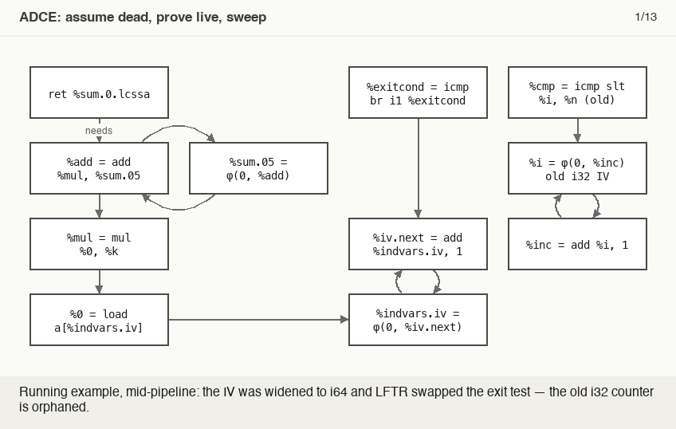

# Dead-Code Elimination (DCE / ADCE / BDCE)

> 🧭 **Concept** · `concept · optimization · general+llvm` · Index [[LLVM.MOC]] · see also [[muchnick.MOC|Muchnick]]
> **Prerequisites:** [[ssa-form]], [[data-flow-analysis]] · **Cleans up after:** most other passes

> [!abstract] Chapter map
> Remove computations whose results are never used (and the control flow that only feeds them). Three strengths: **DCE** (trivial) ⇒ **ADCE** (also dead branches/loops) ⇒ **BDCE** (dead result *bits*).

---

## 1. Trivial DCE

An instruction with **no uses** and **no side effects** is dead — delete it, and iterate (deleting one can make its operands dead). [[ssa-form|SSA]] makes this immediate: every value carries its use list, so "no uses" is a direct check.
```llvm
%t = add i32 %a, %b   ; %t never used, no side effects  → deleted
```

## 2. ADCE — aggressive (optimistic)

> [!info] Assume dead until proven live
> Trivial DCE is *pessimistic* (keeps anything reachable). **ADCE** flips it: assume all dead, seed live = side effects (stores, calls, returns), propagate through operands **and control dependence**, delete the rest — including a **dead branch** (and, behind `-adce-remove-loops`, even a whole loop) that only controls dead code.

**Try it:** save as `dead-phi.ll` — plain `dce` keeps the mutually-dead cycle (each value has a use: the other one); `adce` deletes it:

```llvm
define void @f(i1 %c) {
entry:
  br label %loop
loop:
  %a = phi i32 [ 0, %entry ], [ %b, %loop ]
  %b = add i32 %a, 1
  br i1 %c, label %loop, label %exit
exit:
  ret void
}
```

`opt -passes=dce -S dead-phi.ll` (`%a`, `%b` both kept) vs `opt -passes=adce -S dead-phi.ll` (both gone — the loop skeleton itself stays; deleting the loop structure needs `-adce-remove-loops`).

> [!figure]+ Animation — assume dead, prove live, sweep (on [[running-example|the running example]])
> 
> Liveness spreads backward from the `ret` through operands and control dependence; the old i32 counter orphaned by IV widening — a self-feeding φ-cycle trivial DCE can't delete — is never reached, so the sweep removes it. (Regenerate: `_meta/anim/storyboards/dead-code-elimination-adce-liveness.json`.)

## 3. BDCE — bit-tracking

> [!info] Demanded bits
> **BDCE** uses **demanded-bits** analysis: if *no* use needs *any* bit of an instruction's result, the instruction is dead even though it technically has a use (e.g. an instruction that can only affect bit positions every downstream user discards — the in-tree test `Transforms/BDCE/basic.ll` removes calls whose results only feed bits an `ashr … 4` shifts away). It removes such instructions and simplifies operands whose upper bits don't matter.

> [!summary] The one thing to remember
> Dead code = results (or bits, or branches) that can't affect output. LLVM: **DCE** (no-use, no-side-effect), **ADCE** (optimistic + control-dependence, kills dead branches/loops), **BDCE** (demanded-bits). SSA use lists make the liveness check cheap; DCE runs constantly to clean up after other passes. Module-scope cleanup: [[interprocedural-dead-code-elimination]].

> [!quote] Further reading
> - **Source:** [`Transforms/Scalar/ADCE.cpp`](https://github.com/llvm/llvm-project/blob/main/llvm/lib/Transforms/Scalar/ADCE.cpp) · [`BDCE.cpp`](https://github.com/llvm/llvm-project/blob/main/llvm/lib/Transforms/Scalar/BDCE.cpp) · [`DCE.cpp`](https://github.com/llvm/llvm-project/blob/main/llvm/lib/Transforms/Scalar/DCE.cpp)
> - **Muchnick §18** — dead-code elimination; **Dragon §9.1**.
