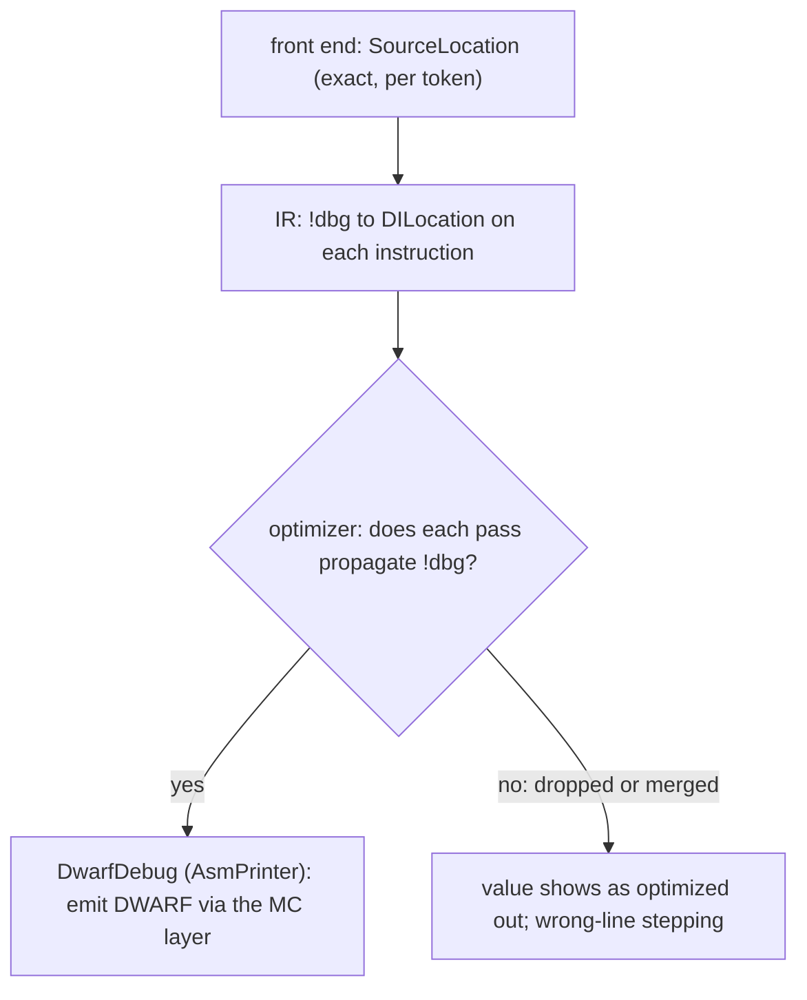

# Debug Info (DILocation, DISubprogram, DWARF, debugify)

> 🧭 **Concept** · `concept · codegen · llvm` · Index [[LLVM.MOC]]
> **Prerequisites:** [[llvm-basics]], [[extending-llvm-ir]] · **Related:** [[source-locations-and-diagnostics]], [[mc-layer]], [[inlining]]

> [!abstract] Chapter map
> How a source location survives **into and through** optimized IR to the debugger — the IR-side sequel to the front end's [[source-locations-and-diagnostics|SourceLocation]] story. Debug info rides as **IR metadata**: `!dbg` attachments point at **`DILocation`** nodes (*"a debug location in source code"*), functions carry a **`DISubprogram`**, the TU a **`DICompileUnit`**; the backend's **`DwarfDebug`** emits it as DWARF through the [[mc-layer|MC layer]]. The catch: **optimization can drop or merge `!dbg`**, and a location lost to a careless pass is the difference between a fixable bug report and `<optimized out>`. That fragility is why **`debugify`** exists — a pass that *"checks debug info preservation in optimizations."*

---

## 1. Definition

> [!note] Definition
> **Debug info** is metadata attached to LLVM IR that maps generated code back to source — file/line/column, function and variable descriptions, types — and is emitted as **DWARF** (or CodeView) so a debugger can map an address to a source line and a value to a variable.

It is enabled by `-g`. Without it, optimized code is a black box; with it, the compiler must *carry* source facts through every transform.

## 2. The metadata model — three nodes to know

> [!info] Core debug-info nodes (confirmed, pinned LLVM [[llvm-version]])
>
> | Node | Describes | Attaches to |
> |---|---|---|
> | `DICompileUnit` | the translation unit (language, producer) | the `Module` |
> | `DISubprogram` | *"Subprogram description"* — one function | a `Function` |
> | `DILocation` | *"a debug location in source code"* (line, column, scope) | an `Instruction`, via `!dbg` |

An instruction's `!dbg` is a pointer to a `DILocation`; the `DILocation`'s `scope` chains up to the `DISubprogram` and `DICompileUnit`. That chain is what turns a machine address back into `file:line:col` in a function.

> [!warning] That table is the **line-info** half only
> Variable locations are a *separate* mechanism: debug records — `#dbg_declare` (a variable lives in this stack slot) and `#dbg_value` (a variable currently holds this SSA value) — interleaved with instructions and pointing at `DILocalVariable` + `DIExpression`. This matters because **`<optimized out>` is usually a variable-location failure, not a missing `DILocation`**: the line table can be perfect while the variable half is gone.

## 3. Worked example — `-g` IR (the metadata *shapes* are the point)

> [!example]+ `clang -g -O0 -emit-llvm -S dbg.c` on `int sq(int x){ return x*x; }`
> ```llvm
>   ret i32 %mul, !dbg !20
> !7  = distinct !DICompileUnit(language: DW_LANG_C11, …)
> !10 = distinct !DISubprogram(name: "sq", file: !8, line: 1, unit: !7, …)
> !16 = !DILocation(line: 1, column: 12, scope: !10)
> !20 = !DILocation(line: 1, column: 25, scope: !10)
> ```
> Every instruction that maps to source ends in `!dbg !N`; `!N` is a `DILocation` with a precise `line`/`column` and a `scope` pointing at `sq`'s `DISubprogram`. This is the same **`line:column`** precision as the front end's [[source-locations-and-diagnostics|SourceManager]] — but now it must *survive* the optimizer.

## 4. The relay — and where it breaks



- **Inlining keeps a stack.** After [[inlining]], a `DILocation` records both the inlined line **and** where it was inlined (`inlinedAt`), so a backtrace reconstructs the inline chain instead of losing it.
- **Passes must cooperate.** When a transform creates or merges instructions it must pick a defensible location; forget, and you get `<optimized out>` or a debugger that jumps to the wrong line.

## 5. debugify — the regression guard

Because "did my pass keep debug info?" is easy to get wrong, LLVM ships **`debugify`** (`Debugify.cpp` — *"Check debug info preservation in optimizations"*): it synthesizes synthetic `!dbg`/variable info, runs the pass pipeline, then **verifies** every instruction and variable still has its location. It is the standard way to catch a pass that silently drops locations — the LLVM-world answer to *"is my symbol table intact?"*

## 6. Emission — DWARF through the MC layer

At codegen, **`DwarfDebug`** (a handler in the `AsmPrinter`, *"Collects and handles dwarf debug information"*) turns the surviving metadata into DWARF, written as extra sections on the same [[mc-layer|`MCStreamer`]] that emits the code. So debug info and machine code leave through one door.

## 7. Where it's used — the actionable line

Debuggers (`lldb`/`gdb`), crash symbolication, profilers, and — the security angle — **actionable diagnostics**: an IR-level or sanitizer finding is only usable if it names the exact source site *after* optimization, which means the analysis must propagate `!dbg` through its own transforms and pick a location when instructions merge. A use-after-free reported at `<optimized out>` is noise; location fidelity is the actionable/unusable line (compare the front-end side in [[source-locations-and-diagnostics]] §6).

## 8. Limitations & notes

> [!warning] The tensions
> - **Optimization vs debuggability.** `-O2 -g` is legal but lossy; variables live in registers and appear/disappear, needing DWARF *location lists*. In clang `-Og` is an **exact alias for `-O1`** (`CompilerInvocation` maps the `-O` value `"g"` to level 1) — less optimization, hence cleaner debugging, but *not* a separate debug-oriented pipeline as in GCC.
> - **Preservation is per-pass.** There is no global guarantee; correctness relies on every pass doing the right thing, which is exactly what `debugify` polices.
> - **Size.** DWARF is large; split-DWARF (`-gsplit-dwarf`) and compression exist to manage it.

> [!summary] The one thing to remember
> Debug info is **IR metadata**: `!dbg` → `DILocation` (line/col/scope) on instructions, `DISubprogram` per function, `DICompileUnit` per module — plus a separate **variable** half (`#dbg_declare`/`#dbg_value` → `DILocalVariable`) — emitted as **DWARF** by `DwarfDebug` through the [[mc-layer|MC layer]]. It is the IR sequel to [[source-locations-and-diagnostics|SourceLocation]], and its enemy is **optimization dropping `!dbg`** — which **`debugify`** exists to catch. Location fidelity is what makes a finding actionable.

> [!quote] Sources & confidence
> **Verified 2026-07-20** — every falsifiable claim in this note was enumerated and checked against the pinned LLVM source ([[llvm-version]], `llvmorg-22.1.8`) by the `note-correctness-review` pass; refuted claims were corrected (batch error rate 8.6%, 23/269). GitHub links track `main`; the checked revision is the pinned tag.
> - [llvm/include/llvm/IR/DebugInfoMetadata.h](https://github.com/llvm/llvm-project/blob/main/llvm/include/llvm/IR/DebugInfoMetadata.h) — `DILocation` *"a debug location in source code";* `DISubprogram` *"Subprogram description";* `inlinedAt`.
> - [llvm/lib/Transforms/Utils/Debugify.cpp](https://github.com/llvm/llvm-project/blob/main/llvm/lib/Transforms/Utils/Debugify.cpp) — *"Check debug info preservation in optimizations."*
> - [llvm/lib/CodeGen/AsmPrinter/DwarfDebug.h](https://github.com/llvm/llvm-project/blob/main/llvm/lib/CodeGen/AsmPrinter/DwarfDebug.h) — *"Collects and handles dwarf debug information."*
> - Example IR produced locally with **Apple clang 17** (Apple's own versioning — *not* an upstream LLVM release number, and not the pinned tag; metadata cosmetics track the clang version — see [[llvm-version]]). The model is version-stable.
> - [LLVM — Source Level Debugging](https://llvm.org/docs/SourceLevelDebugging.html) — primary doc.
