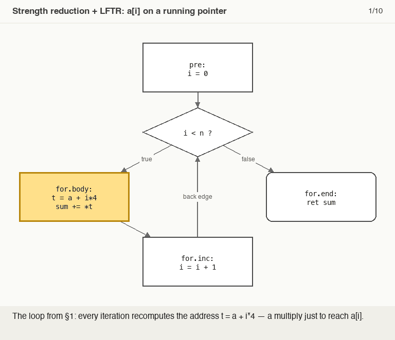
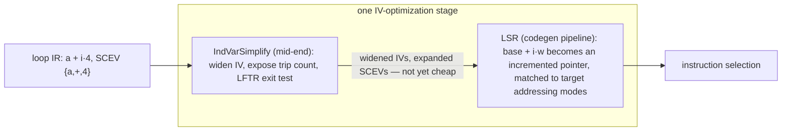

# Induction Variables & Strength Reduction

> 🧭 **Concept** · `concept · optimization · general+llvm` · Index [[LLVM.MOC]] · see also [[muchnick.MOC|Muchnick]]
> **Prerequisites:** [[scalar-evolution]], [[loop-info]] · **Builds on:** the SCEV add-recurrence

> [!abstract] Chapter map
> An **induction variable** changes by a fixed amount each iteration. **Strength reduction** replaces an *expensive* value derived from an IV (a multiply, an address `base + i·w`) with a *cheap* one maintained incrementally (an add). LLVM does this in two cooperating passes: **IndVarSimplify** (canonicalize IVs via [[scalar-evolution|SCEV]]) and **LoopStrengthReduce (LSR)**.

> [!tip] See it live
> [[running-example#3. After mem2reg and loop opts|The running example's `-O1` loop]] shows IndVarSimplify's work: the IV widened to i64 (`%indvars.iv`), the exposed `%wide.trip.count`, and the **LFTR** exit test `icmp eq %indvars.iv.next, %wide.trip.count`.
> LSR isn't in `opt -O1` — it runs later, in the **codegen pipeline** (`TargetPassConfig::addIRPasses`). Watch it fire on the running example: `clang -O1 -S -emit-llvm -fno-discard-value-names runex.c -o - | opt -passes=loop-reduce -S`. On AArch64 the indexed `getelementptr … %indvars.iv` becomes a pointer φ (`%lsr.iv1`) stepped by `getelementptr i8, ptr %lsr.iv1, i64 4`, with a count-down trip counter; on x86-64 LSR keeps the indexed form, since `base + 4·i` is already a legal addressing mode (verified on the vault's pinned toolchain — [[llvm-version]]).

> [!info] Three terms
> - **Induction variable (IV)** — a value whose SCEV is an add-recurrence `{start,+,step}<loop>` (basic IV `i`; *derived* IV like `i·4` or `a + i·4`).
> - **Strength reduction** — maintain a derived IV by **adding its step** each iteration instead of recomputing it (worked in §1).
> - **Linear-function test replacement (LFTR)** — rewrite the exit test to use the new IV so the original one becomes dead.

---

## 1. Worked example

```c
for (i = 0; i < n; i++)
  sum += a[i];          // address of a[i] is  a + i*4   (i32 elements)
```
The address `a + i*4` is the SCEV `{a,+,4}<loop>`. Strength reduction keeps a running pointer instead of multiplying every iteration:
```c
p = a;
for (i = 0; i < n; i++) { sum += *p; p += 4; }   // multiply → add
```

> [!figure]+ Animation — strength reduction as a sequence of edits
> 
> SCEV tags `i` as `{0,+,1}` and the address as `{a,+,4}`; then `p = a` is created in the preheader, kept in step with `p += 4`, swapped in for the multiply, and LFTR retires the counter `i` entirely. (Regenerate: `_meta/anim/storyboards/induction-variables-and-strength-reduction-pointer-iv.json`.)

## 2. In LLVM — IndVarSimplify then LSR

**How the two passes hand off**



*IndVarSimplify canonicalizes; the result only pays off once LSR lowers it to the target's addressing modes.*

> [!info] Two caveats
> - IndVarSimplify's canonicalization is mainly of the **exit test** (LFTR) — e.g. `for (i=7; i*i<1000; ++i)` → `for (i=0; i!=25; ++i)` — rather than renumbering strides into one unit-stride IV.
> - IndVarSimplify can leave **widened** IVs and SCEV-expanded expressions that aren't cheap on their own — it relies on **LSR running afterward**.

## 3. Why it matters

Turning per-iteration multiplies and address computations into single adds is one of the highest-leverage classical optimizations — and LSR shapes IVs to fit the target's addressing modes ([[code-generation-overview]]), cutting instruction count in the hot loop.

> [!summary] The one thing to remember
> IV = SCEV add-recurrence ⇒ **trade expensive per-iteration work for cheap increments**. IndVarSimplify canonicalizes (widening, trip count, LFTR); LSR strength-reduces into addressing-mode-friendly increments — two halves of one IV-optimization stage.

> [!quote] Further reading
> - **Source:** [`Transforms/Scalar/IndVarSimplify.cpp`](https://github.com/llvm/llvm-project/blob/main/llvm/lib/Transforms/Scalar/IndVarSimplify.cpp) · [`Transforms/Scalar/LoopStrengthReduce.cpp`](https://github.com/llvm/llvm-project/blob/main/llvm/lib/Transforms/Scalar/LoopStrengthReduce.cpp)
> - **Muchnick, *Advanced Compiler Design & Implementation* §14** — induction-variable optimizations, strength reduction, linear-function test replacement.
> - **Dragon Book §9.1** — strength reduction among the principal sources of optimization.
