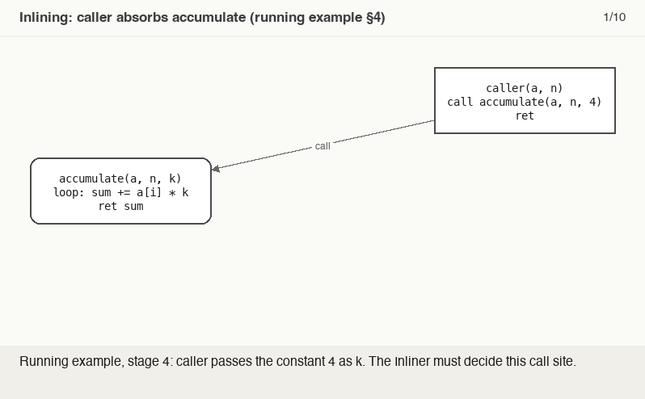

# Inlining

> 🧭 **Concept** · `concept · optimization · llvm` · Index [[LLVM.MOC]] · see also [[dragon-book-ch12.MOC|Dragon Ch.12]]
> **Prerequisites:** [[call-graph]] · **Why interprocedural matters:** it's the flagship IPO

> [!abstract] Chapter map
> Inlining replaces a call with a copy of the callee's body. Its real value isn't just removing call overhead — it's **exposing the callee's code to the caller's context**, which unlocks constant propagation, [[value-numbering|CSE]], and dead-code elimination across what used to be a call boundary. In LLVM it's a **bottom-up CGSCC pass** governed by a cost model.

> [!tip] See it live
> In [[running-example#4. Interprocedural — inlining and constant folding|the running example]], `caller` inlines `accumulate`; with the argument `k = 4` now visible, `mul %0, %k` folds to `shl %0, 2` — the "exposed to the caller's context" payoff in two lines.

---

## 1. What and why

> [!example] The real win is the follow-on optimization
> ```c
> int square(int x) { return x * x; }
> int f()          { return square(3); }
> ```
> Inlining `square` into `f` gives `return 3 * 3;` ⇒ constant folding ⇒ `return 9;`.

## 2. In LLVM — a bottom-up CGSCC pass

> [!info] How the Inliner runs
> The Inliner is a **CGSCC pass**: it walks the [[call-graph]]'s SCCs **bottom-up** (post-order), so each callee has already been simplified before its callers are considered. After inlining a call, the callee's own call sites are added to a worklist and reconsidered, interleaved with the per-function simplification pipeline.

> [!figure]+ Animation — legality → cost → clone → fold, on [[running-example|the running example]]
> 
> The Inliner reaches `caller` bottom-up, clears legality then `InlineCost` (with a bonus for the constant `k = 4`), clones `accumulate`'s blocks in with `.i` suffixes — and the now-visible constant lets InstCombine fold `mul %0, 4` into `shl %0, 2`, the caller-context payoff. (Regenerate: `_meta/anim/storyboards/inlining-clone-and-fold.json`.)

## 3. The decision: legality, then cost

> [!info] Two steps
> 1. **Legality + mandatory.** Some calls can't be inlined (varargs mismatches, incompatible attributes); some are forced by `alwaysinline` or forbidden by `noinline`.
> 2. **Profitability** (only if legal and non-mandatory) — **`InlineCost`**: estimated cost of the inlined body vs a **threshold**.
>
> | knob | effect |
> | --- | --- |
> | `-O3` / hot call | threshold ↑ |
> | `-Os` / `-Oz` (size) | threshold ↓ |
> | constant arg → branches fold | cost bonus (simplification credited) |
> | single call site + `internal` callee | bonus — inlining deletes the original |

> [!example]- Watch the cost model decide
> `clang -O2 -c -Rpass=inline -Rpass-missed=inline square.c` → one remark per call site, e.g. `'square' inlined into 'f' with (cost=-35, threshold=337)`. Make `square` `static` and the single-call-site bonus drops the cost to `-15035`.

## 4. Limitations

Inlining trades **code size and compile time** for speed, so the threshold matters; over-inlining bloats I-cache and slows builds. It can't inline through an **unresolved indirect/virtual call** without [[devirtualization]] first, and recursive SCCs are inlined only to a bounded depth. When full inlining is too costly, [[function-specialization]] clones a specialized copy instead; tail calls reuse the caller's frame ([[tail-call-optimization]]).

> [!summary] The one thing to remember
> Inlining = paste the callee into the caller, mainly to **expose it to the caller's context** for further optimization. LLVM does it **bottom-up over call-graph SCCs**, deciding per call site by **legality → mandatory → `InlineCost` vs threshold**.

> [!quote] Further reading
> - **Also in:** Muchnick *Advanced Compiler Design & Impl.* §15 — procedure integration / in-line expansion.
> - **Source:** [`Transforms/IPO/Inliner.cpp`](https://github.com/llvm/llvm-project/blob/main/llvm/lib/Transforms/IPO/Inliner.cpp) · cost in [`Analysis/InlineCost.cpp`](https://github.com/llvm/llvm-project/blob/main/llvm/lib/Analysis/InlineCost.cpp)
> - **Dragon Book §12.2** — why interprocedural analysis (inlining as the motivating transform).
> - [LLVM `Inliner`](https://llvm.org/doxygen/Inliner_8h_source.html); `InlineCost.cpp`; the CGSCC pass manager ([[call-graph]]).
