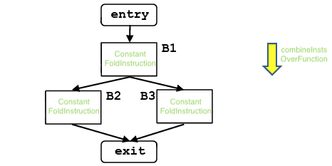

# Instruction Combining

> 🧭 **Concept** · `concept · optimization · llvm` · Index [[LLVM.MOC]]
> **Prerequisites:** [[llvm-basics]], [[ssa-form]] · **Contrast:** [[value-numbering]] · **Mechanism:** [[visitor-pattern]]

> [!abstract] Chapter map
> The **peephole / canonicalization** pass: rewrite small instruction patterns into fewer, simpler, more *canonical* ones — **without touching the CFG** — driven by a worklist.

> [!info]+ From classic compiler theory → LLVM
> | Classic concept | LLVM realization |
> |---|---|
> | Peephole optimization | `instcombine` (but over IR, pattern-based, target-independent) |
> | Algebraic simplification | fold `x+0`, `x*1`, `(x+1)+1 → x+2`, … |
> | Canonicalization (normal forms) | constants to the RHS, fixed operator ordering |
> | Local CSE | *not* this pass — redundancy across blocks is [[value-numbering\|GVN]]'s job |

---

### 1. Instruction combination

> [!note] Definition
> Combine instructions into **fewer, simpler, and more canonical** instructions. ==It does **not** modify the CFG.== **Goal:** avoid redundant computation — if the semantics allow a simpler way to get the same result, use it. In LLVM, `instcombine` is a **function-level** transform pass that rewrites/folds instructions one at a time.

> [!example]+ Fold a chain of adds
> **Input** (two sequential adds):
> ```llvm
> %Y = add i32 %X, 1
> %Z = add i32 %Y, 1
> ```
> **Transformed** (no intermediate result):
> ```llvm
> %Z = add i32 %X, 2
> ```

> [!info] How it works — a worklist algorithm
> Two cooperating worklists drive it to a fixed point:
>
> **1. Prepare (block) worklist** — the set of blocks to process.
> - start with `W = {entry}`;
> - **prune unreachable blocks** so dead instructions never enter the list;
> - iterate until no blocks remain.
>
> **2. Instruction worklist** — the instructions found by the prepare phase; repeatedly apply:
>
> | Step | What it does |
> |---|---|
> | **Fold** | if a binary operator has a constant operand, move it to the **right-hand side** (canonical form), then constant-fold |
> | **Rewrite** | bitwise ops with constant operands are grouped so **shifts** come first, then `or`, then `and`, then `xor`; compares are canonicalized (`<,>,≤,≥` → `=`/`≠` where possible) |
>
> Each rewrite can expose new opportunities, so changed instructions and their users are pushed back on the worklist.

> [!figure]+ Figure — instcombine worklist
> 

> [!warning] What instcombine is *not*
> It's local **canonicalization/peephole**, not redundancy elimination across blocks. It deliberately leaves CFG-changing and cross-block CSE work to other passes ([[value-numbering|GVN]], [[reassociation]], [[simplifycfg]]). Canonical forms it produces, though, make *those* passes far more effective.

> [!quote] Sources
> - **Source:** [`llvm/lib/Transforms/InstCombine/`](https://github.com/llvm/llvm-project/tree/main/llvm/lib/Transforms/InstCombine)
> - [LLVM Passes — `instcombine`](https://llvm.org/docs/Passes.html#instcombine-combine-redundant-instructions)
> - [InstCombine contributor's guide](https://llvm.org/docs/InstCombineContributorGuide.html)
