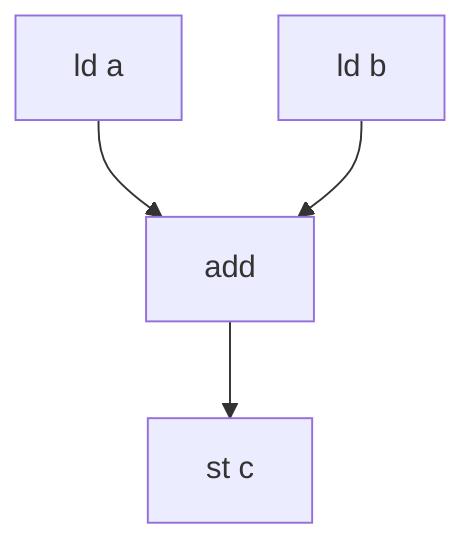

# Instruction Scheduling

> 🧭 **Concept** · `concept · codegen · llvm` · Index [[LLVM.MOC]] · see also [[dragon-book-ch10.MOC|Dragon Ch.10]]
> **Prerequisites:** [[code-generation-overview]], [[control-flow-graph]] · **Trades off against:** [[register-allocation]]

> [!abstract] Chapter map
> Scheduling **reorders machine instructions** to hide latency, avoid pipeline hazards, and expose instruction-level parallelism — while respecting dependences. LLVM does this on a **dependence DAG** with the register-pressure-aware **MachineScheduler**, plus **MachinePipeliner** for overlapping loop iterations (software pipelining).

> [!info] What constrains a schedule
> An instruction can move only if its **dependences** hold: **data** (RAW/true, WAR/anti, WAW/output), **control** (a branch), and **resource/structural** (two ops can't use the same functional unit/port in the same cycle). These form a **dependence DAG** over a region of instructions; any topological order that also respects latencies and resources is a legal schedule.

---

## 1. Local (basic-block) list scheduling

**Figure — a dependence DAG for `c = a + b` (two loads feed an add feeds a store).** The two loads are independent, so a scheduler can issue one while the other's latency is still in flight.

**List scheduling** walks the DAG in priority order (e.g. critical-path length), issuing a ready instruction each cycle — the classic basic-block algorithm.

## 2. Global scheduling and MachineScheduler

> [!info] What LLVM runs
> LLVM's **`MachineScheduler`** is used by almost all targets. It builds a dependence DAG over a scheduling **region** (often larger than one block — *global* scheduling) and orders it to balance **two competing goals**: maximize ILP / hide latency, *and* **minimize register pressure** (it tracks live ranges to avoid causing spills — the direct tension with [[register-allocation]]). It runs **pre-RA** (the important one) and again **post-RA**. (The older per-block `SelectionDAG` scheduler still runs when GlobalISel/MachineScheduler don't.)

## 3. Software pipelining (loops)

> [!info] Overlapping iterations
> **Software pipelining** schedules a loop so that iteration *i+1* starts before iteration *i* finishes — overlapping their independent work to keep the pipeline full. LLVM's **`MachinePipeliner`** implements it via **Swing Modulo Scheduling (SMS)**: it finds an *initiation interval* (cycles between successive iteration starts) and schedules the body modulo that interval, balancing throughput against register pressure. It's enabled on targets that benefit most (e.g. Hexagon, PowerPC).

## 4. Where it sits

Scheduling happens in codegen after [[instruction-selection]], around [[register-allocation]] (pre-RA scheduling shapes register pressure; post-RA scheduling cleans up after spills). It is the LLVM realization of the Dragon Book's basic-block, global, and software-pipelining scheduling.

> [!summary] The one thing to remember
> Scheduling = pick a legal order of machine instructions (respecting data/control/resource deps) that **hides latency and exposes ILP without blowing up register pressure**. LLVM: the **MachineScheduler** on a dependence DAG (pre- and post-RA), plus **MachinePipeliner** (Swing Modulo Scheduling) to overlap loop iterations.

> [!quote] Further reading
> - **Also in:** Muchnick *Advanced Compiler Design & Impl.* §17 — code scheduling (list scheduling, software pipelining).
> - **Source:** [`CodeGen/MachineScheduler.cpp`](https://github.com/llvm/llvm-project/blob/main/llvm/lib/CodeGen/MachineScheduler.cpp) · [`CodeGen/MachinePipeliner.cpp`](https://github.com/llvm/llvm-project/blob/main/llvm/lib/CodeGen/MachinePipeliner.cpp)
> - **Dragon Book §10** — code-scheduling constraints, basic-block & global scheduling, software pipelining.
> - [LLVM CodeGenerator](https://llvm.org/docs/CodeGenerator.html).
