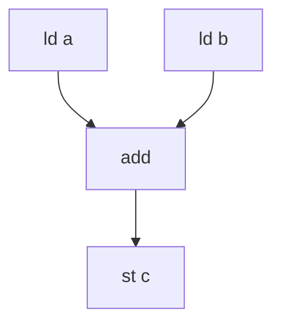
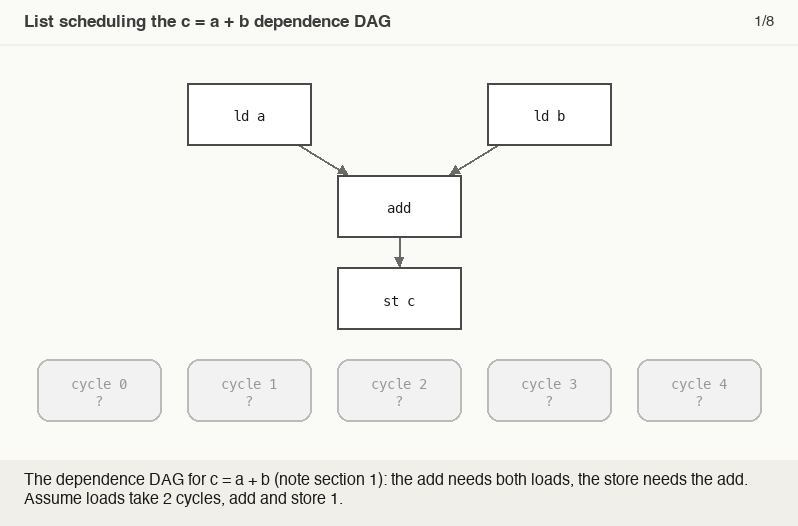

# Instruction Scheduling

> 🧭 **Concept** · `concept · codegen · llvm` · Index [[LLVM.MOC]] · see also [[dragon-book-ch10.MOC|Dragon Ch.10]]
> **Prerequisites:** [[code-generation-overview]], [[control-flow-graph]] · **Trades off against:** [[register-allocation]]

> [!abstract] Chapter map
> Scheduling **reorders machine instructions** to hide latency, avoid pipeline hazards, and expose instruction-level parallelism — while respecting dependences. LLVM does this on a **dependence DAG** with the register-pressure-aware **MachineScheduler**, plus **MachinePipeliner** for overlapping loop iterations (software pipelining).

> [!info] What constrains a schedule
> An instruction can move only if its **dependences** hold: **data** (RAW/true, WAR/anti, WAW/output), **control** (a branch), and **resource/structural** (two ops can't use the same functional unit/port in the same cycle). These form a **dependence DAG** over a region of instructions; any topological order that also respects latencies (an instruction's **latency** = the cycles until its result is ready to use) and resources is a legal schedule.

---

## 1. Local (basic-block) list scheduling

**Figure — a dependence DAG for `c = a + b` (two loads feed an add feeds a store).** The two loads are independent, so a scheduler can issue one while the other's latency is still in flight.

```mermaid
flowchart TD
  L1["ld a"] --> ADD["add"]
  L2["ld b"] --> ADD
  ADD --> ST["st c"]
```

> [!question] Predict first
> Assume `ld` takes 3 cycles and the machine issues one instruction per cycle. In source order `ld a; ld b; add; st`, where do the stalls fall — and can *any* reordering of these four instructions remove them? (Work it out, then check against the worked schedule below: no — every legal order of this DAG stalls the same, because nothing independent is left to fill the load shadow. That's why the scheduler hunts for unrelated work, as the next example shows.)

**List scheduling** walks the DAG in priority order (e.g. critical-path length), issuing a ready instruction each cycle — the classic basic-block algorithm.

> [!figure]+ Animation — list-scheduling this DAG cycle by cycle
> 
> Each cycle the scheduler issues the highest-priority *ready* node (here with 2-cycle loads, single issue): issuing `ld b` while `ld a`'s latency is still in flight finishes the block in 5 cycles instead of the 6 a blocking, one-at-a-time order would take. (Regenerate: `_meta/anim/storyboards/instruction-scheduling-list-schedule.json`.)

> [!example] List-scheduling the running example's loop body
> The [[running-example#3. After mem2reg and loop opts|running example's loop body]] has two chains: the value chain `ld a[i]` → `mul ×k` → `add sum`, and the loop-control chain `add i,1` → `cmp` → `br` — note the compare consumes the incremented `i` (`icmp eq %indvars.iv.next, %wide.trip.count`), so it depends on the increment. Assume `ld` = 3 cycles, everything else 1, single issue.
>
> | cycle | naive source order | list-scheduled |
> |---|---|---|
> | 0 | `ld a[i]` | `ld a[i]` |
> | 1 | *stall* | `add i,1` |
> | 2 | *stall* | `cmp` |
> | 3 | `mul ×k` | `mul ×k` |
> | 4 | `add sum` | `add sum` |
> | 5 | `add i,1` | `br` |
> | 6 | `cmp` | |
> | 7 | `br` | |
>
> This is exactly the ready-list walk above: `add i,1` is ready at cycle 0 (no incoming DAG edges) and `cmp` becomes ready one cycle later, once the increment's result is available; neither depends on the load, so both fit inside its latency shadow — 8 cycles become 6, two saved per iteration.

## 2. Global scheduling and MachineScheduler

> [!info] What LLVM runs
> LLVM's **`MachineScheduler`** is used by almost all targets. It builds a dependence DAG over a scheduling **region** (a portion of a single basic block — *local/regional* scheduling) and orders it to balance **two competing goals**: maximize ILP / hide latency, *and* **minimize register pressure** (it tracks live ranges to avoid causing spills — the direct tension with [[register-allocation]]). It runs **pre-RA** (before register allocation — the run that matters most, since it can still shape register pressure) and again **post-RA** (after allocation, to clean up around spill code). (Targets that haven't adopted `MachineScheduler` instead get their real scheduling from an older list scheduler built into the `SelectionDAG` instruction selector; on targets that have adopted it, that in-selector scheduler just emits instructions in source order and leaves scheduling to `MachineScheduler` — a legacy detail you can ignore on mainstream targets. See `createDefaultScheduler` in `SelectionDAGISel.cpp`.)

## 3. Software pipelining (loops)

> [!info] Overlapping iterations
> **Software pipelining** schedules a loop so that iteration *i+1* starts before iteration *i* finishes — overlapping their independent work to keep the pipeline full. LLVM's **`MachinePipeliner`** implements it via **Swing Modulo Scheduling (SMS)**: it finds an *initiation interval* (cycles between successive iteration starts) and schedules the body modulo that interval, balancing throughput against register pressure. It's enabled on targets that benefit most (e.g. Hexagon, PowerPC).

## 4. Where it sits

Scheduling happens in codegen after [[instruction-selection]], around [[register-allocation]] (pre-RA scheduling shapes register pressure; post-RA scheduling cleans up after spills). It is the LLVM realization of the Dragon Book's basic-block, global, and software-pipelining scheduling.

> [!summary] The one thing to remember
> Scheduling = pick a legal order of machine instructions (respecting data/control/resource deps) that **hides latency and exposes ILP without blowing up register pressure**. LLVM: the **MachineScheduler** on a dependence DAG (pre- and post-RA), plus **MachinePipeliner** (Swing Modulo Scheduling) to overlap loop iterations.

> [!quote] Further reading
> - **Also in:** Muchnick *Advanced Compiler Design & Impl.* §17 — code scheduling (list scheduling, software pipelining).
> - **Source:** [`CodeGen/MachineScheduler.cpp`](https://github.com/llvm/llvm-project/blob/main/llvm/lib/CodeGen/MachineScheduler.cpp) · [`CodeGen/MachinePipeliner.cpp`](https://github.com/llvm/llvm-project/blob/main/llvm/lib/CodeGen/MachinePipeliner.cpp)
> - **Dragon Book §10** — code-scheduling constraints, basic-block & global scheduling, software pipelining.
> - [LLVM CodeGenerator](https://llvm.org/docs/CodeGenerator.html).
