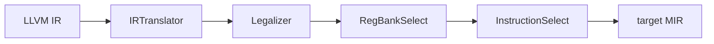

# Instruction Selection

> 🧭 **Concept** · `concept · codegen · llvm` · Index [[LLVM.MOC]] · see also [[dragon-book-ch8.MOC|Dragon Ch.8]]
> **Prerequisites:** [[code-generation-overview]] · **Followed by:** [[register-allocation]]

> [!abstract] Chapter map
> Instruction selection maps **target-independent IR operations** to **target machine instructions**. One IR op may need several machine instructions, and one machine instruction may cover several IR ops — so selection is a **covering** (tiling) problem. LLVM has three selectors: **SelectionDAG** (default), **GlobalISel** (newer), and **FastISel** (`-O0`).

> [!info] The textbook framing: tiling
> Represent the computation as a tree/DAG; a target instruction is a **tile** (a small pattern with a cost) that covers part of it. Selecting code = covering the whole tree with tiles at minimum total cost. **Maximal munch** greedily takes the largest matching tile; **dynamic programming** finds an *optimal* tiling. LLVM's pattern matchers are the engineering form of this.

---

## 1. SelectionDAG (the default)

For each basic block, LLVM builds a **DAG** of operations, then runs four phases:

1. **Build** — IR → an `SDNode` DAG (shared subexpressions are shared, like an [[three-address-code|expression DAG]]).
2. **Legalize** — rewrite types and operations the target can't handle (e.g. promote `i1`→`i8`, expand a 64-bit op on a 32-bit target).
3. **Combine** — peephole-style DAG simplifications (folded between phases).
4. **Select** — **pattern-match** target instruction tiles onto the DAG. The patterns and their costs are generated by **TableGen** from the target's `.td` files — this is the tiling step.

A final **scheduler** linearizes the selected DAG into a sequence of `MachineInstr`s.

> [!example] Tiling, concretely
> An IR `load` then `add` (`%v = load ptr %p; %r = add %v, %x`) may match a single x86 tile `add %x, (%p)` (a load-and-add addressing-mode instruction) — one tile covering two IR ops — if the target defines that pattern. On a RISC target with no memory operands, it stays two instructions (`ld`, `add`).

## 2. GlobalISel (whole-function, newer)

GlobalISel replaces the per-block DAG with a function-wide pipeline on **generic MIR (gMIR)**:

- **IRTranslator** — IR → generic `G_*` MIR opcodes.
- **Legalizer** — make those generic ops legal for the target.
- **RegBankSelect** — assign each value a register *bank* (e.g. GPR vs. FPR).
- **InstructionSelect** — match generic ops to real target instructions (TableGen patterns, shared with SelectionDAG where possible).

It avoids SelectionDAG's per-block isolation and large `SDNode` graphs, and is most mature on AArch64.

## 3. FastISel (`-O0`)

A fast, **best-effort** selector for unoptimized builds: it handles common cases directly for compile speed and **falls back to SelectionDAG** for anything it can't select.

> [!summary] The one thing to remember
> Instruction selection is **tiling**: cover the IR with target-instruction patterns at low cost. LLVM does it three ways — per-block **SelectionDAG** (build→legalize→combine→select, TableGen patterns), whole-function **GlobalISel** (translate→legalize→regbank→select), and quick **FastISel** at `-O0`.

> [!warning] Version-sensitive
> Which selector is the default is **target- and version-dependent**: SelectionDAG remains the default on most targets while GlobalISel is the default on some (most mature on AArch64). Confirm for your target/version in [CodeGenerator.html](https://llvm.org/docs/CodeGenerator.html) (this vault tracks [[llvm-version]]).

> [!quote] Further reading
> - **Source:** [`CodeGen/SelectionDAG/`](https://github.com/llvm/llvm-project/tree/main/llvm/lib/CodeGen/SelectionDAG) · [`CodeGen/GlobalISel/`](https://github.com/llvm/llvm-project/tree/main/llvm/lib/CodeGen/GlobalISel)
> - **Dragon Book §8.9** (instruction selection by tree rewriting), **§8.10–8.11** (optimal tiling via dynamic programming).
> - [LLVM CodeGenerator](https://llvm.org/docs/CodeGenerator.html); [GlobalISel](https://llvm.org/docs/GlobalISel/index.html).
