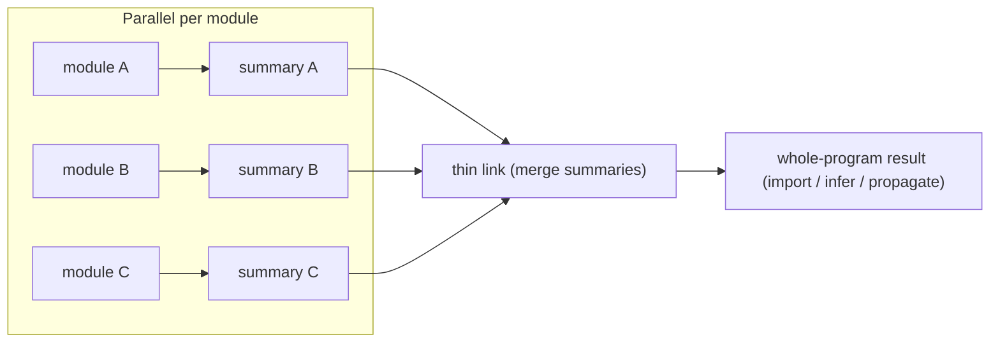

# Summary-Based (Compositional) Interprocedural Analysis

> 🧭 **Concept** · `concept · analysis · general+llvm+clang` · Index [[LLVM.MOC]]
> **Prerequisites:** [[data-flow-analysis]], [[call-graph]] · **Related:** [[inlining]], [[ipsccp]], [[interprocedural-dead-code-elimination]]

> [!abstract] Chapter map
> The scaling trick for whole-program analysis: **analyze each procedure once into a compact _summary_, then compose summaries across the [[call-graph]]** instead of re-analyzing a callee anew for every caller and context. The arc *definition → the two classic strategies → how LLVM/Clang realize summaries → the figure → the precision/cost knob → the frontier*.

---

## 1. Definition

> [!note] Definition
> A **procedure summary** is a compact, caller-independent description of a procedure's behavior — an input→output relation, a **transfer function** over the analysis lattice, or a **pre → post contract**. An analysis is **compositional** when it computes each procedure's summary **independently of its callers**, then **composes** those summaries along [[call-graph]] edges. The alternative — re-analyzing a callee's body freshly for every caller (or every calling context) — is precise but blows up combinatorially on real programs.

The payoff is threefold: each procedure is analyzed **once**, the work is **parallel** across procedures with no call dependence, and it is **incremental** — change one procedure, re-summarize only it and re-compose.

## 2. The two classic strategies

> [!info] Functional (summary) vs. call-strings
> Two ways to make an intraprocedural analysis interprocedural:
>
> | Strategy | Idea | Cost model |
> |---|---|---|
> | **Functional / summary** | Summarize each procedure as a transfer function (input lattice → output lattice); apply the summary at each call site | One summary per procedure; composes cheaply |
> | **Call-strings** | Tag every fact with a bounded call stack (the last _k_ call sites) so contexts stay distinct | Fact set grows with the number of tracked contexts |

Call-strings keep contexts apart by brute force and grow with them; the functional/summary approach keeps one reusable object per procedure, so it is the one that **scales to whole programs** — which is why every production LLVM realization below is summary-based.

## 3. LLVM & Clang realizations

> [!info]+ Summaries in LLVM/Clang (tier-1 confirmed)
>
> | Realization | Summary object | How it composes |
> |---|---|---|
> | **ThinLTO** | per-module **`ModuleSummaryIndex`** — `GlobalValueSummary` / `FunctionSummary` (`llvm/IR/ModuleSummaryIndex.h`) | each module emits a summary at compile time; a serial **thin link** merges them into a combined index; then per-function optimization **imports** just what it needs (`Transforms/IPO/FunctionImport.cpp`) — parallel + incremental |
> | **Function-attrs inference** | inferred attributes (`readonly`, `readnone`, `nounwind`, `nocapture`, …) — a classic bottom-up function summary (`Transforms/IPO/FunctionAttrs.cpp`) | deduced **bottom-up over [[call-graph]] SCCs**; a callee's attributes are known before its callers are visited |
> | **[[ipsccp\|IPSCCP]]** | the SCCP value-lattice per argument/return (`Transforms/IPO/SCCP.cpp`) | constant **arguments in**, constant **returns out**, propagated whole-module |
> | **Scalable Static Analysis Framework** (emerging) | per-TU entity summaries keyed by a stable **`EntityName`** (`clang/lib/Analysis/Scalable`) | "ThinLTO for static analysis" — see §6 |

The unifying model is clearest in **ThinLTO**: the `ModuleSummaryIndex` header describes itself as holding "the module index and summary for function importing." Compilation stays parallel; only the tiny thin-link merge is serial; and because each module's summary is a self-contained artifact, an unchanged module need not be re-summarized.

The **Scalable framework** ports that same shape to bug-finding. `EntityName` is documented as "a globally unique identifier for program entities that remains stable across compilation boundaries," which "enables whole-program analysis to track and relate entities across separately compiled translation units." An `EntityId` / `EntityIdTable` interns these; a `BuildNamespace` (kind `CompilationUnit` or `LinkUnit`) scopes an entity to a translation unit or a link unit; and `ASTEntityMapping` maps declarations (functions, methods, globals, parameters, record types, fields) to their `EntityName`. Per-TU summaries plus cross-TU **entity linking** is exactly ThinLTO's compile → thin-link → use pipeline, applied to analysis rather than codegen.

## 4. The pipeline

**Figure — compile each module to a summary, thin-link/merge, then compose.** The per-module step is parallel and incremental; only the merge is whole-program.

## 5. The precision/cost tension

> [!warning] A summary must be expressive yet small
> Composition scales only if the summary stays **compact**, but a compact summary must also stay **precise** enough to be worth composing. Merging facts at a return or a [[call-graph]] join **loses context** — the correlations between distinct calling contexts, or between paths inside the callee, are folded together. This is the **same knob** as flow- vs. path-sensitivity in [[data-flow-analysis]]: a per-procedure summary is a join over the callee's internal paths, so path correlations do not survive into the caller unless the summary is deliberately made **disjunctive** (more precise, larger). The engineering problem is choosing a summary domain expressive enough to keep the precision you need and small enough to compose across the whole program.

## 6. Where it's used & the frontier

Summary-based analysis is what makes **[[inlining|link-time optimization]]** tractable (ThinLTO's whole-program view without whole-program compile cost), and it underpins **whole-program bug-finding** and **automated hardening**: the Scalable framework's entity model is being built so that a summary of one translation unit can drive transformations that reason across the whole program — for example, safety migrations such as converting raw-pointer APIs to `std::span`, which require knowing every use of an entity across TUs. The trajectory across all four realizations is the same: push interprocedural reasoning toward **"summarize once, compose everywhere,"** keeping it parallel and incremental.

> [!summary] The one thing to remember
> Summarize each procedure once into a compact, caller-independent object, then compose those summaries along the [[call-graph]] — the functional/summary strategy (over call-strings) is how analysis scales to whole programs, and LLVM realizes it as ThinLTO summaries, bottom-up function-attrs, IPSCCP, and the emerging Scalable framework.

> [!quote] Further reading
> - **Sharir & Pnueli (1981)**, "Two approaches to interprocedural data flow analysis" — the original *functional (summary)* vs. *call-strings* framing.
> - **Reps, Horwitz & Sagiv (POPL 1995)**, "Precise interprocedural dataflow analysis via graph reachability" — the IFDS framework (summaries as graph reachability).
> - **Calcagno, Distefano, O'Hearn & Yang (POPL 2009)**, "Compositional shape analysis by means of bi-abduction" — compositional summaries for heap/shape analysis (the lineage behind whole-program bug-finding).
> - [LLVM ThinLTO documentation](https://llvm.org/docs/LinkTimeOptimization.html) and the [ThinLTO blog post](https://blog.llvm.org/2016/06/thinlto-scalable-and-incremental-lto.html).
> - **Tier-1 source:** [`ModuleSummaryIndex.h`](https://github.com/llvm/llvm-project/blob/llvmorg-22.1.8/llvm/include/llvm/IR/ModuleSummaryIndex.h) · [`FunctionImport.cpp`](https://github.com/llvm/llvm-project/blob/llvmorg-22.1.8/llvm/lib/Transforms/IPO/FunctionImport.cpp) · [`FunctionAttrs.cpp`](https://github.com/llvm/llvm-project/blob/llvmorg-22.1.8/llvm/lib/Transforms/IPO/FunctionAttrs.cpp) · [`Transforms/IPO/SCCP.cpp`](https://github.com/llvm/llvm-project/blob/llvmorg-22.1.8/llvm/lib/Transforms/IPO/SCCP.cpp) · [`clang/lib/Analysis/Scalable`](https://github.com/llvm/llvm-project/blob/llvmorg-22.1.8/clang/lib/Analysis/Scalable).
