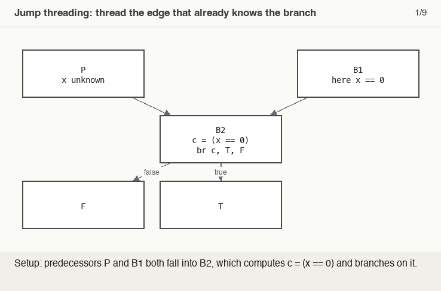

# Jump Threading

> 🧭 **Concept** · `concept · optimization · llvm` · Index [[LLVM.MOC]] · see also [[muchnick.MOC|Muchnick]]
> **Prerequisites:** [[control-flow-graph]] · **Sibling cleanup:** [[simplifycfg]]

> [!abstract] Chapter map
> When the value that controls a branch is **already determined on a particular incoming path**, jump threading **redirects that path straight to the branch's chosen successor** — bypassing the test entirely. It's the CFG optimization that turns "correlated" branches into straight-line flow.

---

## 1. The idea

> [!example] The common form — a `phi` feeds a branch
> One incoming value makes the condition constant, so that predecessor's edge can skip the test (paste-and-run):
> ```llvm
> define i32 @f(i1 %p, i32 %y) {
> entry:
>   br i1 %p, label %a, label %b
> a:
>   br label %merge
> b:
>   br label %merge
> merge:
>   %x = phi i32 [ 0, %a ], [ %y, %b ]
>   %c = icmp eq i32 %x, 0
>   br i1 %c, label %t, label %f
> t:
>   ret i32 1
> f:
>   ret i32 0
> }
> ```
> `opt -passes=jump-threading -S t.ll` — on the edge from `%a`, `%x` is `0` so `%c` is known true: the path through `%a` is rewired straight to `%t` (the duplicated remnants of `%merge` fold away on that edge), while the path through `%b` keeps the test. (The shape `ext-if` in [[running-example]] §7 gives JumpThreading.)

> [!figure]+ Animation — thread the edge, clone the block
> 
> One incoming edge already decides `B2`'s branch, so JumpThreading clones `B2` onto that edge, wires the clone straight to `T` with no test — the predecessor where `x` is unknown keeps the original branch. (Regenerate: `_meta/anim/storyboards/jump-threading-edge-clone.json`.)

## 2. In LLVM

> [!info] `JumpThreading` + LazyValueInfo
> LLVM's **`JumpThreading`** pass uses **`LazyValueInfo`** (LVI — per-edge value ranges/constants) to discover when a predecessor implies a branch's outcome, then rewrites the CFG (cloning the block as needed). Wins: correlated conditionals eliminated; constants propagated across blocks ([[simplifycfg|SimplifyCFG]] alone can't); straight-line code exposed for later passes. Cost: **code duplication** ⇒ bounded by a size threshold.

> [!summary] The one thing to remember
> Jump threading **routes an incoming edge past a branch whose result that edge already determines**, duplicating the block if needed — LazyValueInfo proves the outcome.

> [!quote] Further reading
> - **Source:** [`Transforms/Scalar/JumpThreading.cpp`](https://github.com/llvm/llvm-project/blob/main/llvm/lib/Transforms/Scalar/JumpThreading.cpp)
> - **Muchnick §18** — control-flow optimizations.
