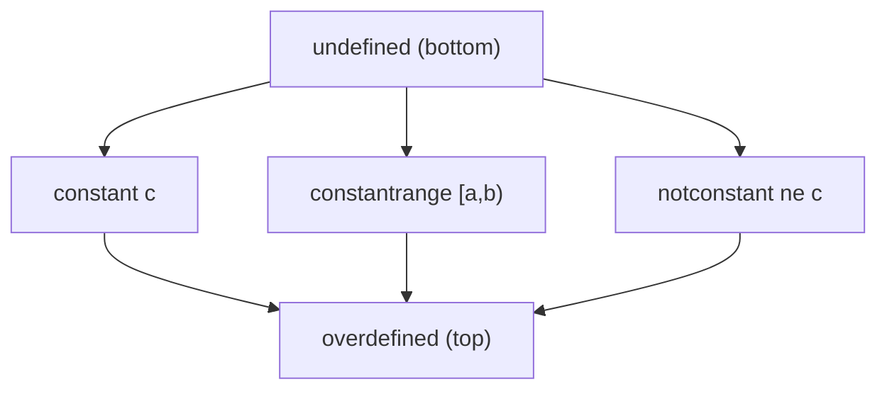

# Lazy Value Information (LVI)

> 🧭 **Concept** · `concept · analysis · general+llvm` · Index [[LLVM.MOC]]
> **Prerequisites:** [[data-flow-analysis]], [[dataflow-foundations]] · **Consumers:** [[correlated-value-propagation]] · **Contrast:** [[sparse-conditional-constant-propagation]]

> [!abstract] Chapter map
> **LVI** answers, on demand, "what is known about integer value `V` at program point `P`?" — returning a lattice element, usually a **`ConstantRange`** (an interval). It is LLVM's in-tree **non-relational interval analysis**, computed **lazily** (per query, cached) rather than as an eager whole-function fixpoint. Read it as abstract interpretation with the interval domain, traded for engineering cost via demand-driven evaluation and a recursion budget.

> [!info]+ Abstract interpretation → LVI
> | Abstract interpretation | LVI realization |
> |---|---|
> | Abstract domain | `ValueLatticeElement` over **`ConstantRange`** (intervals on $\mathbb{Z}/2^\ell$) |
> | $\bot$ (most precise / "unseen") | `undefined` |
> | $\top$ (no information) | `overdefined` |
> | Join $\sqcup$ at merges | union of lattice elements along incoming edges |
> | Condition refinement (`assume`) | edge constraints from `icmp`/branches, `llvm.assume`, guards |
> | Dense fixpoint over all points | **lazy**, per-`(value, block)` query with a cost budget |
> | Widening to force termination | bounded recursion → fall back to `overdefined` (no classic $\nabla$) |

---

## 1. Definition

> [!note] What LVI computes
> For an integer SSA value `V` and a context (an instruction, or a CFG **edge**), LVI returns a `ValueLatticeElement` over-approximating the set of values `V` can take there. The headline API is `getConstantRange(V, CtxI)` and `getConstantRangeOnEdge(V, From, To)`; `getPredicateAt(pred, V, C, CtxI)` answers "is `V pred C` known true/false here?"

## 2. The lattice

> [!info] `ValueLatticeElement`
> A small lattice; ordered from most to least precise:



> [!note] Reading the lattice
> - `undefined` $=\bot$: nothing observed yet (optimistic; also unreachable code).
> - `constant` $c$: exactly one value.
> - `constantrange` $[a,b)$: a **`ConstantRange`** — integers only — possibly a **wrapping** interval modulo $2^\ell$.
> - `notconstant` $\neq c$: known to differ from a constant (e.g. a non-null pointer-as-int).
> - `overdefined` $=\top$: any value; LVI knows nothing.
>
> The **join** $\sqcup$ combines incoming edges: e.g. two constants $c_1\neq c_2$ join to the range $[\min,\max]$ or to `overdefined`. Soundness is monotone over-approximation: $\gamma(\text{element})\supseteq$ the true runtime value set, always.

## 3. The interval domain — and what it is *not*

> [!tip] Non-relational, wrapping intervals
> `ConstantRange` is the classic **interval domain** specialized to fixed-width machine integers: a range $[a,b)$ over $\mathbb{Z}/2^\ell$ that **may wrap** (so $[\,254,2\,)$ on `i8` means $\{254,255,0,1\}$). It is **non-relational** — LVI tracks each value independently and records **no relations between variables**. There is nothing here like the relational domains (octagon, DBM, polyhedra): LVI cannot express `x < y`, only "`x` lies in this range." That is the precision price of the cheap, per-value representation.

## 4. Edge constraints (why it beats plain SCCP on branches)

> [!info] Path/edge sensitivity
> LVI refines a value's range **per CFG edge** using the branch condition. From
> ```llvm
> %c = icmp slt i32 %x, 10
> br i1 %c, label %lt, label %ge
> ```
> on the `%lt` edge LVI knows `%x ∈ [INT_MIN, 10)`, and on `%ge` edge `%x ∈ [10, INT_MAX]`. It also consumes `llvm.assume` and guard conditions. This **correlation** of a value's range with the path taken is exactly what [[sparse-conditional-constant-propagation|SCCP]] (which is constant-only and not edge-range-sensitive) misses, and what gives LVI's consumers their name.

## 5. Why "lazy" — the cost model

> [!warning] Demand-driven, not a dense fixpoint
> Unlike a textbook [[data-flow-analysis|dense dataflow]] analysis that computes a fixpoint for **every** value at **every** point, LVI is **query-driven**: a consumer asks about a specific value at a specific point, and LVI explores **backward** through predecessors/definitions **on demand**, **caching** results per `(value, block)`. Exploration is bounded by a recursion/cost budget; when exceeded, LVI returns `overdefined` — **sound but imprecise**. Consequence worth remembering: LVI does **no loop widening**, so loop-carried ranges are usually `overdefined` unless pinned down elsewhere (e.g. [[scalar-evolution|SCEV]]). The tradeoff: you pay only for the values you query, at the cost of giving up the precision a full fixpoint with widening/narrowing would reach.

## 6. Consumers

> [!info] Who queries LVI
> Per the LVI source comment, **two transforms track ranges along CFG edges using LazyValueInfo**: [[correlated-value-propagation|CorrelatedValuePropagation]] and [[jump-threading|JumpThreading]].
> - **CVP** uses LVI (+ [[dominator-tree|DominatorTree]]) to fold comparisons, narrow arithmetic, drop redundant casts, and set `nsw`/`nuw`/`range` attributes.
> - [[jump-threading|JumpThreading]] uses LVI to prove a branch's outcome is fixed on a given incoming edge and threads control flow past it.

## 7. Limitations

> [!warning] Tradeoffs
> - **Integer-only** ranges; no relational facts (no octagon/DBM/polyhedra-style `x−y≤c`).
> - **Budget-bounded** → can return `overdefined` on deep/loopy code; no $\nabla$ widening.
> - **Cache invalidation** is subtle: transforms must keep LVI consistent as they edit the IR (LVI is "preserved" carefully across CVP/JumpThreading).
> - For a relational or widening-based range analysis you would step outside core LLVM (e.g. an Apron/Crab-style abstract interpreter).

> [!summary] The one thing to remember
> LVI is LLVM's **lazy, non-relational interval analysis**: a `ValueLatticeElement`/`ConstantRange` lattice with `undefined`$=\bot$ and `overdefined`$=\top$, refined per CFG edge from branch conditions, evaluated on demand with a cost budget (no loop widening). It powers CVP and JumpThreading. Cheap and sound, but coarser than a full abstract-interpretation fixpoint.

> [!quote] Sources & confidence
> - **Source:** [`Analysis/LazyValueInfo.cpp`](https://github.com/llvm/llvm-project/blob/main/llvm/lib/Analysis/LazyValueInfo.cpp) — tier-1.
> - [`LazyValueInfo`](https://llvm.org/doxygen/classllvm_1_1LazyValueInfo.html) · [`ValueLatticeElement`](https://llvm.org/doxygen/classllvm_1_1ValueLatticeElement.html) · [`ConstantRange`](https://llvm.org/doxygen/classllvm_1_1ConstantRange.html) doxygen.
> - Theory: [[dataflow-foundations]] (lattices, monotone framework); Cousot & Cousot 1977 (abstract interpretation, interval domain).
