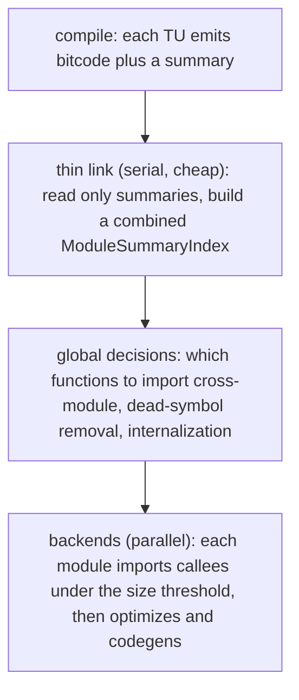

# Link-Time Optimization (LTO & ThinLTO)

> 🧭 **Concept** · `concept · optimization · llvm` · Index [[LLVM.MOC]]
> **Prerequisites:** [[call-graph]], [[inlining]], [[llvm-basics]] · **Related:** [[interprocedural-summaries]], [[devirtualization]]

> [!abstract] Chapter map
> How LLVM optimizes **across translation-unit boundaries**: defer optimization from compile time to **link time**, where the optimizer can see the whole program at once. The mechanism is simple and surprising — under `-flto`, a `.o` file is **not machine code, it is LLVM bitcode**; the "linker" invokes LLVM to optimize and codegen the merged program. Two designs trade power for scale: **Regular (monolithic) LTO** merges every module into one giant `Module` (maximum cross-module optimization, but serial and memory-hungry), while **ThinLTO** attaches a compact **summary** to each module, does a cheap serial "thin link" to decide cross-module **function imports**, then runs per-module backends **in parallel**. This is [[interprocedural-summaries|interprocedural optimization]] scaled to the whole binary.

---

## 1. Definition

> [!note] Definition
> **LTO** moves the optimizer to the link step so it operates on the **entire program's IR**, not one TU at a time. Cross-module [[inlining]], [[devirtualization]], and [[ipsccp|constant propagation]] become possible because callee and caller are finally in the same place.

The enabling trick: with LTO, each object file carries **IR**, and the actual machine-code generation happens at link time.

## 2. The tell — a `.o` that isn't an object

> [!example]+ `-flto` changes what a `.o` *is* (real Apple clang output)
> ```bash
> clang -c      a.c -o a.o        # file a.o → Mach-O 64-bit object arm64
> clang -flto -c a.c -o a.o        # = -flto=full (monolithic); file a.o → LLVM bitcode, wrapper
> clang -flto=thin -c a.c -o a.o   # file a.o → LLVM bitcode, wrapper
> ```
> Under `-flto` the compiler emits **bitcode wearing an object-file extension**; codegen is deferred to the link. The linker (via the LLVM plugin / `LLVMgold`, or lld natively) hands that bitcode back to `llvm/lib/LTO` to optimize and lower.

## 3. Two designs

> [!info] Regular vs Thin (confirmed dirs/classes, pinned LLVM [[llvm-version]])
>
> | | **Regular (monolithic) LTO** | **ThinLTO** |
> |---|---|---|
> | Link-time IR | **merge all modules** into one `Module` | keep modules separate |
> | Cross-module info | the whole program, directly | a compact **`ModuleSummaryIndex`** per module |
> | Backend | one big serial optimize + codegen | **parallel** per-module backends |
> | Key class/file | `lto::LTO` + `LTOBackend.cpp` | `lto::LTO` + `FunctionImport.cpp` |
> | Cost | high memory, serial, slow | scales; incremental cache; slight precision loss |

Both designs run through **`lto::LTO`** (`llvm/include/llvm/LTO/LTO.h`) on the modern linker-plugin path; the older `LTOCodeGenerator` / `ThinLTOCodeGenerator` classes are the **legacy libLTO C-API** entry points (`llvm/include/llvm/LTO/legacy/`), not what lld/gold drive today.

## 4. How ThinLTO works

ThinLTO is the design that made LTO practical for large programs. Three phases:



- **Summaries.** The `ModuleSummaryIndex` (*"Class to hold module path string table and global value map"*) records per-symbol facts (size, refs, callees) — **without** the function bodies, so the thin-link stays cheap.
- **The thin link.** A serial phase reads only summaries, builds a combined index, and decides **cross-module function imports** (`FunctionImport.cpp`) and global cleanups. The default import criterion is **size, not hotness**: `ComputeCrossModuleImport` admits a callee whose summary `instCount()` fits under `import-instr-limit` (**default 100**); hot/cold multipliers only bite when profile data is present.
- **Parallel backends.** Each module's backend imports the chosen callees and runs the normal optimizer + codegen — independently, so it parallelizes and **caches incrementally** across builds.

`llvm/include/llvm/LTO/LTO.h` frames the seam: linkage for *"prevailing symbols"* is resolved in the index, and *"the ThinLTO backends must apply the changes to the module."*

## 5. Where it's used

Release builds that want cross-TU optimization: cross-module [[inlining]] and [[devirtualization|whole-program devirtualization]], [[ipsccp|inter-module constant propagation]], and dead-symbol elimination the per-TU compiler can't do because it only sees one [[clang-ast|translation unit]]. It is the production home of the [[interprocedural-summaries|summary-based interprocedural]] techniques.

## 6. Limitations & tradeoffs

> [!warning] What LTO costs
> - **Build-system integration.** The linker must load the LLVM plugin (or be lld); the toolchain, not just the compiler, has to cooperate.
> - **Regular LTO doesn't scale.** Merging a large program into one `Module` is memory- and time-heavy and serial — the reason ThinLTO exists.
> - **ThinLTO trades precision for scale.** Summary-based global decisions are an approximation of what monolithic LTO sees directly; a few optimizations are weaker.
> - **Debugging & reproducibility.** Optimization at link time complicates crash triage and can lengthen incremental links (mitigated by ThinLTO's cache).

> [!summary] The one thing to remember
> LTO defers optimization to **link time** so the optimizer sees the **whole program** — under `-flto` a `.o` is actually **LLVM bitcode**. **Regular LTO** merges everything into one `Module` (max power, serial). **ThinLTO** emits per-module **summaries**, does a cheap serial **thin link** to pick cross-module **imports**, then runs backends **in parallel**. Note the flag spelling: plain `-flto` means `-flto=full` (regular/monolithic); **ThinLTO must be requested explicitly with `-flto=thin`**.

> [!quote] Sources & confidence
> **Verified 2026-07-20** — every falsifiable claim in this note was enumerated and checked against the pinned LLVM source ([[llvm-version]], `llvmorg-22.1.8`) by the `note-correctness-review` pass; refuted claims were corrected (batch error rate 8.6%, 23/269). GitHub links track `main`; the checked revision is the pinned tag.
> - [llvm/lib/LTO/LTO.cpp](https://github.com/llvm/llvm-project/blob/main/llvm/lib/LTO/LTO.cpp) / [`LTO.h`](https://github.com/llvm/llvm-project/blob/main/llvm/include/llvm/LTO/LTO.h) — the `LTO` orchestrator; prevailing-symbol resolution; *"the ThinLTO backends must apply the changes to the module."*
> - [llvm/lib/LTO/LTOCodeGenerator.cpp](https://github.com/llvm/llvm-project/blob/main/llvm/lib/LTO/LTOCodeGenerator.cpp) (regular) and [`ThinLTOCodeGenerator.cpp`](https://github.com/llvm/llvm-project/blob/main/llvm/lib/LTO/ThinLTOCodeGenerator.cpp) (thin).
> - [llvm/include/llvm/IR/ModuleSummaryIndex.h](https://github.com/llvm/llvm-project/blob/main/llvm/include/llvm/IR/ModuleSummaryIndex.h) — *"Class to hold module path string table and global value map";* [llvm/lib/Transforms/IPO/FunctionImport.cpp](https://github.com/llvm/llvm-project/blob/main/llvm/lib/Transforms/IPO/FunctionImport.cpp) — cross-module import.
> - Example output produced locally with **Apple clang 17** (Apple's own versioning — *not* an upstream LLVM release number, and not the pinned tag; the `file` labels track the platform — see [[llvm-version]]). The LTO/ThinLTO model is version-stable.
> - [Clang — ThinLTO](https://clang.llvm.org/docs/ThinLTO.html) — primary doc.
