# LLVM Basics

> 🧭 **Concept** · `concept · ir · llvm` · Index [[LLVM.MOC]]
> **Prerequisites:** none · **Deep dive:** [[getelementptr]] · **Next:** [[ssa-form]]

> [!abstract] Chapter map
> 1. What LLVM *is* — a **library of reusable compiler components**, not one monolithic compiler.
> 2. The **three-phase architecture**: front end → optimizer (IR) → back end.
> 3. **LLVM IR**: a typed, RISC-like, SSA, three-address representation — its syntax and object model.
> 4. The **object model** Module → Function → BasicBlock → Instruction, and the core classes Type / Value / Use.

> [!info]+ From classic compiler theory → how LLVM is built
> | Classic concept | LLVM realization |
> |---|---|
> | Front end / middle end / back end | Clang etc. → **LLVM IR + passes** → target back ends |
> | Three-address code | LLVM IR instructions (`%r = add i32 %a, %b`) |
> | Infinite virtual registers in [[ssa-form]] | IR values, each assigned exactly once |
> | Symbol table / translation unit | **Module** |
> | CFG of basic blocks | **Function** = CFG of **BasicBlock**s |
> | IR-as-a-narrow-waist | one IR, many front ends *and* many back ends plug into it |
>
> The whole point of LLVM: build a compiler by **reusing components** around a single, well-specified IR.

---

### 1. Def. — LLVM compiler infrastructure

> [!note] Definition
> **LLVM** is a set of compiler and toolchain technologies — reusable libraries — for building a **front end for any language** and a **back end for any ISA**. You use it to *analyze programs* and *build compilers* (assembler, optimizer, code generator, …).

---

### 2. Original intention

> [!quote] The design observation
> *"LLVM is designed to address one simple observation: human patience is limited."* — i.e. compile/optimize fast and well by making optimization **multi-stage and reusable**.

> [!info] Optimize at three moments
> | Stage | What happens | Why LLVM enables it |
> |---|---|---|
> | **Compile time** | optimize the IR | IR is low-level but carries **high-level type info** → easier static analysis than raw GCC RTL |
> | **Link time** | inter-procedural optimization | linking happens **at the IR level** (LTO) |
> | **Run time** | profile-guided / JIT re-optimization | a profiler can feed back into IR |

---

### 3. Architecture

> [!figure]+ Figure — LLVM's three-phase architecture
> 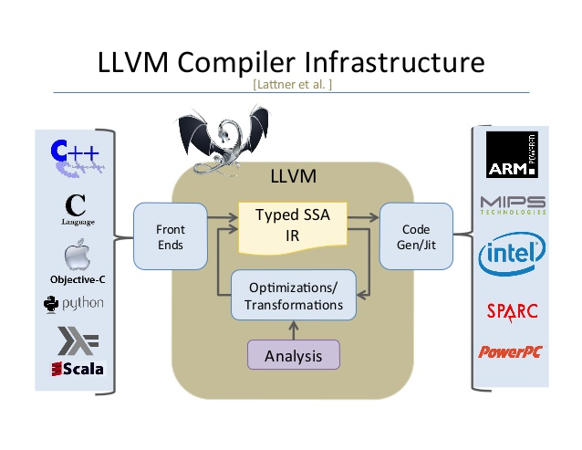

- **Front ends** — one per source language. They *translate source → IR*, which "simplifies the job of the rest of the compiler, which doesn't want to deal with the full complexity of (say) C++ source."
- **Optimizer** — **passes** that transform *IR → IR* (usually to optimize).
- **Back ends** — one per target ISA (ARM, x86, SystemZ, …). An **ISA** defines the data types, registers, memory model, addressing modes, and I/O model of a processor family.

> [!figure]+ Figure — IR in the pipeline
> 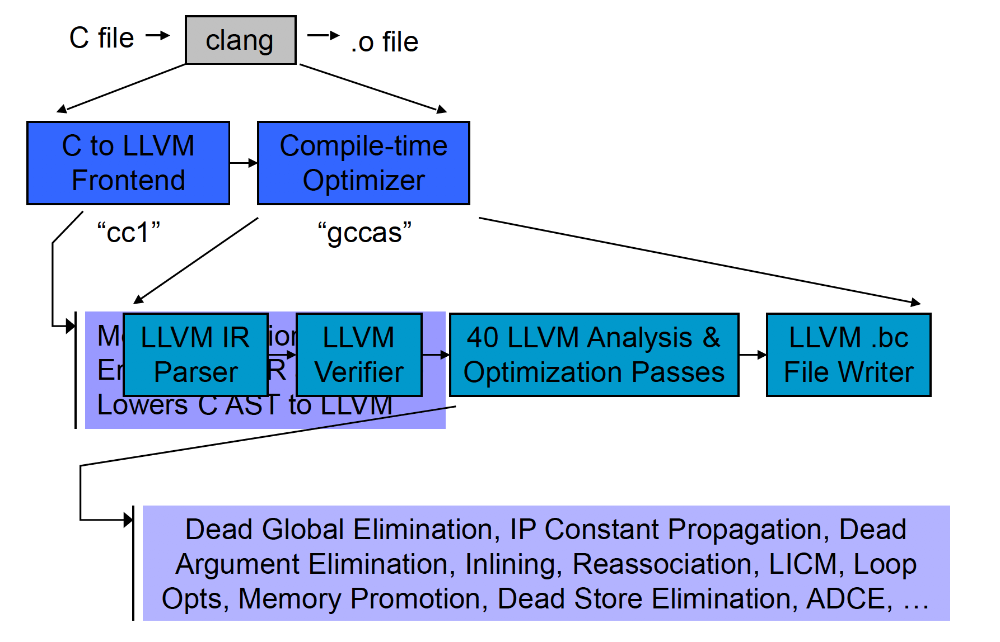

> [!figure]- Figures — IR object model & worked examples (click to expand)
> 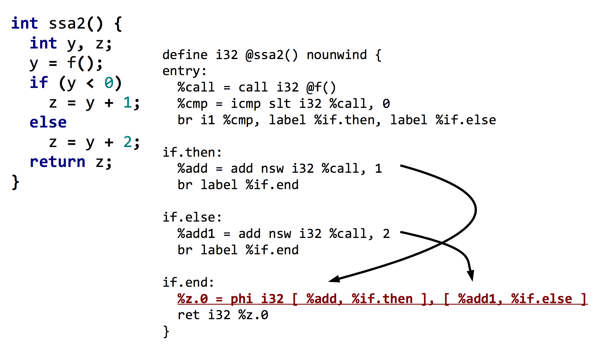
> 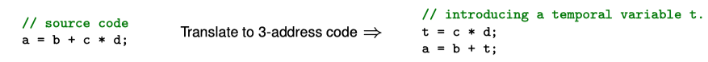
> 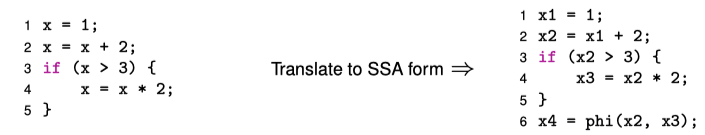
> 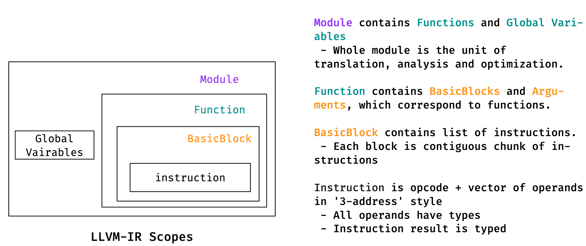
> 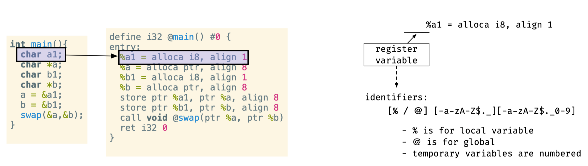
> 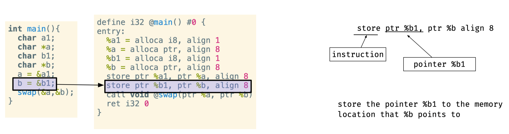
> 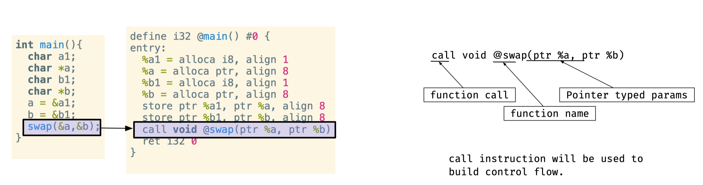
> 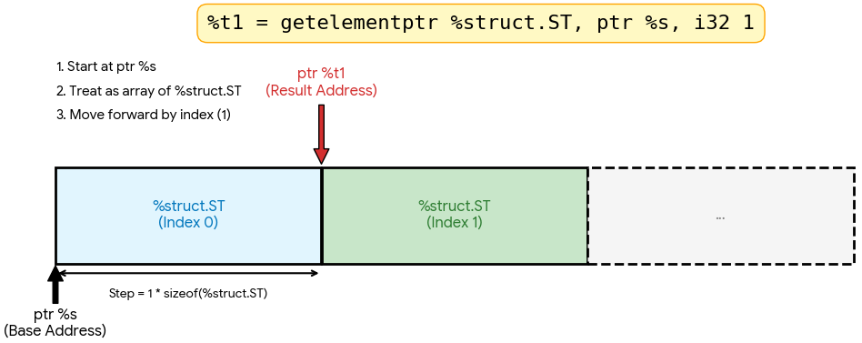
> 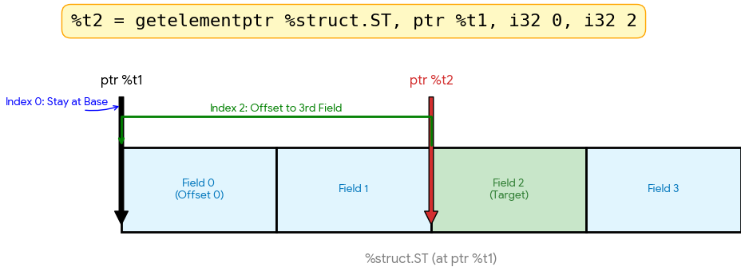
> 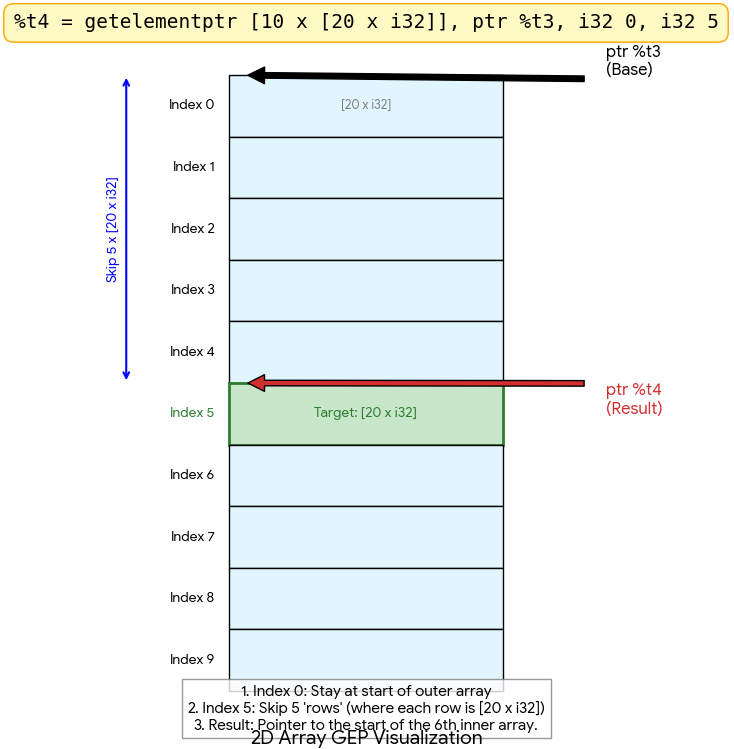

> [!tip] What kind of IR is it?
> A **strongly-typed, RISC-like** instruction set that abstracts the target away:
> - RISC **three-address code**;
> - an **infinite virtual register set** in [[ssa-form|SSA form]];
> - simple low-level **control flow** constructs;
> - **load/store** with opaque pointers (no implicit memory access — see [[getelementptr]]);
> - things like calling conventions are explicit via `call`/`ret` with explicit arguments.

> [!info] Three equivalent forms of the same IR
> | Form | Use |
> |---|---|
> | human-readable **assembly** (`.ll`) | reading/writing by hand |
> | in-memory | what front ends build |
> | dense **bitcode** (`.bc`) | serialization |

---

### 4. LLVM IR

> [!note] Well-formedness
> A construct is **well-formed** if it conforms to both the *grammar* and the *semantic rules* of the language — analogous to a well-formed expression in a language standard.

**Syntax — identifiers.** Two namespaces:

- ==Global== identifiers (functions, global variables) start with `@`.
- ==Local== identifiers (registers, types) start with `%`.
- Every global and local register is **assigned exactly once** (SSA).
- The identifier regex is `[%@][-a-zA-Z$._][-a-zA-Z$._0-9]*`.

> [!example] Named, unnamed, constants
> - **Named values:** `%foo`, `@DivisionByZero`.
> - **Unnamed values:** `%12`, `@2` — created when a result isn't given a name; numbered by a per-function counter from 0 (basic blocks and unnamed params are included in the numbering).
> - **Constants:** booleans `true`/`false` (`i1`); integer; floating-point; **null pointer** `null`; token `none`.
> - Comments run from `;` to end of line.

**Components — the object model** (top → bottom):

> [!note]- Module / Global variable / Function / BasicBlock / Instruction (expand)
> - **Module** — represents a source file (roughly) or a translation unit (pedantically). The top-level container: a list of globals, functions, dependencies, a symbol table, and target data. *Everything else lives in a Module.*
> - **Global variable** — a region of memory allocated at **compile time** (not run time); must be initialized; has [linkage](https://llvm.org/docs/LangRef.html#linkage) controlling cross-TU visibility.
> - **Function** — a named chunk of executable code (C++ functions *and* methods → LLVM Functions). Has a **calling convention** (how params/returns are passed): `ccc` (C convention, OS-dependent), `fastcc` (as fast as possible, e.g. params in registers). Also has linkage.
> - **BasicBlock** — a contiguous, single-entry/single-exit chunk of instructions (the CFG node).
> - **Instruction** — a single operation, abstraction roughly RISC machine code (integer add, FP divide, store…). e.g. `alloca` (stack-allocate), `store` (write through a pointer), `call` (pass args into a callee).

> [!info] Special: inline assembly, and "User / Use"
> - **Inline assembly** — embed target ASM inside IR; modeled as `InlineAsm` Values used as the callee of a `call`. Unique like constants.
> - **Use vs. User** — a ==use== is an operand that consumes a value; a ==user== is the instruction (top-level operator) that holds the operand. (This is the data structure behind def-use chains — see [[ssa-form]].)

---

### 5. Core classes (Type, Value, Use)

> [!note] The class hierarchy
> - **Type** — defines the type of a value instance.
> - **Value** — base of *everything computed* that can be an operand. Each `Value` keeps a **use list** (who uses me) — LLVM's built-in def-use chain.
> - In LLVM, ==almost everything is a `Value`==: `Argument`, `BasicBlock`, `InlineAsm`, `MetadataAsValue`, and `User` all derive from it. (`User` = a Value that *has* operands.)

> [!tip] Why this matters
> Because every definition keeps its use list, transforms can do `replaceAllUsesWith()` and walk def-use chains in $O(\#uses)$ without re-running data-flow analysis — the engine behind GVN, LICM, instcombine, and friends.

---

### 6. Instructions

- **Arithmetic** — `add`, `sub`, `mul`, `fdiv`, … on typed operands.
- **Memory** — `load`, `store`, and **address computation** via `getelementptr`:

> [!tip] Pointer arithmetic = `getelementptr` (full deep dive: [[getelementptr]])
> ```llvm
> <result> = getelementptr <ty>, ptr <ptrval>{, <ty> <idx>}*
> <result> = getelementptr inbounds <ty>, ptr <ptrval>{, <ty> <idx>}*
> ```
> Informally, $\text{Ptr}_{new} = \text{Ptr}_{base} + \sum_i \text{idx}_i \cdot \text{stride}(\text{ty}_i)$, where a struct field contributes its `offsetof` and an array index contributes `idx · sizeof(elem)`.
> - The **first index steps the pointer**; later indices step into aggregates.
> - **`inbounds`** does *not* promise the access is in range; it promises the pointer won't reach *another* allocated object — out-of-bounds yields `poison`. Its payoff is better [[pointer-alias-analysis|alias analysis]].
> - GEP **never accesses memory**. → See [[getelementptr]] for the full treatment (the extra `0`, trailing/leading zeros, examples).

> [!info] Looking ahead
> Memory-aware optimizations rely on **link-time** and pointer reasoning — e.g. **Data-Structure Analysis (DSA)**, covered in [[pointer-alias-analysis]].

> [!quote] Sources
> - [LLVM Language Reference](https://llvm.org/docs/LangRef.html) — identifiers, types, linkage, calling conventions, instructions.
> - [The Often Misunderstood GEP Instruction](https://llvm.org/docs/GetElementPtr.html) → [[getelementptr]].
