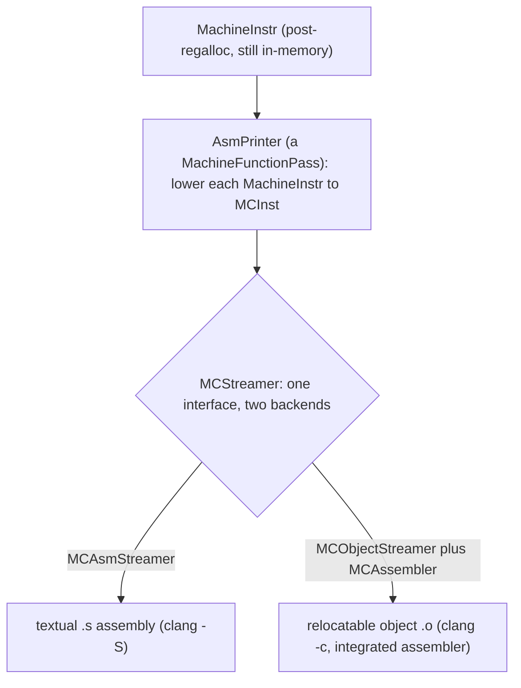

# The MC Layer (MCInst, MCStreamer, object emission)

> 🧭 **Concept** · `concept · codegen · llvm` · Index [[LLVM.MOC]]
> **Prerequisites:** [[code-generation-overview]], [[instruction-selection]] · **Related:** [[register-allocation]], [[debug-info]]

> [!abstract] Chapter map
> The **bottom of the backend** — the "assembler as a library." After [[register-allocation]], the machine code is still `MachineInstr`; the MC layer (`llvm/lib/MC`) lowers it to **`MCInst`** (*"a single low-level machine instruction"*) and streams it through an **`MCStreamer`**, whose interface is *"very similar to the level that an assembler `.s` file provides."* The design's payoff: one `MCStreamer` interface has **two implementations** — one prints textual assembly, one writes an **object file directly**. That is why `clang -S` and `clang -c` share a code path and why LLVM needs no external `as` (the **integrated assembler**). This is the last stop before bytes on disk, and the layer that also powers `llvm-mc`, the disassembler, and relocation handling.

---

## 1. Definition

> [!note] Definition
> The **MC layer** is LLVM's assembler/disassembler infrastructure: the representation (`MCInst`) and the streaming API (`MCStreamer`) that turn post-register-allocation machine code into either **assembly text** or a **relocatable object file**.

It sits *below* the parts covered in [[code-generation-overview]] (ISel → scheduling → regalloc) — those produce `MachineInstr`; MC turns `MachineInstr` into an artifact.

## 2. Where it runs — the last lowering



The **`AsmPrinter`** is the bridge: a `MachineFunctionPass` that holds *"the `MCStreamer` object for the file we are generating"* and lowers each `MachineInstr` to an `MCInst` fed to that streamer.

## 3. The one-interface-two-outputs design

This is the idea worth remembering. `MCStreamer` is *"the streaming machine code generation interface … multiple implementations of this interface"*:

> [!info] MCStreamer implementations (confirmed, pinned LLVM [[llvm-version]])
>
> | Implementation | Output | Driven by |
> |---|---|---|
> | `MCAsmStreamer` | textual `.s` assembly | `clang -S`, `llc` |
> | `MCObjectStreamer` (+ `MCAssembler`) | relocatable object file | `clang -c` (integrated assembler) |

Because emission is *"very similar to the level that an assembler `.s` file provides,"* both paths issue the *same* stream of calls (`emitInstruction`, `emitLabel`, section/directive callbacks); only the backend differs. So there is no separate "run `as`" step — the same in-process API that would have printed `.s` instead writes the object.

## 4. The supporting cast

- **`MCContext`** — *"owns all of the global MC-related objects for the generated translation unit"*: `MCSymbol`, `MCSection`, `MCExpr`.
- **`MCInst`** — the target-independent container for one lowered instruction (opcode + `MCOperand`s).
- **`MCAssembler`** — the integrated assembler proper: computes layout, resolves **fixups**, and turns unresolved references into **relocations**.
- **`MCObjectWriter`** — the per-format writer (ELF / Mach-O / COFF / wasm).

## 5. Worked example

> [!example]+ Same instructions, two MC backends (real Apple clang, arm64)
> ```bash
> clang -S mc.c -o -    # MCAsmStreamer → text:
> #   _add:
> #       add  w0, w8, w9
> #       ret
> clang -c mc.c -o mc.o # MCObjectStreamer → Mach-O object, no external assembler
> ```
> The `add w0, w8, w9` you read in `-S` and the bytes inside `mc.o` came from the **same** `MCInst` stream — `MCAsmStreamer` printed it, `MCObjectStreamer` encoded it. (`llvm-mc` exposes this layer standalone for round-tripping asm ↔ object, and the reverse path — bytes → `MCInst` — is the disassembler.)

## 6. Where it's used

Every object file LLVM produces; the integrated assembler (default in Clang) that removes the dependency on a system `as`; standalone `llvm-mc`; the disassembler (`llvm-objdump`); and inline-asm assembly. [[debug-info|Debug info]] emission (DWARF) is written *through* this layer, as extra sections on the same `MCStreamer`.

## 7. Limitations & notes

> [!warning] What lives here (and what bites)
> - **Encoding is target law.** Each target supplies its `MCCodeEmitter` and relocation rules; a wrong fixup is a silent bad object, not a compile error.
> - **It is not optimization.** MC is faithful lowering + encoding; the last optimizations happened at the `MachineInstr` level ([[code-generation-overview]]).
> - **Object-format sprawl.** ELF/Mach-O/COFF/wasm each need their own `MCObjectWriter` and section/relocation conventions.

> [!summary] The one thing to remember
> The MC layer is LLVM's **assembler-as-a-library**: `AsmPrinter` lowers `MachineInstr` → **`MCInst`**, and a single **`MCStreamer`** interface either **prints `.s`** (`MCAsmStreamer`) or **writes an object** (`MCObjectStreamer` + `MCAssembler`). One code path, two artifacts — which is why `clang -S`/`-c` agree and LLVM needs no external assembler.

> [!quote] Sources & confidence
> **Verified 2026-07-20** — every falsifiable claim in this note was enumerated and checked against the pinned LLVM source ([[llvm-version]], `llvmorg-22.1.8`) by the `note-correctness-review` pass; refuted claims were corrected (batch error rate 8.6%, 23/269). GitHub links track `main`; the checked revision is the pinned tag.
> - [llvm/include/llvm/MC/MCStreamer.h](https://github.com/llvm/llvm-project/blob/main/llvm/include/llvm/MC/MCStreamer.h) — *"Streaming machine code generation interface … very similar to the level that an assembler `.s` file provides … multiple implementations."*
> - [llvm/include/llvm/MC/MCInst.h](https://github.com/llvm/llvm-project/blob/main/llvm/include/llvm/MC/MCInst.h) — *"a single low-level machine instruction";* [`MCObjectStreamer.h`](https://github.com/llvm/llvm-project/blob/main/llvm/include/llvm/MC/MCObjectStreamer.h); [`MCContext.h`](https://github.com/llvm/llvm-project/blob/main/llvm/include/llvm/MC/MCContext.h) — owns MC objects.
> - [llvm/include/llvm/CodeGen/AsmPrinter.h](https://github.com/llvm/llvm-project/blob/main/llvm/include/llvm/CodeGen/AsmPrinter.h) — a `MachineFunctionPass` holding *"the `MCStreamer` object for the file we are generating."*
> - Example output produced locally with **Apple clang 17** (Apple's own versioning — *not* an upstream LLVM release number, and not the pinned tag; assembly syntax is target/OS-specific — see [[llvm-version]]). The MC design is version-stable.
> - [LLVM — Code Generator, The MC Layer](https://llvm.org/docs/CodeGenerator.html) — primary doc.
