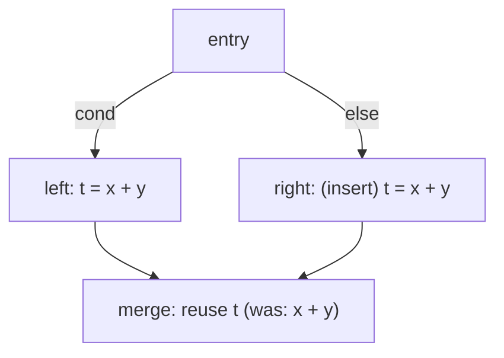

# Partial-Redundancy Elimination (PRE)

> 🧭 **Concept** · `concept · optimization · general+llvm` · Index [[LLVM.MOC]] · see also [[dragon-book-ch9.MOC|Dragon Ch.9]]
> **Prerequisites:** [[value-numbering]], [[data-flow-analysis]] · **In LLVM:** [[llvm-gvn|the GVN pass]]

> [!abstract] Chapter map
> A computation is **partially redundant** if it is already available on *some* paths to a point but not all. PRE makes it **fully** redundant by inserting it on the missing paths, then deletes the now-redundant copy — effectively hoisting each computation to its earliest profitable point (lazy code motion). LLVM realizes this mainly as **load PRE** inside its `GVN` pass.

---

## 1. The idea

> [!note] Partial vs. full redundancy
> *Fully* redundant: the value is already computed on **every** path to the use (plain CSE/GVN removes it). *Partially* redundant: computed on **some** paths only. PRE **inserts** the computation on the paths that lack it, turning partial into full redundancy, then removes the redundant evaluation.

**Figure — `x+y` is computed on the left path and again at the merge (partial redundancy).** Inserting `x+y` on the right path makes it available on *all* predecessors of the merge, so the merge's computation becomes fully redundant and is replaced by a reuse.

This is **lazy code motion** (Knoop–Rüthing–Steffen): place each computation as late as possible while still removing the redundancy, which also avoids lengthening any path.

## 2. In LLVM — load PRE inside GVN

> [!info] What LLVM actually does
> LLVM's **`GVN`** pass (engineering detail: [[llvm-gvn]]) performs PRE primarily for **loads** ("load PRE"). Using **memory-dependence analysis** (`MemoryDependenceResults`), when a loaded value is available on some predecessors of a block but not all, GVN **inserts the load on the missing edge** to make it fully available, then eliminates the redundant load.
> - It is **guarded**: GVN will not insert a load on a path where it didn't already occur (no new faults), and it **won't grow code** — so e.g. **critical edges block load PRE** unless they can be split safely.
> - Scalar PRE in GVN is more limited; the full value-based **GVN-PRE** algorithm (VanDrunen–Hosking) is **not implemented in upstream LLVM** (it was only prototyped externally, never merged).

## 3. Why it matters

PRE removes redundancies that plain [[value-numbering|GVN/CSE]] can't — especially **loads hoisted out of the common path** and computations partially redundant across `if`/loop structure — without ever adding work to a path that didn't have it. It pairs with **memory-dependence analysis** (`MemoryDependenceResults` — what default GVN uses to find an available load) and alias analysis (to know it isn't clobbered); MemorySSA-based GVN is opt-in (it's what `NewGVN` uses).

> [!summary] The one thing to remember
> PRE = "make a partially-redundant computation fully redundant by inserting it on the missing paths, then delete it." In LLVM this is mostly **load PRE in the GVN pass**, carefully guarded so it never adds a fault or grows code; full value-based GVN-PRE is not implemented in upstream LLVM.

> [!quote] Further reading
> - **Also in:** Muchnick *Advanced Compiler Design & Impl.* §13.3 — partial-redundancy elimination (the canonical algorithmic treatment).
> - **Source:** [`Transforms/Scalar/GVN.cpp`](https://github.com/llvm/llvm-project/blob/main/llvm/lib/Transforms/Scalar/GVN.cpp) (load PRE)
> - **Dragon Book §9.5** — partial-redundancy elimination (and lazy code motion).
> - [Introduction to load elimination in GVN — LLVM Project Blog (2009)](https://blog.llvm.org/2009/12/introduction-to-load-elimination-in-gvn.html); Knoop, Rüthing, Steffen — *Lazy Code Motion*.
