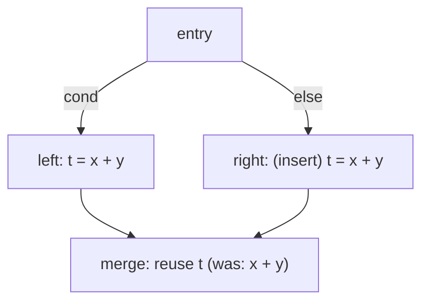
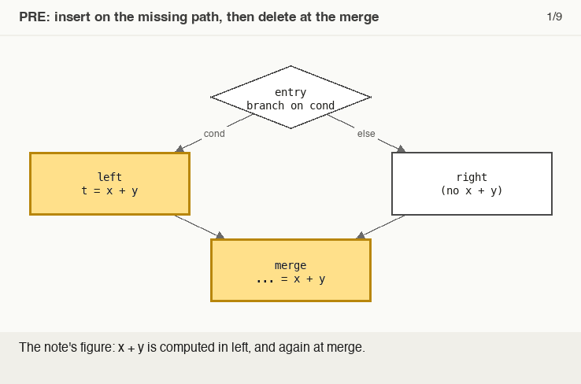

# Partial-Redundancy Elimination (PRE)

> 🧭 **Concept** · `concept · optimization · general+llvm` · Index [[LLVM.MOC]] · see also [[dragon-book-ch9.MOC|Dragon Ch.9]]
> **Prerequisites:** [[value-numbering]], [[data-flow-analysis]] · **In LLVM:** [[llvm-gvn|the GVN pass]]

> [!abstract] Chapter map
> A computation is **partially redundant** if it is already available on *some* paths to a point but not all. PRE makes it **fully** redundant by inserting it on the missing paths, then deletes the now-redundant copy — effectively hoisting each computation to its earliest profitable point (lazy code motion). LLVM realizes this mainly as **load PRE** inside its `GVN` pass.

---

## 1. The idea

> [!note] Partial vs. full redundancy
> *Fully* redundant — available on **every** path to the use ⇒ plain CSE/GVN deletes it. *Partially* redundant — on **some** paths only ⇒ PRE's job (figure below).

**Figure — inserting `x+y` on the right path ⇒ the merge's copy is now *fully* redundant ⇒ replaced by reuse of `t`.**


```mermaid
flowchart TD
  E["entry"] -->|cond| L["left: t = x + y"]
  E -->|else| R["right: (insert) t = x + y"]
  L --> M["merge: reuse t   (was: x + y)"]
  R --> M
```

This is **lazy code motion** (Knoop–Rüthing–Steffen): place each computation as late as possible while still removing the redundancy, which also avoids lengthening any path.

> [!figure]+ Animation — insert, then delete
> 
> PRE walks each path into the merge, finds `x + y` available on the left but missing on the right, inserts it there, then deletes the merge's now fully-redundant recomputation — no path ends up computing `x + y` twice. (Regenerate: `_meta/anim/storyboards/partial-redundancy-elimination-insert-then-delete.json`.)

## 2. In LLVM — load PRE inside GVN

> [!info] What LLVM actually does
> LLVM's **`GVN`** pass (engineering detail: [[llvm-gvn]]) performs PRE primarily for **loads** ("load PRE"). Using **memory-dependence analysis** (`MemoryDependenceResults`), when a loaded value is available on some predecessors of a block but not all, GVN **inserts the load on the missing edge** to make it fully available, then eliminates the redundant load.
> - It is **guarded**: GVN will not insert a load on a path where it didn't already occur (no new faults), and it **won't grow code** — so e.g. **critical edges block load PRE** unless they can be split safely.
> - Scalar PRE in GVN is more limited; the full value-based **GVN-PRE** algorithm (VanDrunen–Hosking) is **not implemented in upstream LLVM** (it was only prototyped externally, never merged).

> [!example]- See load PRE fire (click to expand)
> The upstream regression test [`Transforms/GVN/PRE/pre-load.ll`](https://github.com/llvm/llvm-project/blob/llvmorg-22.1.8/llvm/test/Transforms/GVN/PRE/pre-load.ll) (`test1`) is exactly the diamond above with loads:
> ```llvm
> define i32 @test1(ptr %p, i1 %C) {
> block1:
>   br i1 %C, label %block2, label %block3
> block2:
>   br label %block4          ; no load on this path
> block3:
>   store i32 0, ptr %p       ; the value of %p is known here
>   br label %block4
> block4:
>   %PRE = load i32, ptr %p   ; partially redundant
>   ret i32 %PRE
> }
> ```
> `opt -passes=gvn -S pre-load.ll` ⇒ a `%PRE.pre = load …` appears in `block2` (the path that lacked it) and `block4`'s load becomes `phi i32 [ 0, %block3 ], [ %PRE.pre, %block2 ]` — insert on the missing edge, then reuse.

## 3. Why it matters

PRE removes redundancies that plain [[value-numbering|GVN/CSE]] can't — especially **loads hoisted out of the common path** and computations partially redundant across `if`/loop structure — without ever adding work to a path that didn't have it. Alias analysis tells GVN the load isn't clobbered; the opt-in `NewGVN` uses MemorySSA instead of `MemoryDependenceResults`.

> [!summary] The one thing to remember
> PRE = "make a partially-redundant computation fully redundant by inserting it on the missing paths, then delete it." In LLVM this is mostly **load PRE in the GVN pass**, carefully guarded so it never adds a fault or grows code; full value-based GVN-PRE is not implemented in upstream LLVM.

> [!quote] Further reading
> - **Also in:** Muchnick *Advanced Compiler Design & Impl.* §13.3 — partial-redundancy elimination (the canonical algorithmic treatment).
> - **Source:** [`Transforms/Scalar/GVN.cpp`](https://github.com/llvm/llvm-project/blob/main/llvm/lib/Transforms/Scalar/GVN.cpp) (load PRE)
> - **Dragon Book §9.5** — partial-redundancy elimination (and lazy code motion).
> - [Introduction to load elimination in GVN — LLVM Project Blog (2009)](https://blog.llvm.org/2009/12/introduction-to-load-elimination-in-gvn.html); Knoop, Rüthing, Steffen — *Lazy Code Motion*.
