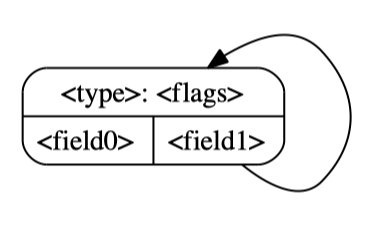
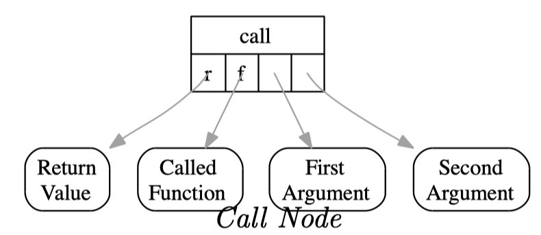
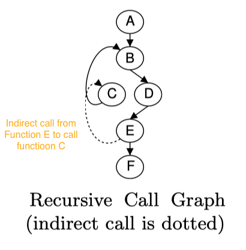
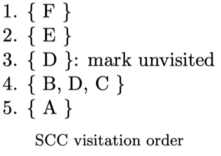

# Pointer / Alias Analysis

> 🧭 **Concept** · `concept · analysis · general+llvm` · Index [[LLVM.MOC]]
> **Prerequisites:** [[llvm-basics]] · **Enables:** [[loop-transformations]], [[value-numbering]], [[memory-ssa]]

> [!abstract] Chapter map
> 1. **What alias/pointer analysis answers** — do two pointers touch the same memory?
> 2. The **three answers** (must / no / may) and the sensitivity knobs (flow / context / field).
> 3. **LLVM's `AliasAnalysis` interface** (the API every memory pass queries).
> 4. **DSA** — a concrete, scalable, unification-based points-to analysis and its graph.

> [!info]+ From classic compiler theory → LLVM
> | Classic concept | LLVM realization |
> |---|---|
> | May/must alias | `AliasResult`: `NoAlias` / `MayAlias` / `PartialAlias` / `MustAlias` |
> | "Does stmt write X?" (gen/kill for memory) | `getModRefInfo` → `Mod` / `Ref` / `ModRef` |
> | Andersen (subset) vs. Steensgaard (unification) | **subset-based** vs. **unification-based** points-to |
> | Points-to graph | **DSA graph** ⟨N, E, V, C⟩ |
> | Allocation-site abstraction | one DSA node ≙ a (possibly infinite) *set* of objects |
>
> Alias analysis is the *enabler* under [[loop-transformations#7. Loop-invariant code motion (LICM)|LICM]], [[value-numbering|GVN]], DSE, and vectorization — they can only move/remove memory ops when AA proves non-interference.

---

### 1. Pointer analysis (or alias analysis)

> [!note] The core question
> Given two pointers, **do they point to the same memory?**
> - Do they *always* point to **different** locations?
> - Do they *always* point to the **same** location?

> [!info] Three possible answers
> | Result | Meaning |
> |---|---|
> | **MustAlias** | always the same location |
> | **NoAlias** | always different memory |
> | **MayAlias** | can't prove either way (very common!) |
>
> Must/No are crisp in many statements, but **MayAlias happens a lot** — and conservative passes must assume the worst when they get it.

> [!example]+ Why `may alias` is unavoidable
> ```c
> bool foo(char *a, char *b) {
>   *a = 'a';
>   *b = 'b';
>   return *a == 'a';
> }
> ```
> The result **depends on whether `a` and `b` alias**: if same location → `false` (the `*b='b'` overwrote it); if different → `true`. With **calling context** the answer may be clear; for *any* context, there's no single answer ⇒ `MayAlias`.

> [!tip] Sensitivity knobs (same vocabulary as general program analysis)
> - **Flow sensitivity** — respect statement order?
> - **Context sensitivity** — distinguish different call sites?
> - **Field sensitivity** — distinguish struct fields?
>
> And two classic algorithm families:
> - **Unification-based** (Steensgaard): pointers that may alias are *merged* into one node — fast, less precise.
> - **Subset-based** (Andersen): models $pts(a) \supseteq pts(b)$ constraints — more precise, costlier.

---

### 2. LLVM alias analysis

> [!info] The `AliasAnalysis` interface (what passes actually call)
> LLVM exposes AA as a **queryable, chained** interface — passes ask, they don't re-derive:
> - `alias(LocA, LocB)` → `NoAlias` / `MayAlias` / `PartialAlias` / `MustAlias`.
> - `getModRefInfo(I, Loc)` → does instruction `I` **Mod**ify / **Ref**erence `Loc`?
> - Providers are chained: `basic-aa`, `tbaa` (type-based, via `!tbaa` [[extending-llvm-ir#5. Metadata|metadata]]), `scev-aa`, `globals-aa`, … each refines the others. ([AliasAnalysis doc](https://llvm.org/docs/AliasAnalysis.html))

#### Data-Structure Analysis (DSA)

> [!note] Definition
> **DSA** is a points-to analysis that also recovers the **data-layout** of data-structure instances. It is **context-sensitive**, **unification-based**, **field-sensitive**, and **flow-insensitive** — designed to be *efficient and scalable*.
> - **Efficient:** flow-insensitivity + unification + a completely non-iterative analysis.
> - **Scalable:** unification keeps the graph **finite**.

> [!warning] Where DSA/Steensgaard actually live (verified against the AliasAnalysis doc)
> In current LLVM the *in-tree* alias analyses are `basic-aa`, `tbaa`, `globals-aa` (globalsmodref), and `scev-aa`. **DSA (`-ds-aa`) and Steensgaard (`-steens-aa`) are NOT part of LLVM core** — they ship in the optional `poolalloc` module. Treat DSA below as the canonical *algorithm* to learn, not an off-the-shelf core pass.

> [!info] What it gives you
> - **Input:** an IR file. **Output:** a **DSA graph** with memory info.
> - Tells *which pointers point to which node*; due to **allocation-site abstraction**, it may not separate distinct objects from the same site (e.g. objects allocated inside a loop).
> - Yields **must-not-alias** facts: if `ptr1` and `ptr2` reach two different nodes, they never alias.

> [!figure]- Figures — DSA graphs (click to expand)
> 
> 
> 
> 

> [!note] The graph ⟨N, E, V, C⟩
> Each **node** represents a (possibly infinite) **set** of memory objects; distinct nodes represent **disjoint** sets.
> *Why a set, not one object?* Because of aliasing, unification may **merge** two nodes into one — which also keeps the graph finite (bounded nodes).

> [!info] Node types, flags, and cells
> **Node** $n \in N$ — a set of memory objects, tagged by origin and state:
>
> | Node type | Flag | Meaning |
> |---|---|---|
> | Heap | `H` | from `malloc` |
> | Stack | `S` | from `alloca` |
> | Global | `G` | global var/function |
> | Unknown | `U` | e.g. pointer from a constant |
> | Incomplete | — | has out-edges to nodes not (yet) in this graph (common for params/returns, since a graph is per-procedure) |
>
> **State flags:** `M` modified · `R` read · `O` collapsed (lost field-sensitivity).
> **Cell** $\langle node, fld\rangle \in C$ — a field/offset within a node; may be pointed-to, and (if it's a pointer) may have **one** outgoing edge.
> **Edge** $e \in E:\ cell \mapsto cell$ — a *may-point-to* relation (a cell may point back to its own node, e.g. a linked list).
> **Variable map** $V:\ Var \mapsto Cell$ — each pointer register maps to the cell it may point to (or NULL); since IR is [[ssa-form]], the map has no conflicts.
> **Call nodes** $C \subseteq N$ — unresolved call sites in the current function.

> [!info] Graph invariants
> - Cells at a node are **disjoint** (no two share an offset). If two nodes point to one cell, they get **merged**.
> - A cell points to **at most one** node.

##### The algorithm — three phases

> [!example]- Helpers: `collapse` and `mergeCells` (unification) — expand
> ```text
> collapse(n)                         # lose field-sensitivity, fold to char[]
>   e = ⟨null, 0⟩
>   for f in fields(T(n)):
>     e = mergeCells(e, E(⟨n,f⟩))     # merge old field target into e
>     remove field f
>   T(n) = char[]                     # reset type info
>   E(⟨n,0⟩) = e                      # single edge from field 0
>   flags(n) ∪= 'O'                   # mark Collapsed
>
> mergeCells(c1=⟨n1,f1⟩, c2=⟨n2,f2⟩)  # unify two cells/nodes, align fields
>   if IncompatibleForMerge(T(n1), T(n2), f1, f2):
>     collapse(n2)
>   union flags(n1)   into flags(n2)
>   union globals(n1) into globals(n2)
>   move in-/out-edges of n1 onto matching fields of n2 (recursively mergeCells)
>   directEdges(n1, n2); destroy n1
>   return ⟨n2,0⟩ if collapsed else ⟨n2,f2⟩
> ```
> **Collapse triggers:** incompatible field types, or compatible types at misaligned offsets (`IncompatibleForMerge`).

> [!info] Local phase — build a per-function graph
> Initialize nodes for the return, virtual registers, and globals; then walk each instruction, creating nodes for allocations and **unifying** cells on loads/stores/field/array/call/cast.

> [!example]- Local phase pseudocode — expand
> ```text
> InitGraph(F)
>   G = empty graph
>   if F returns a pointer-compatible type: varmap(ret) = makeNode(void)
>   for R in virtual registers of F:        varmap(R)   = makeNode(T(R))
>   for X in globals used in F:
>     N = makeNode(T(X)); G(N) ∪= X; flags(N) ∪= 'G'
>   return G
>
> LocalAnalysis(F)
>   G = InitGraph(F)
>   for I in F:
>     match I:
>       X = malloc ...:   varmap(X)=makeNode(void); flags(node(varmap(X))) ∪= 'H'   # heap
>       X = alloca ...:   varmap(X)=makeNode(void); flags(node(varmap(X))) ∪= 'S'   # stack
>       X = *Y:           mergeCells(varmap(X), varmap(varmap(Y))); flags(...) ∪= 'R' # load
>       *Y = X:           mergeCells(varmap(varmap(X)), varmap(varmap(Y))); flags(...) ∪= 'M' # store
>       X = &Y->Z:        ⟨n,f⟩ = updateType(varmap(Y), typeof(*Y))
>                         f' = 0 if n collapsed else field(field(n,f), Z)
>                         mergeCells(varmap(X), ⟨n,f'⟩)
>       X = &Y[idx]:      ⟨n,f⟩ = updateType(varmap(Y), typeof(*Y)); mergeCells(varmap(X), ⟨n,f⟩)
>       return X:         mergeCells(varmap(ret), varmap(X))
>       X = (cast) Y:     mergeCells(varmap(X), varmap(Y))           # value-preserving cast
>       X = Y(Z1..Zn):    c = new callnode; C ∪= c                   # call site
>                         mergeCells(varmap(X), c[1]); mergeCells(varmap(Y), c[2])
>                         for i in 1..n: mergeCells(varmap(Zi), c[i+2])
>       default X = Y op Z:                                          # everything else
>                         mergeCells(varmap(X), varmap(Y)); mergeCells(varmap(X), varmap(Z))
>                         flags(node(varmap(X))) ∪= 'U'; collapse(node(varmap(X)))
>   MarkCompleteNodes()
> ```
> After Local, the graph has **no caller/callee info** — arguments and return are left incomplete.

> [!warning] Why context-sensitivity costs
> Full context-sensitivity is potentially **exponential** (a node with $n$ out-edges whose targets each have $n$ out-edges…). DSA controls this by only **cloning arguments/parameters and return/pass values** during the two interprocedural phases.

> [!info] Interprocedural phases — Bottom-Up then Top-Down
> - **Bottom-Up (BU):** clone the *callee* graph into the *caller* and merge formals↔actuals + returns — removes incompleteness for the **caller**.
> - **Top-Down (TD):** clone the *caller* graph into the *callee* — removes incompleteness for the **callee**.
> - Both operate over **SCCs of the [[call-graph]]** (recursion handled per strongly-connected component).

> [!example]- Call-resolution pseudocode — expand
> ```text
> resolveRetArgs(G_callee, F_callee, CS)
>   mergeCells(target of CS.return, target of return of F_callee)
>   for i in 1..min(NumFormals(F_callee), NumActualArgs(CS)):
>     mergeCells(target of actual arg i at CS, target of formal i of F_callee)
>
> cloneGraphInto(G_src, G_dst)        # clone G_src into G_dst, merging globals
>   G' = copy of G_src
>   add nodes/edges of G' to G_dst
>   for node N in G':
>     for global g in G(N): merge N with the node holding g in G_dst
>
> resolveCallee(G_caller, G_callee, F_callee, CS):   # BU
>   cloneGraphInto(G_callee, G_caller); clear 'S' on cloned nodes
>   resolveRetArgs(G_caller, F_callee, CS)
>
> resolveCaller(G_callee, G_caller, F_callee, CS):   # TD
>   cloneGraphInto(G_caller, G_callee)
>   resolveRetArgs(G_callee, F_callee, CS)
> ```

> [!quote] Sources
> - **Also in:** Muchnick *Advanced Compiler Design & Impl.* §10 — alias analysis.
> - [LLVM Alias Analysis Infrastructure](https://llvm.org/docs/AliasAnalysis.html) — `alias`, `getModRefInfo`, chained AA.
> - DSA: Lattner & Adve, *Data Structure Analysis* (and SeaDSA for the array-collapse refinement).
