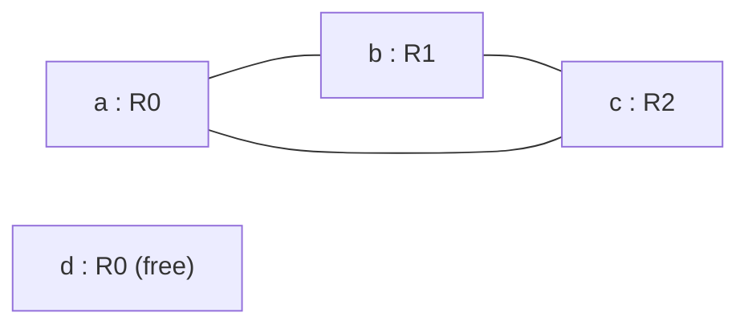

# Register Allocation

> 🧭 **Concept** · `concept · codegen · general+llvm` · Index [[LLVM.MOC]] · see also [[dragon-book-ch8.MOC|Dragon Ch.8]]
> **Prerequisites:** [[code-generation-overview]] · **Liveness from:** [[data-flow-analysis]] · **Pairs with:** [[instruction-selection]]

> [!abstract] Chapter map
> After instruction selection, MIR still uses **infinitely many virtual registers**; register allocation maps them onto the target's **finite** physical registers, **spilling** to the stack when they don't fit. The textbook method is graph coloring — but LLVM's production allocator is *not* a graph colorer, and the difference is worth knowing.

> [!info] What it needs first: live ranges
> A virtual register's **live range** is the set of program points where its value may still be used — computed by **liveness**, a backward "may" [[data-flow-analysis|dataflow analysis]] over the [[control-flow-graph|CFG]] (`LiveVariables` → `LiveIntervals`). Two ranges **interfere** if they are live at the same point and so cannot share a physical register.

---

## 1. The textbook method — graph coloring

Build an **interference graph**: one node per live range, an edge between ranges that interfere. Assigning $k$ physical registers = finding a **$k$-coloring** (adjacent nodes get different colors). If no $k$-coloring exists, **spill** a node (store/reload it from memory) and retry.

**Figure — interference graph for a 3-way clash plus an independent value.** `a, b, c` are mutually live (a triangle ⇒ needs 3 registers); `d` interferes with none, so it reuses `R0`.

This is the classic **Chaitin–Briggs** graph-coloring approach: build → try to color → spill → repeat.

## 2. What LLVM actually does (and doesn't)

> [!warning] LLVM's default allocator is **not** classic graph coloring
> LLVM works on **`LiveIntervals`** (live ranges as sets of slot-indexed segments), not an explicit interference graph + coloring. Its allocators:
>
> | Allocator | When | Idea |
> |---|---|---|
> | **Fast** (`RegAllocFast`) | `-O0` | local, per-block, greedy — fastest, lowest quality |
> | **Basic** (`RegAllocBasic`) | reference/baseline | priority-ordered; spills whole live intervals (no splitting) |
> | **Greedy** (`RegAllocGreedy`) | **default at `-O1+`** | global; **live-range splitting + eviction** guided by spill-weight cost, not coloring |
> | **PBQP** (`RegAllocPBQP`) | opt-in | models allocation as a Partitioned Boolean Quadratic Problem (graph-based, constraint solver) |

**Greedy**, the one you actually get, treats allocation as a priority queue of intervals: assign the highest-priority interval a free register; if none is free, either **evict** a lower-spill-weight interval (re-queue it) or **split** the interval at block boundaries so part of it stays in a register and part spills. Splitting (instead of spilling a whole value) is the key win over textbook coloring.

> [!info] Why LLVM skips coloring, and how Greedy refines
> Greedy never builds a full interference graph — it checks interference with **live-interval unions** (a B+ tree per physical register) plus a priority queue. It allocates **large live ranges first** (so small ranges slot into the gaps), then reaches a fixpoint by **gradual refinement**: split a range around a hot loop → its spill weight rises → it can **evict** a colder range → that range is re-queued and itself split… A range is spilled only when splitting won't help. LLVM chose this over Chaitin-style coloring because the interference graph is expensive and **spill/split placement matters more than optimal coloring**. *(Source: the LLVM blog post in Further reading — by the allocator's author.)*

## 3. Around allocation: φ-elimination, two-address, coalescing

> [!info] The pipeline neighbors
> - **PHIElimination** runs *before* regalloc: `phi` nodes become **copies** on the incoming edges (MIR leaves SSA here — see [[ssa-form]]).
> - **TwoAddressInstruction** rewrites three-address ops into the target's two-address form where needed.
> - **Coalescing** then removes redundant copies by merging non-interfering live ranges (the copies φ-elimination introduced are prime targets).

## 4. Spilling

When a value can't stay in a register, it's **spilled**: a stack slot is allocated and `store`/`reload` (`load`) instructions are inserted around its uses. Spill cost (estimated dynamic frequency) is the **spill weight** that Greedy minimizes when choosing what to evict or split.

> [!summary] The one thing to remember
> Register allocation = pack ∞ virtual registers into finite physical ones, spilling the rest. Graph coloring is the textbook framing; **LLVM's default `Greedy` allocator instead splits and evicts live intervals by spill-weight** — same problem, a more incremental solution.

> [!quote] Further reading
> - **Source:** [`CodeGen/RegAllocGreedy.cpp`](https://github.com/llvm/llvm-project/blob/main/llvm/lib/CodeGen/RegAllocGreedy.cpp) (+ `RegAllocBasic/Fast/PBQP.cpp`, `LiveIntervals`)
> - **Dragon Book §8.8** — register allocation and assignment via graph coloring.
> - **Greedy Register Allocation in LLVM 3.0** — J. Stoklund Olesen, LLVM Project Blog (2011): the canonical account of why LLVM uses splitting + eviction over `LiveIntervals` rather than coloring. ↗ https://blog.llvm.org/2011/09/greedy-register-allocation-in-llvm-30.html
> - [LLVM CodeGenerator — register allocation](https://llvm.org/docs/CodeGenerator.html); `RegAllocGreedy.cpp`, `LiveIntervals`.
