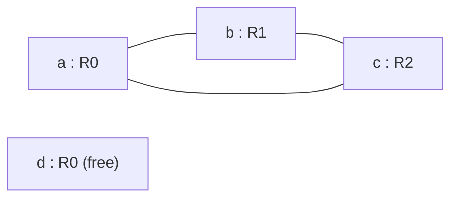
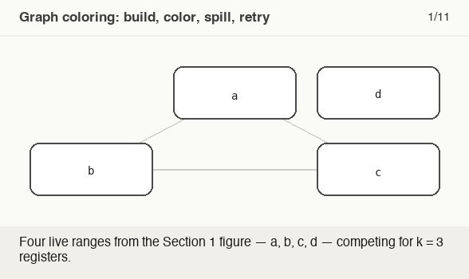

# Register Allocation

> 🧭 **Concept** · `concept · codegen · general+llvm` · Index [[LLVM.MOC]] · see also [[dragon-book-ch8.MOC|Dragon Ch.8]]
> **Prerequisites:** [[code-generation-overview]] · **Liveness from:** [[data-flow-analysis]] · **Pairs with:** [[instruction-selection]]

> [!abstract] Chapter map
> After instruction selection, the code is **MIR** (LLVM's machine-level IR) and still uses **infinitely many virtual registers**; register allocation maps them onto the target's **finite** physical registers, **spilling** to the stack when they don't fit. The textbook method is graph coloring — but LLVM's production allocator is *not* a graph colorer, and the difference is worth knowing.

> [!info] What it needs first: live ranges
> A virtual register's **live range** is the set of program points where its value may still be used — computed by **liveness**, a backward "may" [[data-flow-analysis|dataflow analysis]] over the [[control-flow-graph|CFG]] (`LiveVariables` → `LiveIntervals`). Two ranges **interfere** if they are live at the same point and so cannot share a physical register.

---

## 1. The textbook method — graph coloring

Build an **interference graph**: one node per live range, an edge between ranges that interfere. Assigning $k$ physical registers = finding a **$k$-coloring** (adjacent nodes get different colors). If no $k$-coloring exists, **spill** a node (store/reload it from memory) and retry.

> [!question] Predict first
> Four values: `a`, `b`, `c` are all live at the same time; `d` overlaps none of them. What is the *minimum* number of physical registers this code needs — and which value can share a register with another? Check yourself against the figure.

**Figure — interference graph for a 3-way clash plus an independent value.** `a, b, c` are mutually live (a triangle ⇒ needs 3 registers); `d` interferes with none, so it reuses `R0`.


```mermaid
graph LR
  a["a : R0"] --- b["b : R1"]
  b --- c["c : R2"]
  c --- a
  d["d : R0 (free)"]
```

This is the classic **Chaitin–Briggs** graph-coloring approach: build → try to color → spill → repeat.

> [!figure]+ Animation — build, color, spill, retry on this graph
> 
> Chaitin–Briggs on the figure's graph: the `a–b–c` triangle forces three registers while `d` reuses `R0`; a rewind with only `k = 2` registers shows the spill-and-retry loop — which LLVM's Greedy allocator replaces with live-range splitting and eviction (§2). (Regenerate: `_meta/anim/storyboards/register-allocation-coloring-spill.json`.)

## 2. What LLVM actually does (and doesn't)

> [!warning] LLVM's default allocator is **not** classic graph coloring
> LLVM works on **`LiveIntervals`** (live ranges as sets of slot-indexed segments), not an explicit interference graph + coloring. Its allocators:
>
> | Allocator | When | Idea |
> |---|---|---|
> | **Fast** (`RegAllocFast`) | `-O0` | local, per-block, greedy — fastest, lowest quality |
> | **Basic** (`RegAllocBasic`) | reference/baseline | priority-ordered; spills whole live intervals (no splitting) |
> | **Greedy** (`RegAllocGreedy`) | **default at `-O1+`** | global; **live-range splitting + eviction** guided by spill-weight cost, not coloring |
> | **PBQP** (`RegAllocPBQP`) | opt-in | models allocation as a Partitioned Boolean Quadratic Problem (graph-based, constraint solver) |

**Greedy**, the one you actually get, treats allocation as a priority queue of intervals: assign the highest-priority interval a free register; if none is free, either **evict** a lower-spill-weight interval (re-queue it) — *spill weight* ≈ the estimated runtime cost of keeping that value in memory, defined in §4 — or **split** the interval at block boundaries so part of it stays in a register and part spills. Splitting (instead of spilling a whole value) is the key win over textbook coloring.

> [!info] Why LLVM skips coloring, and how Greedy refines
> Greedy never builds a full interference graph — it checks interference with **live-interval unions** (a B+ tree per physical register) plus a priority queue. It allocates **large live ranges first** (so small ranges slot into the gaps), then reaches a fixpoint by **gradual refinement**: split a range around a hot loop → its spill weight rises → it can **evict** a colder range → that range is re-queued and itself split… A range is spilled only when splitting won't help. LLVM chose this over Chaitin-style coloring because the interference graph is expensive and **spill/split placement matters more than optimal coloring**. *(Source: the LLVM blog post in Further reading — by the allocator's author.)*

> [!example] The running example's loop through the allocator (`ext-asm`)
> In [[running-example#3. After mem2reg and loop opts|the running example's loop]], **five** values are live across `for.body`'s back edge: `%a`, `%k`, `%wide.trip.count`, plus the induction variable and the reduction (the φs `%indvars.iv`/`%sum.05` — their incoming values `%indvars.iv.next`/`%add` are coalesced into the same live intervals once PHIElimination's copies are removed). Five overlapping intervals ⇒ needs ≥5 registers, trivially satisfied on AArch64/x86-64 — nothing spills. The real `clang -O1 -S` output ([[running-example#7. Sanctioned extensions|ext-asm]], Apple clang 17, arm64):
>
> ```asm
> LBB0_2:                    ; for.body
>   ldr  w10, [x0], #4       ; w10 = a[i]  — %a lives in x0, post-incremented
>   madd w8, w10, w2, w8     ; w8  = sum   — %sum.05; %k stays put in w2
>   subs x9, x9, #1          ; x9  = down-counter (init: n)
>   b.ne LBB0_2
> ```
>
> Only **four** registers survive the back edge (`x0, w2, w8, x9`): the backend folded `%indvars.iv` into the pointer's post-increment (`[x0], #4`) and turned the `%indvars.iv.next == %wide.trip.count` exit test into a single down-counter (`subs`), fusing two IR intervals into one. `w10` lives only inside the iteration. To watch the allocator actually spill, starve it instead: each AArch64 `reserve-x#` subtarget feature removes that GPR from allocation — `llc -mtriple=aarch64 -mattr=+reserve-x9,+reserve-x10,…`.

## 3. Around allocation: φ-elimination, two-address, coalescing

> [!info] The pipeline neighbors
> - **PHIElimination** runs *before* regalloc: `phi` nodes become **copies** on the incoming edges (MIR leaves SSA here — see [[ssa-form]]).
> - **TwoAddressInstruction** rewrites three-address ops (`c = a op b`) when the target instruction is two-address — the destination doubles as a source, like x86 `add dst, src` computing `dst += src` — by inserting a copy (`c = a`) so the op can overwrite one operand.
> - **Coalescing** then removes redundant copies by merging non-interfering live ranges (the copies φ-elimination introduced are prime targets).

## 4. Spilling

When a value can't stay in a register, it's **spilled**: a stack slot is allocated and `store`/`reload` (`load`) instructions are inserted around its uses. Spill cost (estimated dynamic frequency) is the **spill weight** that Greedy minimizes when choosing what to evict or split.

> [!summary] The one thing to remember
> Register allocation = pack ∞ virtual registers into finite physical ones, spilling the rest. Graph coloring is the textbook framing; **LLVM's default `Greedy` allocator instead splits and evicts live intervals by spill-weight** — same problem, a more incremental solution.

> [!quote] Further reading
> - **Also in:** Muchnick *Advanced Compiler Design & Impl.* §16 — register allocation by graph coloring.
> - **Source:** [`CodeGen/RegAllocGreedy.cpp`](https://github.com/llvm/llvm-project/blob/main/llvm/lib/CodeGen/RegAllocGreedy.cpp) (+ `RegAllocBasic/Fast/PBQP.cpp`, `LiveIntervals`)
> - **Dragon Book §8.8** — register allocation and assignment via graph coloring.
> - **Greedy Register Allocation in LLVM 3.0** — J. Stoklund Olesen, LLVM Project Blog (2011): the canonical account of why LLVM uses splitting + eviction over `LiveIntervals` rather than coloring. ↗ https://blog.llvm.org/2011/09/greedy-register-allocation-in-llvm-30.html
> - [LLVM CodeGenerator — register allocation](https://llvm.org/docs/CodeGenerator.html); `RegAllocGreedy.cpp`, `LiveIntervals`.
