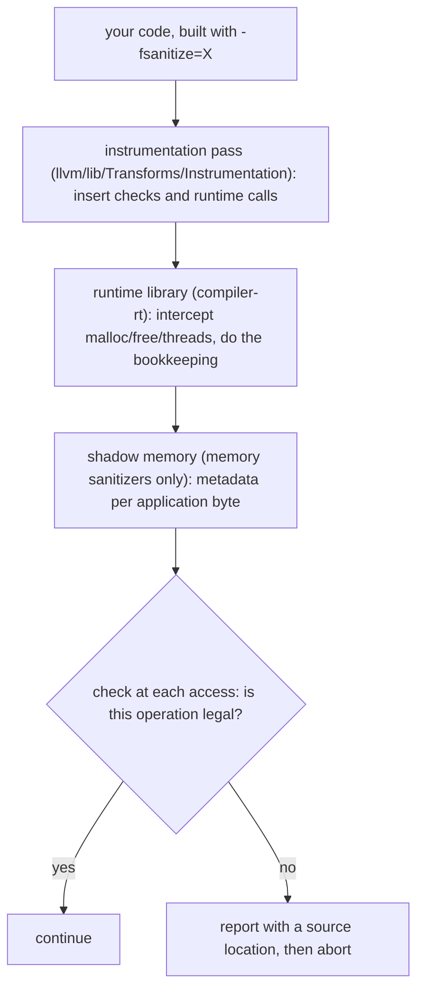

# Sanitizers (compile-time instrumentation + runtime + shadow memory)

> 🧭 **Concept** · `concept · runtime · llvm` · Index [[LLVM.MOC]]
> **Prerequisites:** [[llvm-basics]], [[debug-info]] · **Deep dives:** [[address-sanitizer]], [[thread-sanitizer]], [[memory-sanitizer]] · **Static counterparts:** [[fbounds-safety]], [[safe-buffers]]

> [!abstract] Chapter map
> The **dynamic** half of the memory-safety story. Where [[fbounds-safety]] and [[safe-buffers]] change the language to make bugs *impossible*, and [[clang-static-analyzer|static analysis]] reasons about *all* paths approximately, a **sanitizer** instruments the program at compile time and checks it **as it actually runs** — precise, but only on the paths you execute. LLVM ships a dozen-odd instrumentation passes in `llvm/lib/Transforms/Instrumentation` (ten files named `*Sanitizer*.cpp` at the pinned tag, plus `BoundsChecking.cpp` and `AllocToken.cpp`), and they share a *shape*: **an instrumentation pass** inserts checks and runtime calls, and **a runtime library** (compiler-rt) does the bookkeeping. The **memory** sanitizers additionally maintain **shadow memory** describing every application byte — but that is not universal: `RealtimeSanitizer` and `SanitizerCoverage` have no shadow at all, and `NumericalStabilitySanitizer` shadows floating-point *values* rather than bytes. Where a sanitizer does use shadow, the interesting variation is *what one shadow byte means*.

---

## 1. Definition

> [!note] Definition
> A **sanitizer** is a compile-time **instrumentation pass** paired with a **runtime library** that together detect a class of undefined behaviour *dynamically*. You opt in per build with `-fsanitize=<name>`; the compiler rewrites the IR to check each relevant operation, and the runtime maintains the metadata those checks consult.

## 2. The shared architecture

The shape common to all of them is two parts — pass + runtime; the memory sanitizers add a third, shadow memory:

The report is only useful because [[debug-info|debug info]] survived — that is why sanitizer builds want `-g`.

## 3. Shadow memory — the idea behind the *memory* sanitizers

The memory sanitizers each map application memory to a **shadow** region, but the *ratio and meaning* differ, and that single choice explains each tool's power and cost. (Not every pass has one — see the abstract.)

> [!info] What one shadow byte means (confirmed, pinned LLVM [[llvm-version]])
>
> | Sanitizer | Shadow ratio | A shadow byte encodes |
> |---|---|---|
> | [[address-sanitizer\|ASan]] | **1 shadow byte : 8 app bytes** (`kDefaultShadowScale = 3`) | *addressability* — how many of those 8 bytes are legal to touch, or which poison class (redzone, freed, …) |
> | [[memory-sanitizer\|MSan]] | **1 shadow byte : 1 app byte** (*"8 shadow bits per byte"*) | *initialisedness*, **bit for bit** — which bits are undefined |
> | [[thread-sanitizer\|TSan]] | several shadow cells per app word | recent *accesses* (thread, clock, size, is-write) for race detection |
>
> ASan can afford 1:8 because "is this byte addressable?" is a property of the *allocation*, not the value. MSan needs 1:1 because "is this **bit** initialised?" must follow data through arithmetic.

## 4. The family

> [!info]+ Nine of the instrumentation passes at the pinned tag (file-header descriptions)
>
> | Pass | Detects | `-fsanitize=` |
> |---|---|---|
> | `AddressSanitizer` | *"an address basic correctness checker"* — overflow, use-after-free/return | `address` |
> | `HWAddressSanitizer` | *"an address basic correctness checker"* using pointer tagging (much cheaper on AArch64) | `hwaddress` |
> | `MemorySanitizer` | *"a detector of uninitialized reads"* | `memory` |
> | `ThreadSanitizer` | *"a race detector"* | `thread` |
> | `DataFlowSanitizer` | *"a generalised dynamic data flow"* analysis (taint), a building block not a bug detector | `dataflow` |
> | `TypeSanitizer` | *"a type-based-aliasing-violation"* detector (strict-aliasing bugs) | `type` |
> | `NumericalStabilitySanitizer` | numerical instability in floating-point code | `numerical` |
> | `RealtimeSanitizer` | non-realtime-safe calls in realtime contexts | `realtime` |
> | `SanitizerCoverage` | *"Coverage instrumentation done on LLVM IR level, works with Sanitizers"* — feeds fuzzers | `-fsanitize-coverage=` |

Note the last two rows are not bug detectors in the same sense: **DFSan** is generic taint plumbing you build tools on, and **SanitizerCoverage** is the coverage feedback that makes coverage-guided fuzzing (libFuzzer) work.

> [!warning] The table is not the whole list — and the biggest sanitizer isn't in it
> The directory also holds **`SanitizerBinaryMetadata.cpp`** (emits metadata for binary-analysis tools), **`BoundsChecking.cpp`** (`-fsanitize=local-bounds`) and **`AllocToken.cpp`** (`-fsanitize=alloc-token`). More importantly, **UBSan (`-fsanitize=undefined`) has no pass here at all** — undefined-behaviour checks are emitted by **Clang CodeGen** ([[clang-codegen]]) as it lowers the AST, not by an IR instrumentation pass. So "the sanitizers" as a user-facing feature is broader than this directory.

## 5. Dynamic vs static — where this chapter sits

> [!info] Three ways to attack the same bug class
>
> | Approach | Guarantee | Cost | In this vault |
> |---|---|---|---|
> | **Change the language** | bug becomes impossible | source churn, some runtime checks | [[fbounds-safety]], [[safe-buffers]] |
> | **Static analysis** | reasons over *all* paths, approximately | false positives; scaling | [[clang-static-analyzer]], [[source-level-analysis]] |
> | **Sanitizers** (this note) | *precise* on the paths actually executed | 2–20× slow/fat; misses unexecuted paths | this chapter |

The complementarity is the point: a sanitizer essentially never cries wolf (it saw the bad access happen), but it only sees what your tests drive — which is exactly why sanitizers are paired with **fuzzing**.

## 6. Where it's used

CI and test suites (`-fsanitize=address,undefined` is the common pairing); fuzzing harnesses (SanitizerCoverage + libFuzzer/AFL); triaging a crash you can reproduce. Some hardening-oriented variants are designed for production use, but the classic debugging sanitizers are not — see below.

## 7. Limitations

> [!warning] What sanitizers cannot do
> - **Only executed paths.** No coverage of a branch your test never takes. This is the fundamental difference from static analysis, and the reason for fuzzing.
> - **Cost forbids most production use.** Instrumenting every memory access plus shadow memory costs both time and RAM; the debugging sanitizers are test-time tools. (Hardening variants such as `hwaddress` exist precisely because the classic ones are too expensive.)
> - **Mostly mutually exclusive.** You generally cannot combine `address`, `thread` and `memory` in one binary — they each want their own shadow layout, so you build separate binaries.
> - **A report is only as good as its location.** Symbolising the stack trace depends on [[debug-info|debug info]]; build with `-g` or you get addresses instead of lines.

> [!summary] The one thing to remember
> A sanitizer = **instrumentation pass + compiler-rt runtime**, checking as the program *actually runs*; the **memory** sanitizers add **shadow memory** (RTSan and SanitizerCoverage have none, and UBSan isn't an IR pass at all). Where there is shadow, its *meaning* is what differs: ASan uses **1 byte per 8** for *addressability*, MSan **1 byte per byte** for *bit-level initialisedness*, TSan per-access cells for *races*. Precise but path-limited — the dynamic complement to [[fbounds-safety|language-level guarantees]] and [[clang-static-analyzer|static analysis]].

> [!quote] Sources & confidence
> **Verified 2026-07-20** — every falsifiable claim was enumerated and checked against the pinned LLVM source ([[llvm-version]], `llvmorg-22.1.8`) by `note-correctness-review`; refuted claims were corrected (batch error rate 7.3%, 9/123). GitHub links track `main`; the checked revision is the pinned tag.
> - [llvm/lib/Transforms/Instrumentation](https://github.com/llvm/llvm-project/tree/main/llvm/lib/Transforms/Instrumentation) — the nine passes; the quoted descriptions are each file's own header comment.
> - `AddressSanitizer.cpp` — `kDefaultShadowScale = 3`; `MemorySanitizer.cpp` — *"we use 8 shadow bits per byte of application memory and use a direct shadow mapping."*
> - Runtime behaviour (shadow layout, interception, quarantine) lives in **compiler-rt**, outside the pinned sparse checkout; claims about the runtime here are kept to what the instrumentation passes and the tools' own output show.
> - [Clang User's Manual — sanitizers](https://clang.llvm.org/docs/UsersManual.html#controlling-code-generation) — primary doc for the `-fsanitize=` surface.
