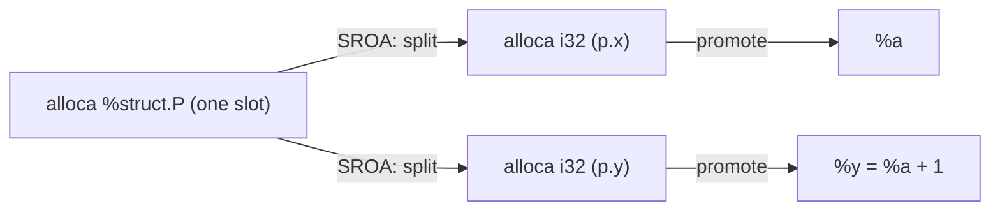

# Scalar Replacement of Aggregates (SROA)

> 🧭 **Concept** · `concept · optimization · llvm` · Index [[LLVM.MOC]] · see also [[muchnick.MOC|Muchnick]]
> **Prerequisites:** [[ssa-form]], [[three-address-code]] · **Enables:** [[mem2reg]] promotion

> [!abstract] Chapter map
> Front ends emit local **structs and arrays** as a single `alloca` with loads/stores to fields — and memory blocks SSA optimization. **SROA** splits that aggregate into independent scalar pieces (or pure SSA values) so [[ssa-form|mem2reg]] can promote them to registers, erasing the memory traffic. It's one of LLVM's highest-impact early passes, especially right after [[inlining]].

---

## 1. The problem

```c
struct P { int x, y; };
int f(int a) { struct P p; p.x = a; p.y = a + 1; return p.x + p.y; }
```
The front end gives `p` one stack slot and stores/loads its fields — `mem2reg` alone can't promote it because it's accessed field-by-field, not as one scalar:
```llvm
%p = alloca %struct.P
%px = getelementptr %struct.P, ptr %p, i32 0, i32 0
store i32 %a, ptr %px
; ... store y, load x, load y ...
```

Reproduce: `clang -O0 -Xclang -disable-O0-optnone -S -emit-llvm p.c -o - | opt -passes=sroa -S` (drop the `opt` stage to see the before).

## 2. What SROA does

> [!info] Split, then promote
> SROA analyzes the uses of the `alloca`. It cleanly splits when the `alloca` never escapes (its address isn't passed away) and is accessed only through distinct, non-overlapping fields/elements; each scalar piece is then promoted like `mem2reg`. After SROA the example becomes pure SSA — no `alloca`, no memory:
> ```llvm
> %y = add i32 %a, 1        ; p.y — pure SSA, no alloca
> %sum = add i32 %a, %y     ; p.x + p.y
> ```
> It also copes with the messy cases front ends produce: partial/overlapping accesses, `memcpy`/`memset` of the aggregate, and casts — splitting where it can and leaving the rest in memory.

**SROA = split, then promote**



One aggregate slot fans out into per-field slots, each then promoted to an SSA value.

## 3. Relationship to mem2reg

> [!note] SROA ⊃ mem2reg
> `mem2reg` promotes an `alloca` only when it's loaded/stored as a **whole scalar**. **SROA is the stronger pass**: it first *decomposes aggregates and partial accesses* into scalar pieces, then promotes them. In the modern pipeline SROA largely subsumes mem2reg for real code.

## 4. Why it matters

> [!tip] The inlining multiplier
> When a callee that passes/returns a `struct` by value is [[inlining|inlined]], the copy becomes a local aggregate `alloca` in the caller. SROA + promotion turn that into registers — which is why inlining followed by SROA unlocks so much downstream constant propagation and [[value-numbering|CSE]].

> [!summary] The one thing to remember
> ==Split aggregate `alloca`s into scalars ⇒ promote to SSA== — memory traffic gone, scalar opts unblocked.

> [!quote] Further reading
> - **Source:** [`Transforms/Scalar/SROA.cpp`](https://github.com/llvm/llvm-project/blob/main/llvm/lib/Transforms/Scalar/SROA.cpp)
> - **Muchnick §12.2** — scalar replacement of aggregates.
