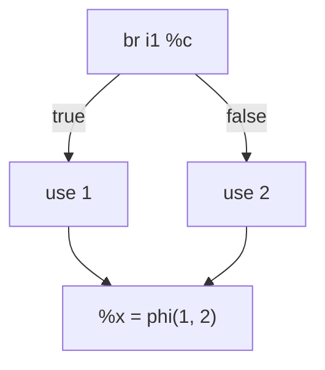

# SimplifyCFG

> 🧭 **Concept** · `concept · optimization · llvm` · Index [[LLVM.MOC]] · see also [[muchnick.MOC|Muchnick]]
> **Prerequisites:** [[control-flow-graph]] · **Runs:** repeatedly throughout the pipeline

> [!abstract] Chapter map
> The CFG **cleanup workhorse**. SimplifyCFG removes unreachable blocks, merges trivial blocks, folds redundant branches, turns small diamonds into `select`, simplifies `switch`es, and hoists/sinks common code. It runs many times in `-O2`, tidying the mess other passes leave behind.

---

## 1. What it cleans up

> [!info] The main simplifications
> - **Unreachable-block removal** and **block merging** (a block with one predecessor that is its only successor folds in).
> - **Branch folding** — a `br` on a known/constant condition becomes unconditional; identical successors collapse.
> - **Branch → `select`** — a tiny if/else that only picks a value becomes branch-free (the machine-level, predicated version is [[if-conversion]]).
> - **`switch` simplification** — dead cases removed; small switches lowered to comparisons.
> - **Common-code hoist/sink** — instructions shared by both successors move out of the diamond.

**Figure — a trivial diamond becomes a `select`.**

When the arms only feed the merge `phi`, SimplifyCFG collapses all of this to `%x = select i1 %c, i32 1, i32 2` — fewer blocks, no branch.

## 2. Why it's everywhere

> [!tip] The pipeline janitor
> Most transforms (inlining, [[dead-code-elimination|DCE]], jump threading, loop passes) leave **degenerate control flow** — empty blocks, single-target branches, unreachable arms. SimplifyCFG normalizes the CFG so the *next* pass sees clean structure, which is why it's scheduled repeatedly rather than once.

> [!summary] The one thing to remember
> SimplifyCFG **normalizes the control-flow graph** — merge/remove blocks, fold branches, branch→`select`, simplify switches, hoist/sink common code — and runs over and over to keep the CFG clean between other passes.

> [!quote] Further reading
> - **Source:** [`Transforms/Utils/SimplifyCFG.cpp`](https://github.com/llvm/llvm-project/blob/main/llvm/lib/Transforms/Utils/SimplifyCFG.cpp) (driven by `SimplifyCFGPass`)
> - **Muchnick §18** — branch and control-flow optimizations.
