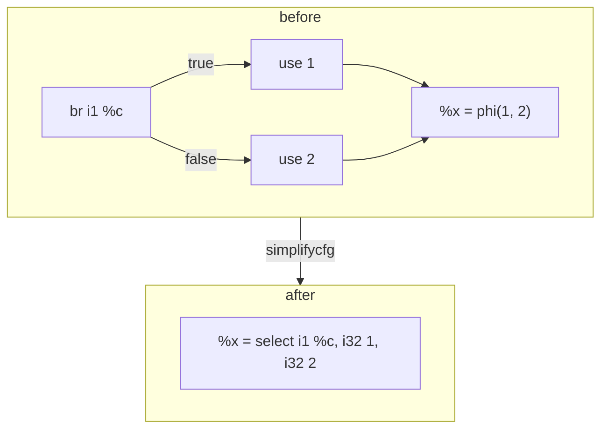
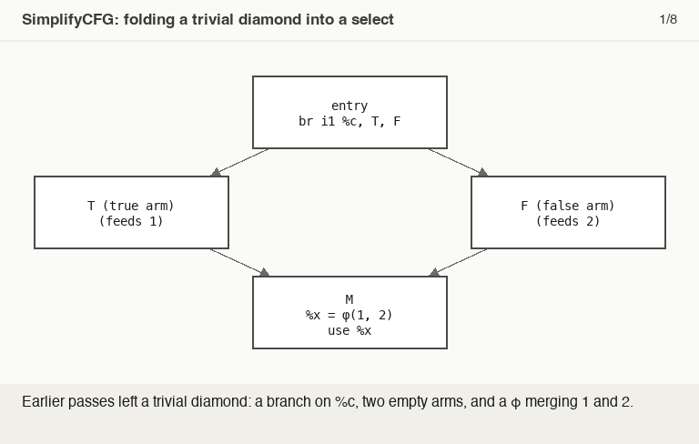

# SimplifyCFG

> 🧭 **Concept** · `concept · optimization · llvm` · Index [[LLVM.MOC]] · see also [[muchnick.MOC|Muchnick]]
> **Prerequisites:** [[control-flow-graph]] · **Runs:** repeatedly throughout the pipeline

> [!abstract] Chapter map
> The CFG **cleanup workhorse**: it normalizes the degenerate control flow other passes leave behind — §1 lists the folds, §2 why it runs so many times in `-O2`.

---

## 1. What it cleans up

> [!info] The main simplifications
> - **Unreachable-block removal** and **block merging** (a block with one predecessor that is its only successor folds in).
> - **Branch folding** — a `br` on a known/constant condition becomes unconditional; identical successors collapse.
> - **Branch → `select`** — a tiny if/else that only picks a value becomes branch-free (the machine-level, predicated version is [[if-conversion]]).
> - **`switch` simplification** — dead cases removed; small switches lowered to comparisons.
> - **Common-code hoist/sink** — instructions shared by both successors move out of the diamond.

**Figure — a trivial diamond becomes a `select`.**


```mermaid
flowchart TD
  subgraph before
    A["br i1 %c"] -->|true| T["use 1"]
    A -->|false| F["use 2"]
    T --> M["%x = phi(1, 2)"]
    F --> M
  end
  subgraph after
    S["%x = select i1 %c, i32 1, i32 2"]
  end
  before -->|simplifycfg| after
```

Arms only feed the merge `phi` ⇒ the whole diamond folds into one branch-free block.

> [!figure]+ Animation — the same fold, one rewrite at a time
> 
> Watch the diamond disappear in four rewrites — the φ becomes a `select` in entry, the branch folds to an unconditional jump (a new entry→M edge), the orphaned arms are deleted, and M merges into entry. (Regenerate: `_meta/anim/storyboards/simplifycfg-diamond-to-select.json`.)

**Try it:** save the diamond as `diamond.ll` and run `opt -passes=simplifycfg -S diamond.ll`:

```llvm
define i32 @f(i1 %c) {
entry:
  br i1 %c, label %t, label %f
t:
  br label %m
f:
  br label %m
m:
  %x = phi i32 [ 1, %t ], [ 2, %f ]
  ret i32 %x
}
```

The two-entry constant `phi` folds to `select i1 %c, i32 1, i32 2` in a single branch-free block. On [[running-example]] `ext-if`, by contrast, `opt -passes="mem2reg,simplifycfg"` does **not** fold the guarded sum: its arm re-loads `a[i]`, and SimplifyCFG never speculates a possibly-trapping load. (Also produce the `-O0` input with `-Xclang -disable-O0-optnone`, or `opt` skips the `optnone` function entirely.)

## 2. Why it's everywhere

> [!tip] The pipeline janitor
> Most transforms (inlining, [[dead-code-elimination|DCE]], jump threading, loop passes) leave **degenerate control flow** — empty blocks, single-target branches, unreachable arms. SimplifyCFG normalizes the CFG so the *next* pass sees clean structure, which is why it's scheduled repeatedly rather than once.

> [!info]- Limits
> - branch→`select` executes the arm's instructions **unconditionally** ⇒ only arms that are tiny (a ~2–4 cheap-instruction cost budget) **and safe to speculate** fold — a possibly-trapping load blocks it.
> - A well-predicted branch can beat a `select` — CodeGen's SelectOptimize converts selects back into branches when profitable.
> - The aggressive options come late: `switch`→lookup table only in the post-vectorization run; full common-code hoist/sink only from the tail of the per-function simplification pipeline onward. Most scheduled runs use the cheap defaults.

> [!summary] The one thing to remember
> SimplifyCFG **normalizes the control-flow graph** — merge/remove blocks, fold branches, branch→`select`, simplify switches, hoist/sink common code — and runs over and over to keep the CFG clean between other passes.

> [!quote] Further reading
> - **Source:** [`Transforms/Utils/SimplifyCFG.cpp`](https://github.com/llvm/llvm-project/blob/main/llvm/lib/Transforms/Utils/SimplifyCFG.cpp) (driven by `SimplifyCFGPass`)
> - **Muchnick §18** — branch and control-flow optimizations.
