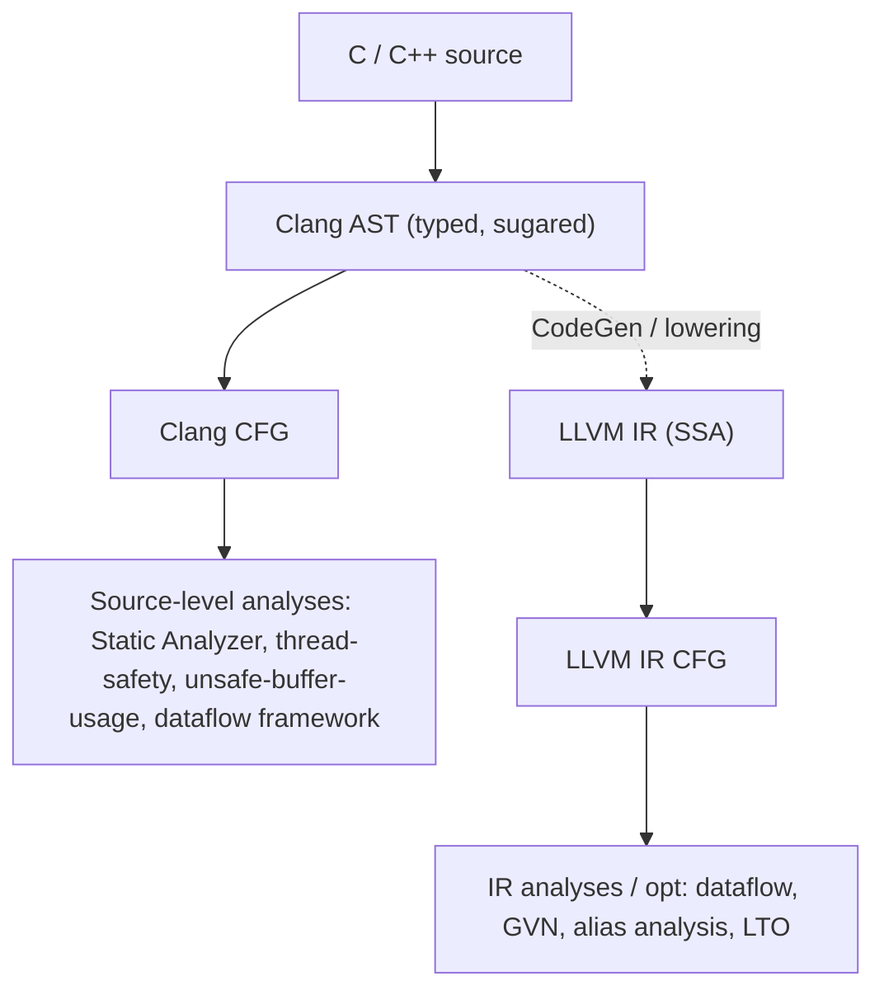

# Source-Level vs IR-Level Program Analysis

> 🧭 **Concept** · `concept · analysis · clang+llvm` · Index [[LLVM.MOC]]
> **Prerequisites:** [[clang-ast]], [[clang-cfg]] · **Chapter siblings:** [[clang-static-analyzer]], [[clang-dataflow-framework]] · **Contrast:** [[data-flow-analysis]]

> [!abstract] Chapter map
> The spine of the *Front-End & Source-Level Analysis* chapter. The **same** program can be analyzed on the Clang [[clang-ast|AST]]/[[clang-cfg|CFG]] (before lowering) or on the [[control-flow-graph|LLVM IR CFG]] (after lowering to [[ssa-form|SSA]]). That single choice — *which level do I analyze on?* — trades **diagnostic fidelity** (point at the user's code) against **analytic power** (SSA, whole-program). This note draws the boundary, then shows how each real tool lands on one side of it.

---

## 1. Two levels, one program

> [!note] Definition
> A program can be analyzed at two levels in the LLVM pipeline. **Source-level** analysis runs on the Clang **AST** (the typed, sugar-preserving parse tree) or the Clang **CFG** built from it (`clang/lib/Analysis/CFG.cpp`) — *before* lowering, so it still knows source locations, types, and C/C++ constructs. **IR-level** analysis runs on the **LLVM IR** CFG — *after* the front end has lowered everything to typed [[ssa-form|SSA]] instructions, so it has def-use chains and can span the whole program, but has forgotten the surface syntax.

The Clang CFG is a **distinct** data structure from the LLVM IR CFG: same classic idea (basic blocks + edges), different substrate. The Clang CFG carries `Stmt*`/`Expr*` AST nodes and models C/C++ semantics (short-circuit `&&`, destructor calls, `?:`); the LLVM CFG carries `Instruction`s in SSA. Lowering happens *between* them, and it is one-way — the surface program is gone by the time you reach IR.

## 2. The tradeoff — the centerpiece

> [!info]+ Source-level (AST/CFG) vs IR-level (LLVM IR)
>
> | Axis | Source-level (Clang AST / CFG) | IR-level (LLVM IR CFG) |
> |---|---|---|
> | **Source locations** | Precise — every node has a `SourceLocation`, so a finding **points at the user's code**: *"`buf[i]` at line 12"* | Lost/coarse — a finding sees a `getelementptr` + `load`; mapping back needs debug info and is approximate |
> | **Types & sugar** | Retained — `typedef`s, `using`, macros, template instantiations, `const`/qualifiers all visible | Erased — canonical machine types only; `size_t` vs `unsigned long` is indistinguishable |
> | **C/C++ constructs** | Visible & un-lowered — short-circuit `&&`/`||`, `?:`, implicit destructors, un-lowered loops | Lowered — control flow is already `br`/`switch`; destructors are explicit calls; sugar is gone |
> | **SSA / def-use** | **Absent** — no φ, no SSA value graph; tracking a value's defs means a hand-rolled flow analysis over the CFG | **Present** — SSA gives def-use chains for free ⇒ value tracking, GVN, range facts are natural |
> | **Control flow** | Not simplified — reflects source shape, good for *diagnostics*, weaker for *reasoning* | Canonicalized/simplified by earlier passes ⇒ cleaner graph to optimize over |
> | **Scope** | Typically **intra-TU** (one translation unit; no linker view) | Can be **whole-program** via LTO ⇒ interprocedural [[pointer-alias-analysis\|alias analysis]], inlining, IPO |
> | **Pointer arithmetic** | Awkward — source-level pointer/array reasoning is semantic and coarse | Easier — arithmetic is explicit `getelementptr`; ranges/offsets are first-class |

The two columns are **complementary, not ranked**: source-level *gains* fidelity and language knowledge; IR-level *gains* structure (SSA) and reach (whole-program). Neither dominates — you pick the level per task (§3).

## 3. The level dictates the tool

> [!tip] Rule of thumb
> **If a human must act on the result** — a compiler warning, a refactoring, a security hardening — analyze at **source level**, where you can point at their code in their terms. **If a machine consumes the result** — an optimizer proving a transform legal — analyze at **IR level**, where SSA and whole-program scope live.

- **Source-level (front-end)** — diagnostics, refactoring, security hardening:
  - The **[[clang-static-analyzer]]** (`clang/lib/StaticAnalyzer/`) — path-sensitive symbolic execution over the Clang CFG.
  - `clang-tidy` lint checks; **`-Wunsafe-buffer-usage`**, **`-Wthread-safety`** (`clang/lib/Analysis/ThreadSafety.cpp`), uninitialized-value and reachable-code warnings (`UninitializedValues.cpp`, `ReachableCode.cpp`).
  - `-fbounds-safety` / C++ Safe Buffers *diagnostics* in `Sema` (see [[type-checking]] for where checking lives).
  - The flow-sensitive **[[clang-dataflow-framework]]** (`clang/include/clang/Analysis/FlowSensitive/`).
- **IR-level (middle-end)** — optimization, whole-program:
  - [[data-flow-analysis]] (SCCP, liveness), GVN/CSE ([[value-numbering]]), [[pointer-alias-analysis|alias analysis]], inlining, LTO.

## 4. Where each analysis runs

**Figure — the same program forks into two analysis worlds.** The front end lowers source → Clang AST → Clang CFG (where the source-level analyses live), then emits LLVM IR (where the optimizer's analyses live). The dashed arrow is lowering — one-way, and lossy for the purposes above.



## 5. Worked contrast — one bug, two views

Take a tiny out-of-bounds access:

```c
void f(int n) {
  int buf[4];
  buf[n] = 0;   // n may exceed 3
}
```

> [!example] Same bug, two levels
> - **Source level** (unsafe-buffer-usage / analyzer): the tool walks the Clang AST, sees an `ArraySubscriptExpr` `buf[n]` with `buf` of type `int[4]`, and reports **at line 3, on `buf[n]`** — actionable, in the user's own syntax, with the array type it declared.
> - **IR level**: after lowering there is no `buf[n]` — only `%p = getelementptr inbounds [4 x i32], ptr %buf, i64 0, i64 %n` then a `store`. An IR range analysis can *reason* about `%n`'s bounds precisely (SSA + integer ranges), but a diagnostic it emits would name a `getelementptr`, not the source expression. Great for *proving/eliminating* a check; poor for *explaining* one to a human.

That asymmetry is the whole thesis: source level **names the bug**, IR level **reasons about the arithmetic**.

## 6. Where it's used / frontier

Memory-safety hardening is the sharpest live example of picking the level per task. **`-fbounds-safety`** and **C++ Safe Buffers** split their work across both levels deliberately:

- **Enforcement & diagnostics** happen at **source level** (front end) — that's where the type/annotation information (`__counted_by`, `std::span`) and the source locations for a good error message live.
- **Bounds-check *elimination*** happens at **IR level** — once checks are lowered into IR, the optimizer's value-range and [[data-flow-analysis|dataflow]] analyses prove redundant checks away, so the safety guarantee costs little at runtime.

Same feature, two levels, chosen by task: *diagnose where the human reads, optimize where the machine reasons.* The frontier here is the [[clang-dataflow-framework|Clang flow-sensitive dataflow framework]] maturing into a general home for source-level analyses that today are hand-written per-check.

> [!summary] Remember
> The AST/CFG (source) vs LLVM IR (post-lowering) choice trades **diagnostic fidelity for analytic power**: source level keeps locations, types, and C/C++ constructs → *actionable diagnostics*; IR level gets SSA and whole-program scope → *powerful optimization*. Diagnose at source, optimize on IR.

> [!quote] Sources & confidence
> - **Doc:** [Clang Static Analyzer](https://clang.llvm.org/docs/ClangStaticAnalyzer.html) · [Thread Safety Analysis](https://clang.llvm.org/docs/ThreadSafetyAnalysis.html) · [`-fbounds-safety`](https://clang.llvm.org/docs/BoundsSafety.html) · [C++ Safe Buffers](https://clang.llvm.org/docs/SafeBuffers.html).
> - **Tier-1 source (verified 2026-06-30, local submodule at pinned tag):** source-level analyses exist in-tree — `clang/lib/Analysis/` (`CFG.cpp`, `LiveVariables.cpp`, `UninitializedValues.cpp`, `ReachableCode.cpp`, `ThreadSafety.cpp`, `UnsafeBufferUsage.cpp`), the Static Analyzer at `clang/lib/StaticAnalyzer/`, and the flow-sensitive framework at `clang/include/clang/Analysis/FlowSensitive/`. `unsafe-buffer-usage` confirmed as a diagnostic group in `clang/include/clang/Basic/DiagnosticGroups.td`.
> - The source/IR *tradeoff* framing is standard front-end vs middle-end analysis practice; the per-task split of Safe Buffers (diagnose at source, eliminate checks at IR) reflects the design intent in the Clang docs above.
