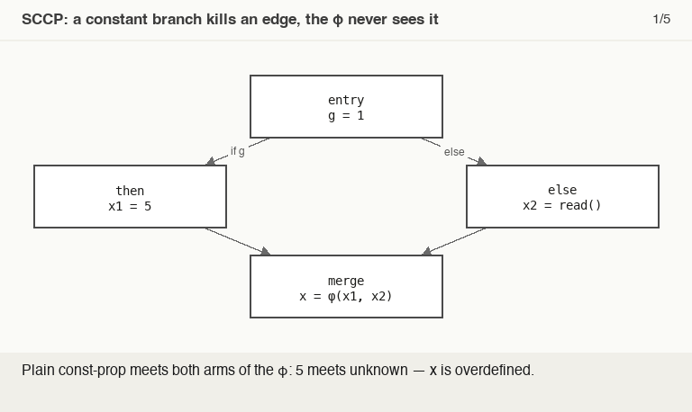

# Sparse Conditional Constant Propagation (SCCP)

> 🧭 **Concept** · `concept · optimization · general+llvm` · Index [[LLVM.MOC]] · see also [[muchnick.MOC|Muchnick]]
> **Prerequisites:** [[data-flow-analysis]], [[ssa-form]] · **Lattice:** see [[data-flow-analysis]] · **Range cousin:** [[lazy-value-info]]

> [!abstract] Chapter map
> SCCP (Wegman–Zadeck) does two things **at once**: propagate constants through SSA values *and* track which CFG edges are **executable**. Doing them jointly finds more constants than constant-propagation-then-DCE run separately — because it can prove a branch dead and ignore the values flowing along it.

---

## 1. The idea

> [!info] Two lattices, one fixpoint
> SCCP keeps, for each SSA value, a lattice cell `undef → constant → overdefined` (see the [[data-flow-analysis|constant-propagation lattice]]), **and** for each CFG edge a flag: *executable* or not. Propagation is **sparse** — it walks SSA def–use edges, not every program point — and a `phi` meets **only the incoming values whose edges are executable**. A conditional branch on a value already known to be a **constant** marks **only the taken successor** executable — so the other arm's instructions are never even evaluated.

## 2. Why "conditional" beats plain const-prop

> [!example] What separate passes miss
> ```c
> int g = 1;
> if (g) x = 5; else x = read();   // else is unreachable, but plain const-prop can't prove it
> use(x);
> ```

> [!figure]+ Animation — the edge dies before the φ ever meets it
> 
> Plain const-prop meets both arms ⇒ *overdefined*; SCCP kills the `else` edge (`g ≡ 1`), the φ meets only `5`, and the use folds — the dead `else` is then removed. (Regenerate: `_meta/anim/storyboards/sccp-edge-kill.json`.)

## 3. In LLVM

LLVM's **`SCCP`** pass implements this intraprocedurally; [[ipsccp|**`IPSCCP`**]] extends it across function boundaries (propagating constant arguments and return values). Both fold the constants they prove and delete the branches/blocks they mark unreachable (overlapping with [[dead-code-elimination|DCE]]).

Watch it: put the §2 snippet in a function body — `int f(void) { int g = 1, x; if (g) x = 5; else x = read(); return use(x); }` with `int read(void); int use(int);` declared (`g` must be a **local**; a file-scope `g` needs `ipsccp`, not `sccp`) — then

```sh
clang -O0 -Xclang -disable-O0-optnone -emit-llvm -S t.c -o t.ll && opt -passes="mem2reg,sccp" -S t.ll -o -
```

The `else` block and the `phi` disappear and the use folds to the constant (`call … @use(i32 … 5)`).

> [!summary] The one thing to remember
> Constants **and** edge executability, one joint fixpoint — a constant branch condition kills the untaken arm. LLVM: **`SCCP`** (intraprocedural) / **`IPSCCP`** (interprocedural).

> [!quote] Further reading
> - **Source:** [`Transforms/Scalar/SCCP.cpp`](https://github.com/llvm/llvm-project/blob/main/llvm/lib/Transforms/Scalar/SCCP.cpp) (and IPSCCP)
> - **Muchnick §12.6**; **Dragon §9.4**; Wegman & Zadeck 1991 — *Constant Propagation with Conditional Branches*.
