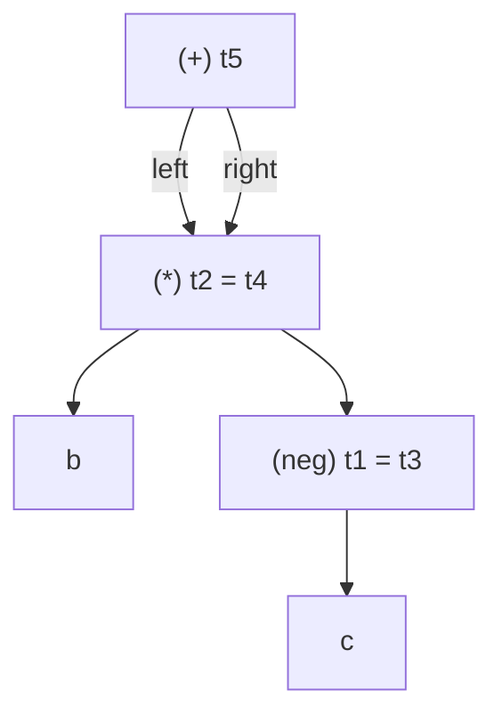

# Three-Address Code

> 🧭 **Concept** · `concept · ir · general+llvm` · Index [[LLVM.MOC]] · see also [[dragon-book-ch6.MOC|Dragon Ch.6]]
> **Prerequisites:** [[llvm-basics]] · **Canonical form:** [[ssa-form]] · **Reused by:** [[value-numbering]]

> [!abstract] Chapter map
> LLVM IR is **three-address code (3AC)**: every instruction does one operation and names its result. This note shows (1) what that looks like in real IR, (2) the two classic ways to *store* 3AC — quadruples and triples — and how LLVM stores it instead, and (3) how LLVM **computes SSA**, the canonical 3AC form, with a worked `mem2reg` example.

---

## 1. LLVM IR is 3AC — a worked example

**Three-address** means each instruction has at most **one operator** and at most **three addresses** (two operands + one result, `result = op1 op op2`); an *address* is a name, a constant, or a compiler-generated temporary. Nested source expressions are flattened so every subexpression gets a name — the prerequisite for optimization. For example:

Source:
```c
a = b * -c + b * -c;
```
Flattened to three-address instructions (one operator each, temporaries `t1..t5`):
```text
t1 = -c
t2 = b * t1
t3 = -c
t4 = b * t3
t5 = t2 + t4
a  = t5
```
The same thing as real LLVM IR — each instruction defines exactly one value:
```llvm
%t1 = fneg double %c
%t2 = fmul double %b, %t1
%t3 = fneg double %c
%t4 = fmul double %b, %t3
%t5 = fadd double %t2, %t4
store double %t5, ptr %a
```
Every LLVM instruction is three-address by construction: `%result = op <ty> %op1, %op2`.

**Figure — the expression `b*-c + b*-c` as a DAG (shared subexpression), not a tree.**


A *syntax tree* (AST) would duplicate the whole `b × (−c)` subtree; the **DAG shares** it, so it is computed once. Spotting that this `×` (and the `−c`) occurs twice is exactly what [[value-numbering]] does — and why SSA gives each such value a single name.

> [!info] Instruction kinds, in LLVM
> | 3AC form | LLVM instruction |
> |---|---|
> | binary / unary `x = y op z` | `add`/`fmul`/`and`/… , `fneg` |
> | conditional / unconditional jump | `br i1 %c, label %t, label %f` / `br label %b` |
> | comparison feeding a jump | `icmp`/`fcmp` then `br` |
> | call / return | `call`, `ret` |
> | indexed & pointer ops `x = y[i]`, `*x = y` | `getelementptr` + `load`/`store` → [[getelementptr]] |

---

## 2. Two ways to *store* 3AC — and why

Once you have the instruction sequence, you must store it. There are two classic schemes; they trade **stability of references** against **compactness**.

**Quadruples** — record `(op, arg1, arg2, result)`, naming the result explicitly:

| # | op | arg1 | arg2 | result |
|---|----|------|------|--------|
| 0 | `-` (neg) | c | — | t1 |
| 1 | `*` | b | t1 | t2 |
| 2 | `-` (neg) | c | — | t3 |
| 3 | `*` | b | t3 | t4 |
| 4 | `+` | t2 | t4 | t5 |
| 5 | `=` | t5 | — | a |

Because each result has an explicit name, you can **move or delete a row freely** — references go through the temporary names, not row positions. Cost: you store (and invent) all those temporary names.

**Triples** — drop the result column; refer to a computed value by the **position** of the instruction that produced it (written `(i)`):

| # | op | arg1 | arg2 |
|---|----|------|------|
| (0) | `-` (neg) | c | — |
| (1) | `*` | b | (0) |
| (2) | `-` (neg) | c | — |
| (3) | `*` | b | (2) |
| (4) | `+` | (1) | (3) |
| (5) | `=` | a | (4) |

Compact (no temporary names), but **fragile**: move row (1) and every `(1)` reference now points at the wrong instruction. The fix is **indirect triples** — keep a separate list of *pointers* to triples and reorder that list, leaving the triples themselves (and their position numbers) untouched.

> [!tip] How LLVM stores it — neither, and both
> In memory, an LLVM `Instruction` object **is** its own result value: other instructions point at it through `Use` edges (pointers), not by name and not by position. So LLVM gets the **reorder-safety of quadruples** (references are stable pointers, like stable names) **without a separate result field** and **without triples' positional fragility** — and it maintains **def-use chains** for free (every value knows its users). That pointer-as-value model is exactly what makes `replaceAllUsesWith` and the [[value-numbering|GVN]]/def-use optimizations cheap.

---

## 3. SSA — the canonical 3AC form, and how LLVM computes it

LLVM's 3AC is always in **[[ssa-form|SSA]]**: each value is assigned once, and **φ-functions** merge values where control flow joins. Front ends don't emit φ directly; they emit *memory* for locals and let a pass build SSA.

> [!example]+ How SSA is computed — `mem2reg`, worked
> Source:
> ```c
> int x;
> if (c) x = 1; else x = 2;
> use(x);
> ```
> **Before** — the front end gives each local a stack slot (`alloca`) and uses `load`/`store` (no φ, not yet "really" SSA for `x`):
> ```llvm
> entry:
>   %x = alloca i32
>   br i1 %c, label %t, label %f
> t:
>   store i32 1, ptr %x
>   br label %m
> f:
>   store i32 2, ptr %x
>   br label %m
> m:
>   %v = load i32, ptr %x
>   call void @use(i32 %v)
> ```
> **After `mem2reg`** — the slot is promoted to an SSA value; a `phi` is inserted at the merge block `m` (the **dominance frontier** of the two stores — see [[dominator-tree]]):
> ```llvm
> entry:
>   br i1 %c, label %t, label %f
> t:
>   br label %m
> f:
>   br label %m
> m:
>   %x = phi i32 [ 1, %t ], [ 2, %f ]   ; choose by which edge we arrived on
>   call void @use(i32 %x)
> ```
>
> That is the whole relationship: **3AC + "assign each name once" + "a φ at every CFG merge where two definitions meet" = SSA.** φ-placement uses the iterated dominance frontier (Cytron et al.); the algorithm and φ semantics live in [[ssa-form]].

> [!tip] Why SSA is the form LLVM keeps
> SSA makes "which definition reaches this use" a **direct pointer** (use-def), with no flow-sensitive bookkeeping. That is precisely what lets [[value-numbering]], LICM, and instcombine reason in near-linear time.

> [!summary] The one thing to remember
> LLVM IR is **typed three-address code in SSA form**. The classic quadruple-vs-triple storage question is moot in LLVM: an instruction *is* its result value (operands are pointers), so references stay stable and def-use chains come for free — and `mem2reg` puts the code in SSA by placing φ at control-flow merges.

> [!quote] Further reading
> - **Dragon Book §6.2** — three-address code, addresses/instructions, quadruples & triples; **§6.2.4** — SSA; **§6.1** — the value-number DAG. (High-level, language-agnostic treatment.)
> - [LangRef — Instruction Reference](https://llvm.org/docs/LangRef.html#instruction-reference); [Mem2Reg / SSA construction in `mem2reg`].
