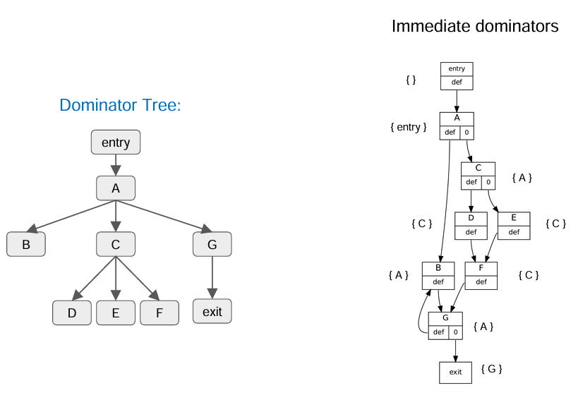

# Value Numbering

> 🧭 **Concept** · `concept · optimization · general+llvm` · Index [[LLVM.MOC]]
> **Prerequisites:** [[ssa-form]] · **Contrast:** [[instruction-combining]]

> [!abstract] Chapter map
> 1. **Value numbering** — give equivalent computations the same *number*, then reuse.
> 2. **Redundancy elimination** — the payoff (remove re-computations).
> 3. **Local** value numbering (per block) → **Global** value numbering (whole function, dominator-tree walk).

> [!info]+ From classic compiler theory → LLVM
> | Classic concept | LLVM realization |
> |---|---|
> | Common-subexpression elimination | **GVN** / **NewGVN** passes |
> | Value numbering (assign IDs to expressions) | hash of `(opcode, operand value-numbers, type)` |
> | Available expressions data-flow | replaced by SSA + a dominator-tree scoped table |
> | DAG of a basic block | the value-number table *is* that DAG |
> | φ at merges | GVN reasons about φ to number across blocks |

---

### 1. Value numbering

> [!note] Definition
> A process to decide whether **two computations are equivalent**; if so, keep only one and reuse it — avoiding redundant computation.

### 2. Redundancy elimination

> [!note] Definition
> An expression is **redundant** iff, on *every* execution path, it is evaluated and its result **has already been computed**. Equivalently: removing it still preserves program semantics. (We assume the program is in [[ssa-form]] form.)

### 3. Prerequisite

> [!tip] Why SSA first
> SSA gives each value a unique name, so "same value number" is well-defined without flow-sensitive bookkeeping — value numbering and [[ssa-form]] are a natural pair.

### 4. What does value numbering mean?

> [!note] The idea
> Assign a **unique number (an "ID") to every canonical expression**. ==If two variables are assigned by the same expression, they get the same ID== — and the second computation is redundant.

> [!example]+ Before → After (reuse the common expression)
> **Before:**
> ```c
> void foo(int x, int y) {
>   int a = x + y;
>   int b = x + y;   // same as a
>   a = 17;
>   int c = x + y;   // still x + y
> }
> ```
> **After:**
> ```c
> void foo(int x, int y) {
>   int tmp = x + y;
>   int b   = tmp;
>   int a   = 17;
>   int c   = tmp;
> }
> ```

### 5. Original (value numbers on SSA)

> [!example]+ SSA-renamed, with value numbers
> ```text
> a0 = x0 + y0     ; value #1
> b1 = x0 + y0     ; expr already seen ⇒ #1  (redundant)
> a1 = 17          ; value #2
> c1 = x0 + y0     ; expr already seen ⇒ #1  (redundant)
> ```
> SSA renaming (`a0`, `a1`) makes the reuse safe: even though source `a` is overwritten, the *value* `x+y` keeps its number.

### 6. Assign IDs to each expression, keep mapping in a table

> [!info] The mechanism
> - **Base case:** each variable/constant gets an ID.
> - **Inductive:** `(IDs of operands) + operator` → a new ID (a canonical key).
> - For each expression `e`: if its key **already has an ID**, `e` is redundant → replace `e` by a table lookup of the existing value.

### 7. Why value numbering?

> [!info] Three wins
> 1. **Replace redundant expressions** (the original motivation).
> 2. **Simplify** — fold and propagate constants/copies.
> 3. **Build a DAG** — the value-number table is exactly the expression DAG of the code.

---

### 8. Local value numbering (LVN)

> [!note] Scope
> Operates **per basic block**. State:
> - `table : map<ValueKey, (num, leaderVar)>`
> - `var2num : map<Var, num>`

> [!example]- LVN pseudocode (click to expand)
> ```text
> LVN(block, table, var2num):
>     nextNum = 1
>     init(var2num)                      # number each argument/constant as needed
>     for instr in block (program order):
>       if instr has side effects:       # conservative: unique, don't CSE
>         num = nextNum++; var2num[instr.dest] = num; continue
>       # canonical key from opcode + operand value-numbers
>       ops = [ var2num[a] for a in instr.args ]
>       key = canon((instr.op, ops, instr.type, instr.extraFlags))
>       if key in table:                 # redundant: reuse the leader
>         (num, leader) = table[key]
>         replace instr with: instr.dest = copy(leader)
>       else:
>         num = nextNum++
>         dest = instr.dest              # keep a stable leader if overwritten later
>         if willBeOverwrittenLater(block, dest):
>           dest = freshVar(dest); instr.dest = dest
>         table[key] = (num, dest)
>         # optional copy-prop: rewrite operands to canonical leaders
>         for each operand position i:
>           instr.args[i] = leaderVarOf(var2num[instr.args[i]])
>       var2num[instr.dest] = num
> ```

> [!figure]+ Figure — local value numbering
> 

> [!warning] The limitation that motivates GVN
> LVN runs in ==linear time== in code size, but it is **per-block**: an expression computed in `Block1` is *not* reused in `Block2`. Local VN never looks across blocks.

---

### 9. Global value numbering (GVN)

> [!note] Scope
> Operates across the **whole function**. A function's entry block typically declares values that later blocks consume, so GVN must number expressions **with respect to control-flow context**.

> [!info] Hash-based GVN (incremental / online)
> - **Data structures:** walk the **[[dominator-tree]]**; keep a **scoped hash table** (updated as you enter/leave blocks). The table guarantees identical operations on identical value-numbered operands get the same number.
> - **Idea 1 — reuse LVN:** hash `(operator, value-numbers of operands)` to get the expression's value. *(e.g. `a op b` where `a→2`, `b→4` yields a fresh value for `a op b`.)*
> - **Idea 2 — walk in dominator-tree order:** a value enters a block either through a **single predecessor** (its immediate dominator) or through **multiple predecessors**, where a **φ** summarizes the incoming values — natural in LLVM IR:
>   ```llvm
>   %x = phi i32 [ %inc, %then ], [ %dec, %else ]
>   ```

> [!note]- Why dominator-tree order? (click to expand)
> - If block `X` executes before `Y` on **every** path, then `X` **dominates** `Y` (strictly if `X≠Y`).
> - The **immediate dominator** `idom(Y)` is the last block that must be visited before `Y` on every path from entry.
> - Compute idoms → form the dominator tree → process blocks in that order so definitions are numbered before uses.

> [!example]- DVNT — Dominator-tree Value Numbering Technique (click to expand)
> ```text
> procedure DVNT(Block B):
>     enter a new scope
>     for each φ-function p of the form "n <- φ(...)" in B:
>         if p is meaningless or redundant:
>             VN[n] = value number of p ; remove p     # all inputs same value ⇒ reuse
>         else:
>             VN[n] = n ; add p to the hash table
>     for each assignment a of the form "x <- y op z" in B:
>         overwrite y with VN[y], z with VN[z]
>         expr = y op z
>         if expr simplifies to expr':
>             replace a with "x <- expr'" ; expr = expr'
>         if expr is in the hash table with value number v:
>             VN[x] = v ; remove a                      # redundant
>         else:
>             VN[x] = x ; add expr to the hash table with value number x
>     for each successor s of B:
>         adjust the φ-function inputs in s
>     for each child c of B in the dominator tree:
>         DVNT(c)
>     clean up the hash table when leaving this scope   # scoped table
> ```
> **φ handling:** a φ `n <- φ(x, y, …)` — if all incoming operands have the **same** value number, `n` inherits it (the φ is redundant); otherwise `n` gets a **fresh** number.

> [!tip] Two algorithmic families
> - **Hash-based** (above) — online/incremental, scoped table over the dominator tree.
> - **Partition/equivalence-based** (offline) — two values are ==congruent== if computed by the same operator with pairwise-congruent operands; refine **congruence classes** to a fixed point.

> [!quote] Sources & further reading
> - **Also in:** Muchnick *Advanced Compiler Design & Impl.* §12.4 — value numbering.
> - **Source:** [`Transforms/Scalar/GVN.cpp`](https://github.com/llvm/llvm-project/blob/main/llvm/lib/Transforms/Scalar/GVN.cpp) · [`NewGVN.cpp`](https://github.com/llvm/llvm-project/blob/main/llvm/lib/Transforms/Scalar/NewGVN.cpp)
> - [LLVM Passes — `gvn`](https://llvm.org/docs/Passes.html#gvn-global-value-numbering) (and NewGVN).
> - Gulwani et al., *A Polynomial-Time Algorithm for Global Value Numbering*.
> - Simpson/Briggs, *Value Numbering* (DVNT).
