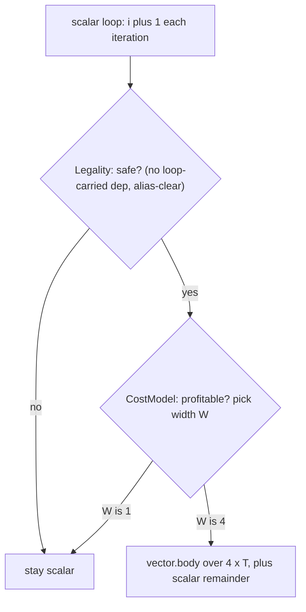

# Vectorization (LoopVectorize, SLP, VPlan)

> 🧭 **Concept** · `concept · optimization · llvm` · Index [[LLVM.MOC]] · v [[llvm-version]]
> **Prerequisites:** [[loop-info]], [[dependence-analysis]], [[ssa-form]] · **Related:** [[loop-transformations]], [[scalar-evolution]]

> [!abstract] Chapter map
> How LLVM turns scalar code into **SIMD**: execute several scalar operations as one wide instruction over a vector type like `<4 x float>`. LLVM ships **two** independent auto-vectorizers — the **Loop Vectorizer** (`LoopVectorize.cpp`), which *"combines consecutive loop iterations into a single 'wide' iteration"*, and the **SLP Vectorizer** (`SLPVectorizer.cpp`), a *"bottom up"* pass that packs isolated scalar operations within one basic block. Both are cost-model-driven — they vectorize only when `TargetTransformInfo` says it pays — and the **loop** vectorizer is migrating onto **VPlan**, an explicit *"Vectorizer Plan"* IR (SLP is not — it builds its own `BoUpSLP` tree). This is one of the highest-impact optimizations in the pipeline and, on its own, the reason [[dependence-analysis]] and [[scalar-evolution]] exist.

---

## 1. Definition

> [!note] Definition
> **Vectorization** replaces N scalar operations with one **SIMD** operation on an N-wide vector register. Auto-vectorization does this without source changes, guided by a legality check (is it safe?) and a cost model (is it faster?).

The header of `LoopVectorize.cpp` states the model exactly: *"combines consecutive loop iterations into a single 'wide' iteration. After this transformation the index is incremented by the SIMD vector width, and not by one."*

## 2. The two vectorizers

> [!info] Loop vs SLP (confirmed, pinned LLVM [[llvm-version]])
>
> | Vectorizer | Packs across | Source | Typical target |
> |---|---|---|---|
> | **Loop Vectorizer** | consecutive **loop iterations** | `LoopVectorize.cpp` | counted loops (`a[i] = …`) |
> | **SLP Vectorizer** | scalar ops in **one basic block** | `SLPVectorizer.cpp` (*"A bottom up SLP Vectorizer"*) | straight-line code (`x.r,x.g,x.b,x.a`) |

They are complementary: the loop vectorizer needs a loop; SLP finds parallelism the loop vectorizer can't (unrolled bodies, struct-of-4 math).

## 3. Inside the loop vectorizer — the four parts

The file comment enumerates the architecture, and it maps one-to-one onto the two questions *safe?* and *profitable?*:

> [!info]+ `LoopVectorize.cpp` — the four units (the header says *"three parts"* then lists four — a long-standing typo in LLVM; the role strings below are verbatim)
>
> | # | Unit | Role |
> |---|---|---|
> | 1 | the main loop pass | drives the others |
> | 2 | `LoopVectorizationLegality` | *"checks for the **legality** of the vectorization"* — is it *safe*? |
> | 3 | `InnerLoopVectorizer` | *"performs the actual **widening** of instructions"* |
> | 4 | `LoopVectorizationCostModel` | *"checks for the **profitability** … decides on the optimal vector width, which **can be one**"* |

**Legality** leans on [[dependence-analysis]] and [[scalar-evolution]]: a loop-carried dependence (iteration *i* reads what *i−1* wrote) blocks vectorization. **Cost** uses `TargetTransformInfo` to price each instruction — *"if vectorization is not profitable"* the chosen width is **1** (a no-op), which is why not every legal loop vectorizes.

## 4. VPlan — the plan-based rewrite

Modern vectorization builds an explicit **VPlan** (`VPlan.h` — *"Represent A Vectorizer Plan"*) before touching the IR: candidate plans — **one per candidate vector width** (`getPlanFor`: *"there is always a single VPlan for each VF"*) — are constructed and costed, and only the winner is materialized; the **interleave count is chosen afterwards** on the winning plan (`selectInterleaveCount`). `LoopVectorize.cpp`'s header (not `VPlan.h`) notes the ongoing *"development effort … to migrate loop vectorizer to the VPlan infrastructure and to introduce outer loop vectorization"* — which is why anything you assert about VPlan is `version-sensitive`.

## 5. Worked example

> [!example]+ `axpy` → SIMD (real Apple clang output)
> ```c
> void axpy(float *restrict y, float *restrict x, float a, int n) {
>   for (int i = 0; i < n; i++) y[i] = a * x[i] + y[i];
> }
> ```
> ```bash
> clang -O2 -Rpass=loop-vectorize -c axpy.c -o /dev/null
> # axpy.c:2:3: remark: vectorized loop (vectorization width: 4, interleaved count: 4)
> #   ^ arm64 / Apple clang 17 — width and interleave are TTI-driven and vary by target and release
> clang -O2 -emit-llvm -S axpy.c -o -   # body now uses <4 x float>: load <4 x float>, fmul/fadd, …
> ```
> Two things happened: **vectorization** (width 4 → `<4 x float>`) *and* **interleaving** (unroll ×4 for ILP). The `restrict` keywords were load-bearing — without them the compiler can't prove `x` and `y` don't alias, [[pointer-alias-analysis|alias analysis]] reports may-alias, and `LoopVectorizationLegality` bails (or emits a runtime alias check). A fuller loop is [[running-example#2. Front-end IR — everything is a stack slot|running example]].



## 6. Where it's used

Every `-O2`/`-O3` build of numeric or data-parallel code; it is the single transform most responsible for LLVM matching hand-written SIMD on hot loops. Downstream, the `<N x T>` vector IR is lowered to real SIMD instructions by [[instruction-selection]] per target (NEON, AVX, SVE).

## 7. Limitations & version notes

> [!warning] What blocks or limits vectorization (version-sensitive → [[llvm-version]])
> - **Legality first.** Loop-carried dependences, unknown trip counts with unclear bounds, aliasing the compiler can't disprove, and non-vectorizable control flow all stop it. `-Rpass-analysis=loop-vectorize` explains why.
> - **The cost model can say no.** A legal loop with width 1 chosen is "vectorized" to nothing — profitability, not legality, decided.
> - **VPlan is in flux.** The internal representation and outer-loop support are an active migration; pin claims to a release.
> - **Two passes, two scopes.** Neither vectorizer subsumes the other; SLP catches straight-line packing the loop vectorizer never sees.

> [!summary] The one thing to remember
> LLVM has **two** cost-model-driven auto-vectorizers: **LoopVectorize** (packs consecutive loop iterations into a `<W x T>` wide iteration — via legality + cost + `InnerLoopVectorizer`) and **SLP** (packs straight-line scalar ops bottom-up). Legality rests on [[dependence-analysis]]; the chosen width can be 1 when unprofitable; the loop vectorizer (not SLP) is moving onto **VPlan**.

> [!quote] Sources & confidence
> **Verified 2026-07-20** — every falsifiable claim in this note was enumerated and checked against the pinned LLVM source ([[llvm-version]], `llvmorg-22.1.8`) by the `note-correctness-review` pass; refuted claims were corrected (batch error rate 8.6%, 23/269). GitHub links track `main`; the checked revision is the pinned tag.
> - [llvm/lib/Transforms/Vectorize/LoopVectorize.cpp](https://github.com/llvm/llvm-project/blob/main/llvm/lib/Transforms/Vectorize/LoopVectorize.cpp) — the four-part structure; *"combines consecutive loop iterations into a single 'wide' iteration";* `LoopVectorizationLegality`, `InnerLoopVectorizer`, `LoopVectorizationCostModel`.
> - [llvm/lib/Transforms/Vectorize/SLPVectorizer.cpp](https://github.com/llvm/llvm-project/blob/main/llvm/lib/Transforms/Vectorize/SLPVectorizer.cpp) — *"A bottom up SLP Vectorizer."*
> - [llvm/lib/Transforms/Vectorize/VPlan.h](https://github.com/llvm/llvm-project/blob/main/llvm/lib/Transforms/Vectorize/VPlan.h) — *"Represent A Vectorizer Plan."*
> - Example output produced locally with **Apple clang 17** (Apple's own versioning — *not* an upstream LLVM release number, and not the pinned tag; widths/remarks track the clang version and target — see [[llvm-version]]).
> - [LLVM — Auto-Vectorization](https://llvm.org/docs/Vectorizers.html) — primary doc.
