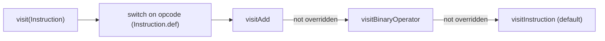

# Visitor Pattern (InstVisitor)

> 🧭 **Concept** · `concept · meta · general+llvm` · Index [[LLVM.MOC]]
> **Prerequisites:** [[llvm-basics]] · **Used by:** [[instruction-combining]], [[instruction-selection]] · **Related:** [[extending-llvm-ir]]

> [!abstract] Chapter map
> 1. **The pattern** — separate *what you do at each node* from *how you walk the structure*, so you can add operations without editing the node classes.
> 2. **In LLVM** — `InstVisitor`, a **CRTP** (compile-time) visitor: no virtual calls, "as efficient as your own switch."
> 3. **Dispatch** — an opcode `switch` (generated from `Instruction.def`) plus a **delegation** chain `visitAdd → visitBinaryOperator → visitInstruction`.
> 4. **Algorithm** — the container-recursion that turns one `visit(F)` into a call per instruction.

> [!info]+ GoF Visitor → LLVM InstVisitor
> | Classic GoF Visitor | LLVM `InstVisitor` |
> |---|---|
> | `element.accept(v)` + `v.visit(Concrete)` — **double dispatch** via two vtables | **single** dispatch: opcode `switch` + **CRTP** static dispatch |
> | Add an operation without touching element classes | subclass `InstVisitor<Sub>`, override the `visitXXX` you care about |
> | Element hierarchy must be fixed | the `Instruction` hierarchy is fixed (enumerated in `Instruction.def`) |
> | Runtime polymorphism (vtable cost) | resolved at compile time — no virtual call overhead |
> | One `visit` per concrete type, no fallback | **delegation**: an unhandled `visitAdd` falls back up to `visitBinaryOperator` → `visitInstruction` |

---

## 1. Definition

> [!note] The pattern
> **Visitor** separates an *operation* from the *object structure* it runs over. Instead of adding a method to every node class for each new operation, you write one **visitor** object with a handler per node type; the structure "accepts" the visitor and dispatches to the right handler. This lets you add new operations (a new visitor) without modifying the node classes.

> [!tip] Why a compiler wants this
> An IR has a fixed, well-known set of instruction types but **many** operations that walk them (cost models, verifiers, lowering, peephole rules, analyses). Visitor keeps each operation in one place and turns "handle every opcode" into "override the few you care about; ignore the rest."

## 2. The problem it replaces

> [!warning] The brittle alternative
> Without a visitor you write, in every pass, a giant `switch (I.getOpcode())` with a `case` per instruction — duplicated across passes, easy to leave a `case` out, and noisy. Virtual methods on the `Instruction` classes are the opposite extreme: adding an operation means editing every subclass. Visitor is the middle path — one dispatch mechanism, reused.

## 3. In LLVM — `InstVisitor` (CRTP, not virtual)

> [!info] The realization
> [`llvm/include/llvm/IR/InstVisitor.h`](https://github.com/llvm/llvm-project/blob/main/llvm/include/llvm/IR/InstVisitor.h) defines `template <typename SubClass, typename RetTy = void> class InstVisitor`. You inherit from it with the **Curiously Recurring Template Pattern**:
> - `RetTy` is the return type of every handler (default `void`).
> - The base class `static_cast`s `this` to `SubClass` and calls `SubClass::visitXXX`, so dispatch is resolved **at compile time** — the Programmer's Manual notes it is "just as efficient as having your own switch statement over the instruction opcode."

> [!example]+ A real InstVisitor subclass
> ```cpp
> #include "llvm/IR/InstVisitor.h"
> using namespace llvm;
>
> struct AllocaCounter : InstVisitor<AllocaCounter> {
>   unsigned NumAllocas = 0;
>
>   void visitAllocaInst(AllocaInst &AI) { ++NumAllocas; }   // specific
>   void visitCallInst(CallInst &CI) {                       // specific
>     errs() << "call to " << CI.getCalledOperand()->getName() << "\n";
>   }
>   void visitInstruction(Instruction &I) { /* catch-all fallback */ }
> };
>
> AllocaCounter V;
> V.visit(F);                       // F is a Function& — visits every instruction
> errs() << "allocas: " << V.NumAllocas << "\n";
> ```
> Override only the handlers you need; everything else lands in `visitInstruction` (the default no-op).

## 4. How dispatch works

> [!info] Opcode switch + DELEGATE
> `visit(Instruction &I)` runs a `switch (I.getOpcode())` whose cases are generated by including **`Instruction.def`** (the single list of all opcodes). Each case uses a `DELEGATE` macro that casts `this` to the subclass and calls the matching `visitXXX`. Handlers you don't override **delegate upward** along the class hierarchy instead of erroring:



So a subclass can handle things at any granularity: one specific opcode (`visitAdd`), a whole family (`visitBinaryOperator`, `visitCastInst`), or everything (`visitInstruction`).

## 5. The traversal algorithm

> [!note] Container recursion (folded in; promote to `algorithm/` if it grows)
> The visitor also supplies the *walk*: `visit` is overloaded for the IR containers, so one top-level call fans out to every instruction.

> [!example]- Dispatch + traversal in pseudocode (click to expand)
> ```text
> visit(Module M):       for F in M.functions(): visit(F)
> visit(Function F):     for BB in F:            visit(BB)
> visit(BasicBlock B):   for I in B:             visit(I)
>
> visit(Instruction I):
>     switch I.getOpcode():            # cases generated from Instruction.def
>       case Add:  DELEGATE(BinaryOperator)
>       case Load: DELEGATE(LoadInst)
>       ...
>
> # DELEGATE(CLASS)  ≡  static_cast<SubClass*>(this)->visit##CLASS(I)
> # base visit##CLASS, if SubClass didn't override it, delegates upward:
> #   visitAdd -> visitBinaryOperator -> visitInstruction (default)
> ```

## 6. Where it's used

LLVM uses `InstVisitor` wherever a pass must act per-opcode:

- [[instruction-combining|InstCombine]] — `InstCombinerImpl : InstVisitor<…, Instruction*>` (note the non-void `RetTy`: each `visitXXX` returns the replacement instruction). It pairs the visitor with a **worklist** rather than a single linear walk.
- [[instruction-selection|SelectionDAGBuilder]] — `visit()` lowers each IR instruction into DAG nodes.
- `PtrUseVisitor` — a specialized visitor for walking the uses of a pointer (used by [[scalar-replacement-of-aggregates|SROA]]).

> [!note] Cross-ecosystem cousins
> The same idea appears as **Clang `RecursiveASTVisitor`** (CRTP visitor over the AST) and, in **MLIR**, as `TypeSwitch` / op `dyn_cast` dispatch rather than a single visitor base — a deliberate divergence worth its own note if we add the MLIR ecosystem.

## 7. Limitations

> [!warning] Tradeoffs
> - **Static, not open:** CRTP fixes the visitor's type at compile time — great for speed, but you can't pick a visitor polymorphically at runtime the way virtual GoF Visitor allows.
> - **Structure must be enumerable:** dispatch relies on the fixed opcode set in `Instruction.def`; it doesn't help with user-extensible node types.
> - **Traversal is order-fixed:** the built-in walk is straight-line over containers; passes that need worklist, dominator-order, or fixpoint iteration (e.g. [[instruction-combining]], [[data-flow-analysis]]) drive the visitor themselves.

> [!summary] The one thing to remember
> `InstVisitor` is LLVM's Visitor pattern done with **CRTP**: dispatch is an opcode `switch` (from `Instruction.def`) plus an upward **delegation** chain (`visitAdd → visitBinaryOperator → visitInstruction`), all resolved at compile time so it costs no more than a hand-written switch. Override the handlers you want; ignore the rest.

> [!quote] Sources & confidence
> - **Source:** [`include/llvm/IR/InstVisitor.h`](https://github.com/llvm/llvm-project/blob/main/llvm/include/llvm/IR/InstVisitor.h) — tier-1.
> - [`llvm::InstVisitor` doxygen](https://llvm.org/doxygen/classllvm_1_1InstVisitor.html) · [header source](https://llvm.org/doxygen/InstVisitor_8h_source.html).
> - [LLVM Programmer's Manual — *The InstVisitor class*](https://llvm.org/docs/ProgrammersManual.html#the-instvisitor-class) (efficiency + delegation behavior).
> - **Also:** Gamma et al., *Design Patterns* (GoF) — the original Visitor.
