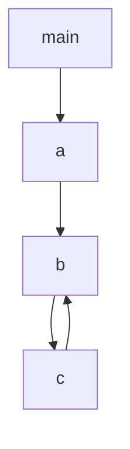

# Call Graph & CGSCC

> 🧭 **Data structure** · `data-structure · analysis · llvm` · Index [[LLVM.MOC]] · see also [[dragon-book-ch12.MOC|Dragon Ch.12]]
> **Prerequisites:** [[control-flow-graph]] · **Drives:** [[inlining]] and other IPO

> [!abstract] Chapter map
> The interprocedural counterpart of the CFG: **nodes are functions, edges are call sites**. LLVM groups its strongly-connected components and processes them **bottom-up** — the order that lets the inliner and other interprocedural passes optimize callees before callers.

> [!info] What it is
> The **call graph** has one node per `Function` and an edge `f → g` for each call of `g` in `f`. Calls through function pointers / virtual dispatch go to a synthetic **external (indirect) node** unless [devirtualization] resolves them. Mutual recursion shows up as a **strongly-connected component (SCC)**.

---

## 1. SCCs and bottom-up order

**Figure — a call graph; `{b, c}` is an SCC (mutual recursion).** The CGSCC pass manager visits SCCs in **post-order (bottom-up)**: leaves first, callers last.

Processing bottom-up means that when a pass looks at a call `f → g`, **`g` has already been optimized** as much as possible — so the caller sees the cleanest possible callee. This is exactly why [[inlining]] runs here.

## 2. In LLVM

> [!info] Two graphs, one pass manager
> - **`CallGraph`** — the classic eager call graph.
> - **`LazyCallGraph`** — built lazily and updated incrementally; used by the new pass manager.
> - The **CGSCC pass manager** runs passes over `LazyCallGraph::SCC` in bottom-up order and **updates the graph on the fly** (inlining creates and removes edges, which can split or merge SCCs). Interprocedural passes — inlining, argument promotion, function-attribute inference (`nounwind`, `readonly`, …) — are CGSCC or module passes.

## 3. Why it matters

The call graph is the substrate for **all interprocedural reasoning**: bottom-up traversal for [[inlining]]; SCC handling for recursion; and it's the scaffold on which interprocedural [[pointer-alias-analysis|alias analysis]] (e.g. DSA's bottom-up/top-down phases) propagates summaries between caller and callee.

> [!summary] The one thing to remember
> The call graph (`CallGraph` / `LazyCallGraph`) is functions-as-nodes, calls-as-edges; LLVM's **CGSCC pass manager** walks its SCCs **bottom-up** so callees are optimized before callers — the enabling order for inlining and interprocedural analysis.

> [!quote] Further reading
> - **Dragon Book §12.1** — basic concepts of interprocedural analysis (call graphs, call sites).
> - [LLVM `CGSCCPassManager`](https://llvm.org/doxygen/CGSCCPassManager_8h.html); `CallGraph`, `LazyCallGraph`.
