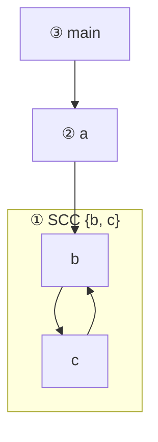

# Call Graph & CGSCC

> 🧭 **Data structure** · `data-structure · analysis · llvm` · Index [[LLVM.MOC]] · see also [[dragon-book-ch12.MOC|Dragon Ch.12]]
> **Prerequisites:** [[control-flow-graph]] · **Drives:** [[inlining]] and other IPO

> [!abstract] Chapter map
> The interprocedural counterpart of the CFG: **nodes are functions, edges are call sites**. LLVM groups its strongly-connected components and processes them **bottom-up** — the order that lets the inliner and other interprocedural passes optimize callees before callers.

> [!info] What it is
> The **call graph** has one node per `Function` and an edge `f → g` for each call of `g` in `f`. Calls through function pointers / virtual dispatch go to a synthetic **external (indirect) node** unless [devirtualization] resolves them. Mutual recursion shows up as a **strongly-connected component (SCC)**.

---

## 1. SCCs and bottom-up order

**Figure — CGSCC post-order: leaf SCC first, callers last.**


```mermaid
flowchart TD
  main["③ main"] --> a["② a"]
  a --> b
  subgraph scc ["① SCC {b, c}"]
    b["b"] --> c["c"]
    c --> b
  end
```

Bottom-up ⇒ at a call `f → g`, ==`g` has already been optimized== as much as possible — exactly why [[inlining]] runs here.

## 2. In LLVM

> [!info] Two graphs, one pass manager
> - **`CallGraph`** — the classic eager call graph.
> - **`LazyCallGraph`** — built lazily and updated incrementally; used by the new pass manager.
> - The **CGSCC pass manager** runs passes over `LazyCallGraph::SCC` in bottom-up order and **updates the graph on the fly** (inlining creates and removes edges, which can split or merge SCCs). Interprocedural passes — inlining, argument promotion, function-attribute inference (`nounwind`, `readonly`, …) — are CGSCC or module passes.

> [!tip]- See it on the running example
> ```bash
> clang -O0 -emit-llvm -S -Xclang -disable-O0-optnone runex.c -o runex.ll   # [[running-example]]
> opt -passes=print-callgraph-sccs -disable-output runex.ll   # SCCs in bottom-up (post-)order
> ```
> `caller → accumulate` ⇒ the leaf SCC `{accumulate}` prints first. `print-callgraph` / `dot-callgraph` dump the raw graph.

## 3. Why it matters

Beyond the inlining order of §1, the graph is the scaffold for interprocedural [[pointer-alias-analysis|alias analysis]]: DSA's bottom-up/top-down phases propagate summaries between caller and callee over it.

> [!summary] The one thing to remember
> The call graph (`CallGraph` / `LazyCallGraph`) is functions-as-nodes, calls-as-edges; LLVM's **CGSCC pass manager** walks its SCCs **bottom-up** so callees are optimized before callers — the enabling order for inlining and interprocedural analysis.

> [!quote] Further reading
> - **Dragon Book §12.1** — basic concepts of interprocedural analysis (call graphs, call sites).
> - [LLVM `CGSCCPassManager`](https://llvm.org/doxygen/CGSCCPassManager_8h.html); `CallGraph`, `LazyCallGraph`.
