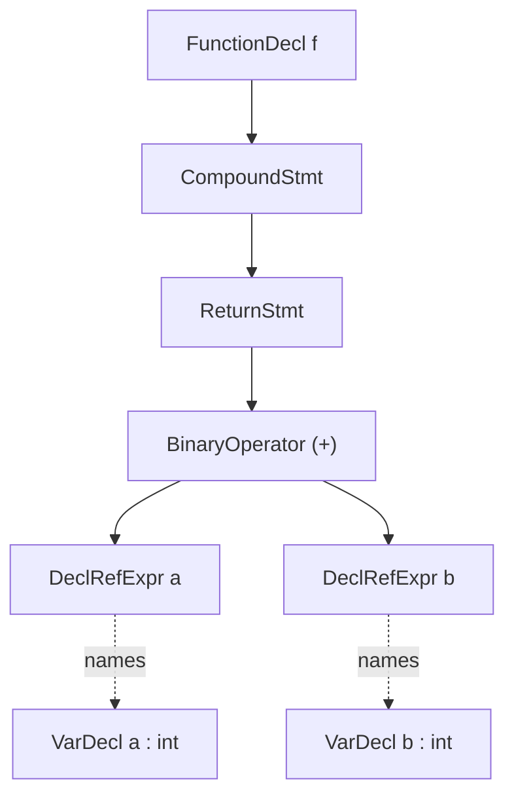

# Clang AST

> 🧭 **Data structure** · `data-structure · frontend · clang` · Index [[LLVM.MOC]]
> **Prerequisites:** [[llvm-basics]] · **Related:** [[clang-cfg]], [[source-level-analysis]], [[type-checking]], [[three-address-code]]

> [!abstract] Chapter map
> The front-end's **typed, sugar-preserving tree** — the faithful record of what the programmer *wrote*, before any lowering. It keeps everything [[three-address-code|LLVM IR]] throws away: types, typedefs, source locations, un-lowered control flow, macros and templates. Every source-level analysis ([[clang-cfg]], the Static Analyzer, clang-tidy, Sema checks) runs on this substrate.

> [!info]+ From classic compiler theory → Clang
>
> | Classic concept | Clang realization |
> |---|---|
> | Abstract syntax tree | three parallel hierarchies, all owned by one `ASTContext` |
> | Declarations | `Decl` — `TranslationUnitDecl` is the root; `FunctionDecl`, `VarDecl`, `RecordDecl`, … |
> | Statements | `Stmt` — and **`Expr` is a subclass of `Stmt`** (`Expr : ValueStmt : Stmt`) |
> | Types | `Type` / `QualType` — kept **separate** from Decl/Stmt, uniqued and canonicalized |
> | Symbol table + scopes | `DeclContext` mixed into `TranslationUnitDecl`, `FunctionDecl`, … |

---

### 1. Definition

> [!note] Definition
> The **Clang AST** is the semantic tree Clang's parser and Sema build for a translation unit. It is three cooperating class hierarchies — **`Decl`** (declarations), **`Stmt`** (statements, with **`Expr` a subclass of `Stmt`**), and **`Type`/`QualType`** (types) — all allocated and owned by a single **`ASTContext`**, whose doc calls it the holder of "long-lived AST nodes (such as types and decls)." The root is **`TranslationUnitDecl`**.

- **`ASTContext`** owns the arena (`BumpPtrAllocator`) and the type-uniquing tables. It hands out **canonical types** (`getCanonicalType`) so that `int` reached through five different typedefs still compares equal, and exposes the root via `getTranslationUnitDecl()`.
- Types live *outside* the Stmt/Decl trees: a node carries a **`QualType`** (a `Type*` plus qualifier bits), never an inline type subtree. This is why the same `Type` object is shared by every expression of that type.
- Nodes are **sugar-preserving**. `typedef int T; T x;` records a `TypedefType` (`TypeBase.h`), not a bare `int`; an implicit conversion becomes an explicit `ImplicitCastExpr` node (`Expr.h`); a `__counted_by(n)` pointer becomes a `CountAttributedType` — literally "a sugar type with `__counted_by`." Desugaring is an explicit, opt-in step (`QualType::getSingleStepDesugaredType`).
- Every node carries **source locations**: `Decl::getLocation()` / `getBeginLoc()` (`DeclBase.h`) and `Stmt::getBeginLoc()` / `getSourceRange()` (`Stmt.h`).

### 2. What the AST keeps that LLVM IR discards

> [!info]+ LLVM IR vs Clang AST
>
> | Property | LLVM IR | Clang AST |
> |---|---|---|
> | Source types | erased to `i32` / `ptr` / `i8` | **`QualType` retained** (signedness, const, the works) |
> | Typedefs & sugar | gone (typedef is transparent) | **preserved** (`TypedefType`, `CountAttributedType`, casts explicit) |
> | Source locations | mostly lost (only `!dbg` if `-g`) | **`SourceLocation` on every node** |
> | Control flow | lowered to `br` / `switch` basic blocks | **un-lowered statements** (`IfStmt`, `ForStmt`, `WhileStmt`) |
> | Macros & templates | expanded / instantiated away | **visible** (expansion locs; template patterns as `Decl`s) |

The thesis in one line: **the AST is the front-end's faithful record of the program as written; IR is what survives lowering.**

### 3. Figure — the AST of `a + b`

**Figure — a `FunctionDecl` whose body adds two `int`s.** Note the two hierarchies meeting: a `Decl` at the top, `Stmt`/`Expr` nodes below, each `DeclRefExpr` pointing back at the `VarDecl` it names. `Type` nodes (the `QualType int` on each expression) hang off to the side, shared, not shown as children.



### 4. Why analysis cares

> [!tip] Source fidelity buys actionable diagnostics
> Because the AST still knows the typedef you used, the macro you expanded, and the exact column, tools can report problems *in the reader's own terms* and point at real source ranges.
> - [[clang-cfg]] — the Static Analyzer builds its per-function CFG **from the AST** (an `IfStmt` becomes real branch edges) to do path-sensitive checking.
> - **clang-tidy** matches AST subtrees (via ASTMatchers) to flag anti-patterns and rewrite them, using `SourceLocation` for fix-its.
> - **Sema attribute checking** validates things like `__counted_by` against the surrounding `RecordDecl` — only possible because the sugar type (`CountAttributedType`) and the field decls are still present.
> - General [[source-level-analysis]] and [[type-checking]] live here: type rules are checked on `QualType`, before any erasure.

### 5. How to inspect it

> [!example]+ Dump the AST for a file
> ```sh
> clang -Xclang -ast-dump -fsyntax-only foo.c
> ```
> For `int f(int a, int b) { return a + b; }` the dump *reads like* the tree above — indented, colorized, one node per line:
> ```text
> TranslationUnitDecl
> `-FunctionDecl f 'int (int, int)'
>   |-ParmVarDecl a 'int'
>   |-ParmVarDecl b 'int'
>   `-CompoundStmt
>     `-ReturnStmt
>       `-BinaryOperator 'int' '+'
>         |-ImplicitCastExpr 'int' <LValueToRValue>
>         | `-DeclRefExpr 'int' lvalue ParmVar 'a'
>         `-ImplicitCastExpr 'int' <LValueToRValue>
>           `-DeclRefExpr 'int' lvalue ParmVar 'b'
> ```
> Note the **explicit `ImplicitCastExpr`** the front-end inserted (lvalue → rvalue) — sugar the AST makes visible.

> [!warning] Illustrative, not captured output
> The excerpt above is hand-written to show the *shape*; exact strings, addresses, and formatting vary by Clang version. Run the command to see the real dump.

### 6. Limitations

- **No values, no SSA.** The AST models syntax and types, not dataflow. There are no basic blocks, φ-nodes, or def-use chains — those appear only after lowering to [[three-address-code|LLVM IR]] via [[control-flow-translation|CodeGen]]. Optimization reasoning belongs there, not here.
- **Intra-TU.** One AST = one translation unit. Whole-program facts need LTO / cross-TU indexing, not the AST alone.
- **Verbose and heavy.** Sugar preservation and per-node source locations make the AST large; walking it repeatedly is not free (hence ASTMatchers and cached traversals).
- It is the **input** to lowering, not the output: CodeGen consumes the AST and emits IR, at which point the fidelity described above is deliberately dropped.

> [!summary] Remember
> The Clang AST is the typed, sugar-preserving, source-located tree of what was *written* — `Decl` / `Stmt` (with `Expr` a `Stmt`) / `Type`, all owned by `ASTContext`, rooted at `TranslationUnitDecl`. It is everything LLVM IR throws away, and the substrate every source-level tool runs on.

> [!quote] Sources & confidence
> Tier-1, confirmed against the pinned Clang source ([[llvm-version]]):
> - [clang/include/clang/AST/ASTContext.h](https://github.com/llvm/llvm-project/blob/main/clang/include/clang/AST/ASTContext.h) — "Holds long-lived AST nodes"; `BumpPtrAllocator`, `getCanonicalType`, `getTranslationUnitDecl`
> - [clang/include/clang/AST/DeclBase.h](https://github.com/llvm/llvm-project/blob/main/clang/include/clang/AST/DeclBase.h) — `Decl`, `DeclContext`, `getLocation`/`getBeginLoc`
> - [clang/include/clang/AST/Decl.h](https://github.com/llvm/llvm-project/blob/main/clang/include/clang/AST/Decl.h) — `TranslationUnitDecl : public Decl` (root)
> - [clang/include/clang/AST/Stmt.h](https://github.com/llvm/llvm-project/blob/main/clang/include/clang/AST/Stmt.h) — `ValueStmt : public Stmt`; source-range accessors
> - [clang/include/clang/AST/Expr.h](https://github.com/llvm/llvm-project/blob/main/clang/include/clang/AST/Expr.h) — `Expr : public ValueStmt`; `ImplicitCastExpr`
> - [clang/include/clang/AST/TypeBase.h](https://github.com/llvm/llvm-project/blob/main/clang/include/clang/AST/TypeBase.h) — `QualType`, `TypedefType`, `CountAttributedType` ("sugar type with `__counted_by`"), `getSingleStepDesugaredType`
> - [Clang — Introduction to the Clang AST](https://clang.llvm.org/docs/IntroductionToTheClangAST.html)
