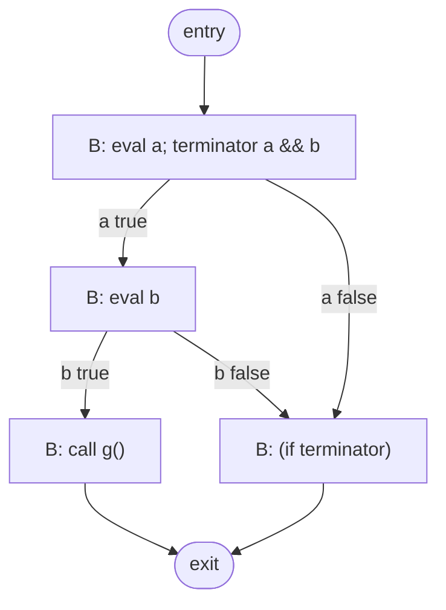

# Clang CFG (source-level)

> 🧭 **Data structure** · `data-structure · analysis · clang` · Index [[LLVM.MOC]]
> **Prerequisites:** [[clang-ast]] · **Contrast with:** [[control-flow-graph|LLVM IR CFG]]

> [!abstract] Chapter map
> A control-flow graph built from a **function's AST body**, not from IR. Its nodes carry *source statements* and *implicit C++ actions* (destructors, temporaries, initializers) rather than lowered IR instructions. This is the substrate the frontend's source-level analyses and diagnostics run on — a different object from LLVM's [[control-flow-graph|IR CFG]], which lives after lowering.

---

### 1. Definition

> [!note] Definition
> The **Clang CFG** is a per-function control-flow graph produced by `CFG::buildCFG(const Decl *D, Stmt *AST, ASTContext *C, const BuildOptions &BO)` from a function's AST body. Its nodes are `CFGBlock`s; each block holds an ordered list of `CFGElement`s and may carry a single **terminator**. Edges are the terminator's possible successors.

- A **`CFGBlock`** is the source-level analogue of a basic block: a straight-line run of elements entered only at the top. Blocks connect via successor/predecessor edges, and the graph has a distinguished **entry** and **exit** block.
- A **`CFGElement`** is what a block contains. Most are `CFGStmt` (an AST `Stmt*`), but the element `Kind` enum also models the *implicit* work the source hides: `CFGInitializer` (a C++ member/base initializer), `CFGAutomaticObjDtor` and the other `CFGImplicitDtor` kinds (`DeleteDtor`, `BaseDtor`, `MemberDtor`, `TemporaryDtor`), `CFGNewAllocator`, plus scope-begin/scope-end and lifetime-end markers.
- A **terminator** (`CFGTerminator`, reachable via `CFGBlock::getTerminator()` / `getTerminatorStmt()`) is the AST statement that decided the branch — an `if`, `while`, `switch`, `&&`/`||`, or `?:`. The frontend keeps the *source* construct as the terminator, unlike IR where the terminator is a lowered `br`/`switch`.

Because it is built straight off the AST, the Clang CFG makes explicit exactly the C/C++ control flow the source implies but the syntax tree does not spell out edge-by-edge.

### 2. Clang CFG vs. LLVM IR CFG

> [!info]+ Two different graphs with the same name
>
> | Aspect | **Clang CFG** (`clang/Analysis/CFG.h`) | **[[control-flow-graph|LLVM IR CFG]]** (`llvm/IR/CFG.h`) |
> |---|---|---|
> | Built from | the **AST**, before lowering (`buildCFG(Decl*, Stmt*, ASTContext*)`) | LLVM IR, after the frontend has emitted it |
> | Node payload | `CFGElement`s: AST statements **plus implicit C++ actions** (dtors, temporaries, initializers) | `Instruction`s inside a `BasicBlock` |
> | Branch representation | source construct kept as **terminator**; `&&`/`\|\|`, `?:`, and destructor edges are **modeled explicitly** | already-lowered `br`/`switch`/`invoke` |
> | Primary use | **source-level diagnostics & analyses** (warnings, static analysis) | **IR optimization** and codegen |
> | SSA / φ | **none** — plain statements, no value numbering | SSA with `phi` at merges ([[ssa-form]]) |
> | Granularity | one graph **per function body**, intra-procedural | per `Function`, intra-procedural |

The headline difference: the Clang CFG sits *before* lowering, so it still speaks C++. Short-circuit operators, the ternary, and the compiler-synthesized destructor calls that C++ scopes imply all appear as their own blocks and edges — precisely the structure the frontend needs to reason about *what the programmer wrote*.

### 3. Figure — short-circuit `&&` becomes explicit blocks

**The Clang CFG for `void f(int a, int b) { if (a && b) g(); }`.** The `&&` is not one instruction; the CFG splits it so the right operand `b` is only evaluated when `a` is true, and both false-paths merge before the `if` body is skipped.



Reading it: the `&&` terminator gives `a` two successors; only the true edge reaches the block that evaluates `b`. An IR CFG for the same code would show the same shape, but as lowered `br i1` branches with no memory that this was a single `&&` expression.

### 4. What runs on it

The Clang CFG is the shared substrate for the frontend's flow-sensitive machinery in `clang/lib/Analysis/`:

> [!info] Consumers (confirmed in `clang/lib/Analysis/`)
> - **Live variables** (`LiveVariables.cpp`) — classic backward [[data-flow-analysis|dataflow]] over the CFG.
> - **Uninitialized values** (`UninitializedValues.cpp`) — the `-Wuninitialized` warning, a forward analysis to a fixpoint on CFG edges.
> - **Reachable code** (`ReachableCode.cpp`) — `-Wunreachable-code`, a CFG reachability sweep.
> - **Thread safety** (`ThreadSafety.cpp`) — Clang's `-Wthread-safety` lock analysis walks the CFG.
> - **The [[clang-static-analyzer|Clang Static Analyzer]]** (`clang/lib/StaticAnalyzer/`) — its `CoreEngine`/`ExprEngine` do path-sensitive symbolic execution over this CFG.
> - **The [[clang-dataflow-framework|FlowSensitive dataflow framework]]** (`clang/lib/Analysis/FlowSensitive/`) — builds an `AdornedCFG` on top of it for generic dataflow analyses.

All of these are **[[data-flow-analysis|dataflow]] over a control-flow graph** — the same theory as IR-level analyses, but run on source constructs so the diagnostics can point at what the user wrote. This is what makes the Clang CFG the substrate for [[source-level-analysis]] generally.

### 5. How to inspect

There is no plain driver flag; the CFG is dumped through the Static Analyzer's debug checker `debug.DumpCFG` (implemented as `CFGDumper` in `clang/lib/StaticAnalyzer/Checkers/DebugCheckers.cpp`, which calls `CFG::dump`):

```sh
clang -Xclang -analyze -Xclang -analyzer-checker=debug.DumpCFG foo.c
```

The output lists each block, its ordered elements, its terminator, and its successors — schematically:

```
 [B2 (ENTRY)]
   Succs (1): B1

 [B1]
   1: a
   T: [B1.1] && ...
   Preds (1): B2
   Succs (2): B3 B0    ; true → eval RHS (B3); false → short-circuit to exit (B0)
```

> [!danger] Unverified
> The exact `DumpCFG` text layout above is **illustrative**, reconstructed from the block/terminator/successor structure — not copied from a run. Block numbering, ordering, and formatting vary by Clang version and by the code analyzed; treat only the *shape* (blocks, `T:` terminator line, `Succs`/`Preds`) as reliable, and dump your own function for exact output.

`debug.ViewCFG` (the sibling `CFGViewer` checker) renders the same graph via Graphviz.

### 6. Limitations

> [!warning] Scope of the Clang CFG
> - **Intra-procedural** — one graph per function body; calls are opaque nodes, not inlined. Cross-function reasoning is the caller's job.
> - **Source-level, not lowered** — it is *not* the IR CFG. Anything defined over lowered IR (LLVM optimizations, SSA, `phi`) lives on [[control-flow-graph|that graph]] instead.
> - **No SSA / value numbering** — elements are statements; there is no φ, so def-use reasoning is done by the analyses on top, not baked into the graph.
> - **C/C++ (and ObjC) specific** — it models those languages' constructs (destructor edges, temporaries, initializers) and is a Clang artifact, not a general LLVM data structure.

> [!summary] Remember
> The Clang CFG is a **per-function, AST-level** control-flow graph whose blocks carry statements *and implicit C++ actions*, modeling `&&`/`?:`/destructor edges explicitly — the substrate for frontend diagnostics and the Static Analyzer, and a distinct object from LLVM's post-lowering [[control-flow-graph|IR CFG]].

> [!quote] Sources & confidence
> Tier-1, verified against the pinned submodule and cross-checked upstream:
> - [`clang/include/clang/Analysis/CFG.h`](https://github.com/llvm/llvm-project/blob/main/clang/include/clang/Analysis/CFG.h) — `CFG`, `CFGBlock`, `CFGElement` + `Kind` enum, `CFGStmt`/`CFGInitializer`/`CFGNewAllocator`/`CFGImplicitDtor`/`CFGAutomaticObjDtor`, `CFGTerminator`, `buildCFG`.
> - [`clang/lib/Analysis/CFG.cpp`](https://github.com/llvm/llvm-project/blob/main/clang/lib/Analysis/CFG.cpp) — `VisitLogicalOperator` (`&&`/`||`), `VisitConditionalOperator` (`?:`), implicit-destructor and temporary handling.
> - Consumers grepped in `clang/lib/Analysis/` (`LiveVariables.cpp`, `UninitializedValues.cpp`, `ReachableCode.cpp`, `ThreadSafety.cpp`, `FlowSensitive/`) and `clang/lib/StaticAnalyzer/` (`CoreEngine.cpp`, `ExprEngine.cpp`); `DumpCFG`/`ViewCFG` in `DebugCheckers.cpp`.
> - [Clang doxygen — `clang::CFG`](https://clang.llvm.org/doxygen/classclang_1_1CFG.html).
