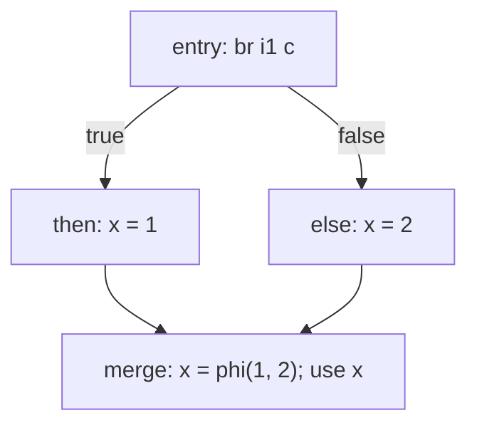

# Control-Flow Graph (CFG)

> 🧭 **Data structure** · `data-structure · ir · general+llvm` · Index [[LLVM.MOC]]
> **Prerequisites:** [[llvm-basics]] · **Built on by:** [[dominator-tree]], [[loop-info]], [[ssa-form]]

> [!abstract] Chapter map
> The graph almost every analysis and transform runs on: nodes are basic blocks, edges are possible control transfers. Dominance, loops, and SSA φ-placement are all defined *over* the CFG.

> [!info]+ From classic compiler theory → LLVM
> | Classic concept | LLVM realization |
> |---|---|
> | Basic block (single-entry, single-exit straight-line code) | `BasicBlock` — ends in exactly one **terminator** |
> | CFG node / edge | `BasicBlock` / successor edges from the terminator (`br`, `switch`, `invoke`, `ret`, …) |
> | Entry block | the first block of a `Function`; not a successor of any block |
> | Successors / predecessors | `successors(BB)` / `predecessors(BB)` (`llvm/IR/CFG.h`) |

---

### 1. Definition

> [!note] Definition
> A **control-flow graph** $G=(V,E)$ has one node per **basic block** and a directed edge $b_1 \to b_2$ whenever control can transfer from the end of $b_1$ to the start of $b_2$. In LLVM, a `Function` *is* a CFG of `BasicBlock`s; each block ends in exactly one **terminator** instruction whose operands name its successor blocks.

- A **basic block** is a maximal straight-line instruction sequence: control enters only at the top and leaves only at the terminator. No internal branches in, no internal branches out.
- The **entry block** has no predecessors and dominates every reachable block.
- Blocks unreachable from entry are where **dominance is undefined** (relevant to [[loop-info]] and SSA).

**Figure — a small CFG for `if (c) x = 1; else x = 2; use(x);`.** Nodes are basic blocks; edges are the terminator's successors. The merge block needs a `phi` because two definitions of `x` reach it.

### 2. Why it's the substrate

> [!info] What gets defined over the CFG
> - **Dominance** and the [[dominator-tree]] — "does every path to B pass through A?"
> - **Loops** — a [[loop-info|natural loop]] is a CFG property (a strongly-connected, single-header subgraph), not a syntactic `for`/`while`.
> - **SSA φ-placement** — φ nodes go at CFG merges, specifically at dominance frontiers ([[ssa-form]]).
> - **Dataflow analysis** — facts propagate along CFG edges to a fixpoint ([[data-flow-analysis]]).

### 3. Reducibility

> [!note] Reducible vs. irreducible
> A CFG is **reducible** if every cycle has a single header that dominates the whole cycle (it can be collapsed to a point by folding sequential blocks, acyclic branches, and self-loops). **Irreducible** control flow (multiple-entry cycles) has no natural loop — only an LLVM [cycle](https://llvm.org/docs/CycleTerminology.html). Structured languages (C/C++ without `goto` spaghetti) almost always produce reducible CFGs.

> [!quote] Sources
> - [LangRef — Functions / Basic Blocks](https://llvm.org/docs/LangRef.html#functions)
> - [LLVM Loop Terminology — reducibility](https://llvm.org/docs/LoopTerminology.html)
