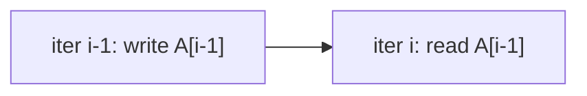

# Array Dependence Analysis

> 🧭 **Data structure** · `data-structure · analysis · llvm` · Index [[LLVM.MOC]] · see also [[dragon-book-ch11.MOC|Dragon Ch.11]]
> **Prerequisites:** [[scalar-evolution]], [[loop-info]] · **Gates:** [[loop-transformations]] (vectorize/parallelize), [[polyhedral-model]]

> [!abstract] Chapter map
> Whether it's legal to reorder, vectorize, or parallelize a loop comes down to one question: do two memory accesses **depend** on each other across iterations? This note covers dependence kinds and distance/direction vectors, and LLVM's `DependenceAnalysis` that answers them.

> [!info] The three dependences
> Between a memory access that runs first and one that runs later:
> - **Flow (true, RAW)** — write then read the same location.
> - **Anti (WAR)** — read then write.
> - **Output (WAW)** — write then write.
> A dependence is **loop-carried** if the two accesses are in different iterations (vs. **loop-independent** within one). Only true (flow) dependences are fundamental; anti/output can often be removed by renaming.

---

## 1. Distance & why it blocks transforms

**Figure — a loop-carried flow dependence with distance 1.**



```c
for (i = 1; i < n; i++)
  A[i] = A[i-1] + 1;   // reads what the previous iteration wrote
```
Iteration `i` reads `A[i-1]`, written by iteration `i-1` — a **loop-carried flow dependence, distance 1**. Because a later iteration needs an earlier one's result, the loop **cannot be vectorized or run in parallel** as written. Contrast `A[i] = A[i] + 1` (distance 0, loop-independent) which *is* parallel.

> [!info] Distance / direction vectors
> For nested loops, a dependence carries a **distance vector** (how many iterations apart, per loop level) and its sign is the **direction vector** (`<`, `=`, `>`). A transformation is legal iff it keeps every dependence's direction lexicographically positive — the test [[loop-transformations|loop transforms]] and [[polyhedral-model|the polyhedral model]] use.

## 2. In LLVM

> [!info] `DependenceAnalysis`
> LLVM's **`DependenceAnalysis`** decides whether two memory references in a loop nest can alias across iterations. It expresses subscripts as [[scalar-evolution|SCEV]] expressions and applies a hierarchy of tests — **ZIV / SIV / MIV** (zero/single/multiple index variable), **GCD**, and **Banerjee** — returning a `Dependence` with direction/distance or "none." A lighter, vectorizer-focused cousin, **`LoopAccessAnalysis`**, gathers may-alias pairs and emits **runtime memory checks** so a loop can be vectorized speculatively.

## 3. Why it matters

Dependence analysis is the **legality oracle** for the whole loop-optimization stack: the vectorizer, [[loop-transformations|LICM / distribution / fusion]], and [[polyhedral-model|Polly]] all ask it "can I move/overlap these memory accesses?" before transforming.

> [!summary] The one thing to remember
> A transform that touches loop iteration order is legal only if it preserves **array dependences** (flow/anti/output, with distance/direction). LLVM answers this with **`DependenceAnalysis`** (SCEV subscripts + ZIV/SIV/MIV/GCD/Banerjee tests) and **`LoopAccessAnalysis`** (runtime checks for the vectorizer).

> [!quote] Further reading
> - **Also in:** Muchnick *Advanced Compiler Design & Impl.* §9 — dependence analysis & dependence graphs.
> - **Source:** [`Analysis/DependenceAnalysis.cpp`](https://github.com/llvm/llvm-project/blob/main/llvm/lib/Analysis/DependenceAnalysis.cpp) · [`Analysis/LoopAccessAnalysis.cpp`](https://github.com/llvm/llvm-project/blob/main/llvm/lib/Analysis/LoopAccessAnalysis.cpp)
> - **Dragon Book §11.6** — array data-dependence analysis (distance/direction, GCD & Banerjee tests).
