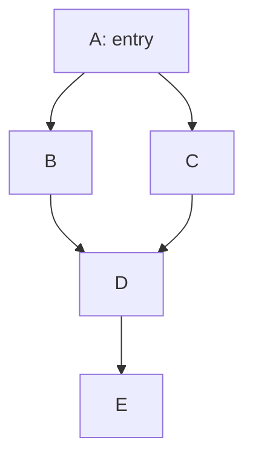
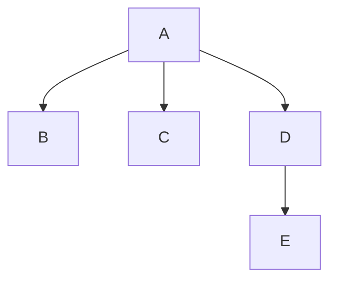

# Dominator Tree & Dominance Frontier

> 🧭 **Data structure** · `data-structure · analysis · general+llvm` · Index [[LLVM.MOC]]
> **Prerequisites:** [[control-flow-graph]] · **Used by:** [[ssa-form]], [[value-numbering]], [[loop-info]]

> [!abstract] Chapter map
> Dominance — "must every path through A?" — and the tree/frontier built from it. This is the single most reused structure in the middle-end: SSA construction, GVN, LICM, and loop canonicalization all walk it.

> [!info]+ From classic compiler theory → LLVM
> | Classic concept | LLVM realization |
> |---|---|
> | $A$ dominates $B$ | `DominatorTree::dominates(A, B)` |
> | Immediate dominator $idom(B)$ | parent of `B` in the `DominatorTree` |
> | Dominator tree | `DominatorTree` (`llvm/IR/Dominators.h`) |
> | Dominance frontier | `DominanceFrontier` — drives `mem2reg` φ-placement |
> | Post-dominance | `PostDominatorTree` |

---

### 1. Dominance

> [!note] Definition
> Block **$A$ dominates $B$** ($A \le B$) iff *every* path from the entry block to $B$ passes through $A$. $A$ **strictly dominates** $B$ if $A \le B$ and $A \neq B$. The **immediate dominator** $idom(B)$ is the unique strict dominator of $B$ closest to it (the last one on every entry→$B$ path).
>
> Dominance is only defined for blocks **reachable** from entry.

### 2. The dominator tree

> [!note] Definition
> Make $idom(B)$ the parent of $B$ for every block; the result is a tree rooted at the entry. $A$ dominates $B$ **iff** $A$ is an ancestor of $B$ in this tree — so dominance queries become ancestor checks. LLVM computes it with the near-linear **Lengauer–Tarjan** algorithm (with the Semi-NCA refinement) and maintains it incrementally as the CFG changes.

**Figure — a CFG and the dominator tree built from it.**

CFG:

Dominator tree (parent = immediate dominator):

`D` is reached through **both** `B` and `C`, so neither dominates it ⇒ `idom(D) = A`. Hence the **dominance frontier** of `B` (and of `C`) is `{D}`: a value defined in `B` or `C` needs a `phi` in `D` — exactly SSA φ-placement (see [[ssa-form]]).

### 3. Dominance frontier (why SSA needs it)

> [!note] Definition
> The **dominance frontier** $DF(A)$ is the set of blocks $B$ where $A$ dominates a *predecessor* of $B$ but does **not** strictly dominate $B$ itself — i.e. the first blocks "just out of reach" of $A$'s dominance. These are exactly the CFG merges where a value defined in $A$ may meet a different definition.

> [!tip] The payoff
> Minimal-SSA construction places a φ for a variable precisely at the **iterated dominance frontier** of its definitions (Cytron et al.) — this is what `mem2reg` does (see [[ssa-form]]).

### 4. Where LLVM uses it

> [!info] Consumers
> - **SSA construction / `mem2reg`** — φ placement via dominance frontiers.
> - **[[value-numbering|GVN]]** — processes blocks in dominator-tree order with a scoped table, so definitions are numbered before uses.
> - **[[loop-transformations#7. Loop-invariant code motion (LICM)|LICM]]** — legality needs the definition to dominate all uses and the block to dominate loop exits.
> - **[[loop-info|LoopInfo / LCSSA]]** — the header dominates the loop; LCSSA closing-φ placement uses dominance frontiers.

> [!note] Post-dominators
> $B$ **post-dominates** $A$ iff every path from $A$ to the exit passes through $B$ — the dominance relation on the reverse CFG. Used by control-dependence and sinking transforms.

> [!quote] Sources
> - **Also in:** Muchnick *Advanced Compiler Design & Impl.* §7 — control-flow analysis (dominators, intervals).
> - [doxygen — `DominatorTree`](https://llvm.org/doxygen/classllvm_1_1DominatorTree.html)
> - Cytron, Ferrante, Rosen, Wegman, Zadeck 1991 (SSA + dominance frontiers); Lengauer & Tarjan 1979 (fast dominators).
