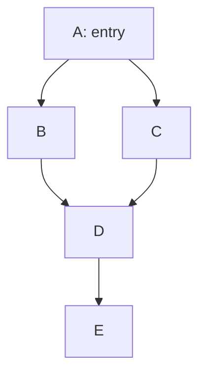
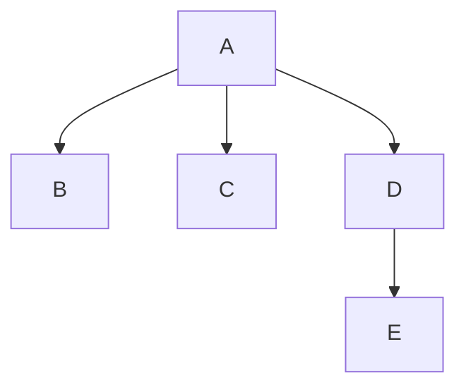
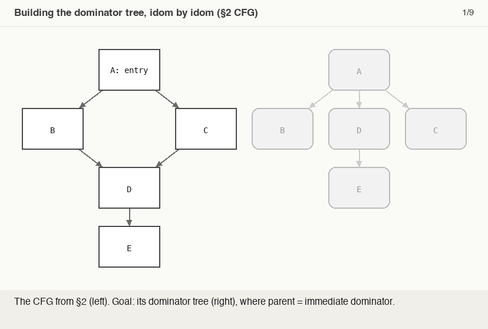

# Dominator Tree & Dominance Frontier

> 🧭 **Data structure** · `data-structure · analysis · general+llvm` · Index [[LLVM.MOC]]
> **Prerequisites:** [[control-flow-graph]] · **Used by:** [[ssa-form]], [[value-numbering]], [[loop-info]]

> [!abstract] Chapter map
> Dominance — "must every path through A?" — and the tree/frontier built from it. This is the single most reused structure in the middle-end: SSA construction, GVN, LICM, and loop canonicalization all walk it.

> [!info]+ From classic compiler theory → LLVM
> | Classic concept | LLVM realization |
> |---|---|
> | $A$ dominates $B$ | `DominatorTree::dominates(A, B)` |
> | Immediate dominator $idom(B)$ | parent of `B` in the `DominatorTree` |
> | Dominator tree | `DominatorTree` (`llvm/IR/Dominators.h`) |
> | Dominance frontier | `DominanceFrontier` — drives `mem2reg` φ-placement |
> | Post-dominance | `PostDominatorTree` |

---

### 1. Dominance

> [!note] Definition
> Block **$A$ dominates $B$** ($A \le B$) iff *every* path from the entry block to $B$ passes through $A$. $A$ **strictly dominates** $B$ if $A \le B$ and $A \neq B$. The **immediate dominator** $idom(B)$ is the unique strict dominator of $B$ closest to it (the last one on every entry→$B$ path).
>
> Dominance is only defined for blocks **reachable** from entry.

### 2. The dominator tree

> [!note] Definition
> Make $idom(B)$ the parent of $B$ for every block; the result is a tree rooted at the entry. $A$ dominates $B$ **iff** $A$ is an ancestor of $B$ in this tree — so dominance queries become ancestor checks. LLVM computes it with the near-linear **Lengauer–Tarjan** algorithm (with the Semi-NCA refinement) and maintains it incrementally as the CFG changes.

**Figure — a CFG and the dominator tree built from it.**

CFG:

```mermaid
flowchart TD
  A["A: entry"] --> B["B"]
  A --> C["C"]
  B --> D["D"]
  C --> D
  D --> E["E"]
```
> [!question] Predict first
> `D`'s CFG predecessors are `B` and `C`. Before looking at the tree below: what is `idom(D)`? (Hint: is there a path entry→`D` that avoids `B`? One that avoids `C`?)

Dominator tree (parent = immediate dominator):

```mermaid
flowchart TD
  A2["A"] --> B2["B"]
  A2 --> C2["C"]
  A2 --> D2["D"]
  D2 --> E2["E"]
```
`D` is reached through **both** `B` and `C`, so neither dominates it ⇒ `idom(D) = A`.

> [!figure]+ Animation — building this dominator tree, idom by idom
> 
> Watch the tree grow one idom at a time — and why `D`'s two converging paths hoist `idom(D)` up to `A`, making `D` the dominance frontier of `B` and `C`. (Regenerate: `_meta/anim/storyboards/dominator-tree-idom-build.json`.)

### 3. Dominance frontier (why SSA needs it)

> [!note] Definition
> The **dominance frontier** $DF(A)$ is the set of blocks $B$ where $A$ dominates a *predecessor* of $B$ but does **not** strictly dominate $B$ itself — i.e. the first blocks "just out of reach" of $A$'s dominance. These are exactly the CFG merges where a value defined in $A$ may meet a different definition.

Check it on the figure above: is `D ∈ DF(B)`? (1) `B` dominates a predecessor of `D` — every block dominates itself, and `B` is a predecessor of `D`. (2) `B` does not strictly dominate `D` — the path `A→C→D` avoids `B`. Both conditions hold ⇒ `D ∈ DF(B)`, and by symmetry `D ∈ DF(C)`. So a value defined in `B` or `C` needs a `phi` in `D` — exactly SSA φ-placement (see [[ssa-form]]).

> [!tip] The payoff
> Minimal-SSA construction places a φ for a variable precisely at the **iterated dominance frontier** of its definitions — *iterated* because each placed φ is itself a new definition with its own frontier, so DF is re-applied until the set stops growing (Cytron et al.) — this is what `mem2reg` does (see [[ssa-form]]).

> [!example] On the running example
> The `-O0` CFG of `accumulate` ([[running-example#2. Front-end IR — everything is a stack slot]]) is `entry → for.cond`, `for.cond → {for.body, for.end}`, `for.body → for.inc → for.cond` (the back-edge). Dominator tree: `entry → for.cond → {for.body, for.end}`, `for.body → for.inc`.
> Apply the DF definition to `for.inc`: it dominates itself, a predecessor of `for.cond`, but does not strictly dominate `for.cond` (the `entry → for.cond` edge avoids it) ⇒ `for.cond ∈ DF(for.inc)`. Now the stores: `i` is written in `entry` and `for.inc`; `sum` in `entry` and `for.body`. Since `DF(entry) = ∅` and `DF(for.body) = DF(for.inc) = {for.cond}` (already a fixed point), the iterated DF of each variable's definition blocks is `{for.cond}` — so `mem2reg` places the φs for both `sum` and `i` at the loop header `for.cond`. (In the `-O1` dump of [[running-example#3. After mem2reg and loop opts]] the surviving φs — `%sum.05`, `%indvars.iv` — sit in `for.body` because loop rotation later made it the new loop header.)

### 4. Where LLVM uses it

> [!info] Consumers
> - **SSA construction / `mem2reg`** — φ placement via dominance frontiers.
> - **[[value-numbering|GVN]]** — processes blocks in reverse post-order with a global leader table, using the dominator tree for dominance queries. (A contrasting design: `EarlyCSE` instead walks the dominator tree itself, scoping its hash table to the current root-to-node path.)
> - **[[loop-transformations#Loop-invariant code motion (LICM)|LICM]]** — legality needs the definition to dominate all uses and the block to dominate loop exits.
> - **[[loop-info|LoopInfo / LCSSA]]** — the header dominates the loop; LCSSA closing-φ placement uses dominance frontiers.

> [!note] Post-dominators
> $B$ **post-dominates** $A$ iff every path from $A$ to the exit passes through $B$ — the dominance relation on the reverse CFG. Used by control-dependence and sinking transforms.

> [!quote] Sources
> - **Also in:** Muchnick *Advanced Compiler Design & Impl.* §7 — control-flow analysis (dominators, intervals).
> - [doxygen — `DominatorTree`](https://llvm.org/doxygen/classllvm_1_1DominatorTree.html)
> - Cytron, Ferrante, Rosen, Wegman, Zadeck 1991 (SSA + dominance frontiers); Lengauer & Tarjan 1979 (fast dominators).
