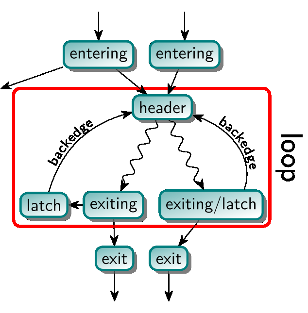
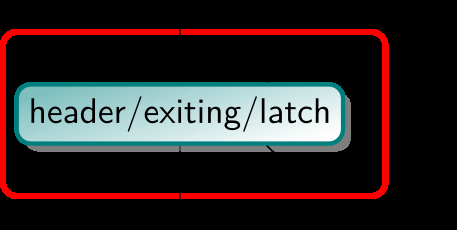
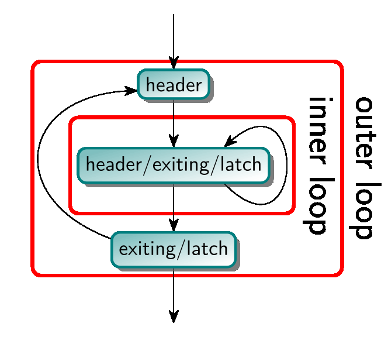
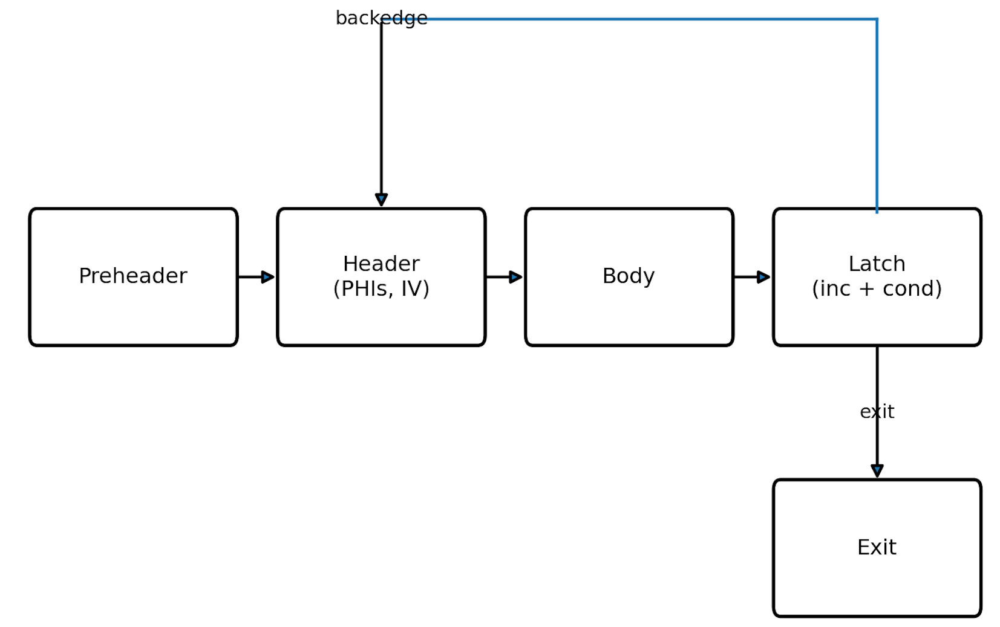
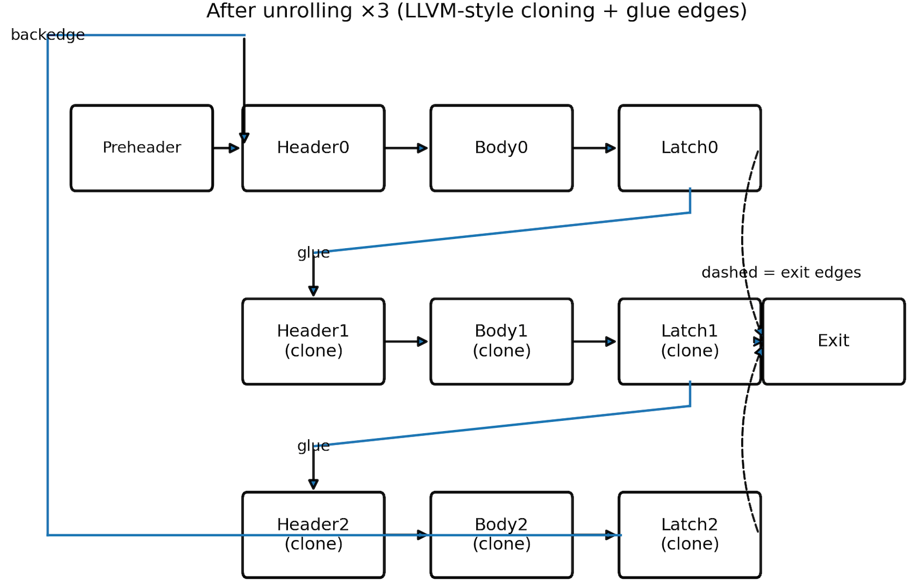

# LoopInfo & Loop Canonical Forms

> 🧭 **Data structure** · `data-structure · analysis · llvm` · Index [[LLVM.MOC]]
> **Prerequisites:** [[ssa-form]] · **Feeds:** [[loop-transformations]] · Chapter: [[Loop-Optimization.MOC]]

> [!abstract] Chapter map
> 1. **What a loop *is*** in LLVM (a CFG property, not a syntax form) → `LoopInfo`.
> 2. The `LoopInfo` analysis — what it guarantees and doesn't.
> 3. **Canonical forms** that make loop passes simpler: *LoopSimplify*, *LCSSA*, *rotation*.

> [!tip] See it live
> Every term here is visible in [[running-example#3. After mem2reg and loop opts|the running example's `-O1` loop]]: `for.body.preheader` (the preheader), the `for.body` header/latch with its back-edge, and `%sum.0.lcssa` (the LCSSA closing φ at the exit).

> [!info]+ From classic compiler theory → how LLVM actually does it
> | Dragon-book concept | LLVM realization |
> |---|---|
> | *Natural loop* (single-entry, back edge to a dominating header) | `Loop` discovered by the `LoopInfo` analysis |
> | Back edge $n \to h$ where $h$ dominates $n$ | **latch → header** edge; header dominates the loop |
> | Loop pre-header | **preheader** (the unique entering block) |
> | Reducible vs. irreducible flow graphs | reducible ⇒ loop; irreducible ⇒ only a [cycle](https://llvm.org/docs/CycleTerminology.html) |
> | Reaching definitions / available expressions | used by LICM, GVN, LoopDistribute to prove legality |
> | Data-dependence testing | gates fission/fusion/vectorization legality |
>
> Keep this mapping in mind: in LLVM a loop is **derived from the [[control-flow-graph|CFG]] + [[dominator-tree]]**, never from the source `for`/`while` keyword.

---

### 1. In LLVM, a LoopInfo indicates where are loops

> [!note] Definition — a loop (the `LoopInfo` model)
> A **loop** is a subset of CFG nodes (basic blocks) such that:
> 1. the **induced subgraph** is *strongly connected* (every node reachable from every other);
> 2. all edges entering the subset point to one node — the ==header== — which therefore **dominates** every node in the loop;
> 3. it is **maximal**: no extra node can be added while keeping (1) and (2).
>
> In the literature this is a ==natural loop==; LLVM's more general notion is a [cycle](https://llvm.org/docs/CycleTerminology.html). *(Source: LLVM LoopTerminology.)*

Your notes, made precise — the anatomy of a loop:

| Term | Meaning | Your wording |
|---|---|---|
| **Header** | single entry; dominates the whole loop | "entry point of the loop" |
| **Entering block** / **predecessor** | non-loop node with an edge into the header | "nodes that point to header" |
| **Preheader** | the *unique* entering block (dominates the loop, not part of it) | "if only one entering node → pre-header" |
| **Latch** | loop node with an edge back to the header | "node that has edge back to header" |
| **Backedge** | the latch → header edge | "the edge is called backedge" |
| **Exiting block** | loop node with an edge leaving the loop | "exiting node" |
| **Exit block** | the (non-loop) target of an exiting edge | "exit node" |

> [!figure]+ Figure 1 — loop anatomy (header / latch / exiting / exit)
> 

> [!info] Trip count vs. backedge-taken count
> The **trip count** is the number of header executions before leaving. A sharper measure used throughout LLVM is the **backedge-taken count**: for an execution that enters the header, $\text{backedge-taken} = \text{trip count} - 1$. [[scalar-evolution|Scalar Evolution (`SCEV`)]] reasons in terms of this count.

**Loop subgraph properties** (kept from your notes, now justified):

- A header block ==cannot be the header of another loop== → a loop is identified by its header (Single-Entry-Multiple-Exit region).
- A loop may be *undefined* if it is not reachable from `entry` (dominance is undefined there).
- The smallest loop is **one block that branches to itself** — that block is header, latch *and* exiting block at once.

> [!figure]+ Figure 2 — a single-block loop (header = latch = exiting)
> 

- Loops can be **nested**; the loop hierarchy of a function forms a *forest* (each top-level loop roots a tree of sub-loops).

> [!figure]+ Figure 3 — nested loops
> 
>
> Nodes of the inner loop *belong to* the node set of the outer loop, but they are not "special" nodes of the outer loop.

- Two loops are either **disjoint or nested** — they can never share only *some* nodes (that would violate maximality; only the merge of both sets is a loop).

> [!figure]+ Figure 4 — non-maximal subsets are not loops; only their merge is
> 
> 

> [!warning] A cycle in the CFG is **not** always a loop
> If no single header dominates the whole cycle, the control flow is ==irreducible== and there is no natural loop — only a *cycle*. Such irreducible cycles can be turned into natural loops (by inserting a single header) by the **FixIrreducible** pass — *not* by LoopSimplify, which only canonicalizes loops that are already natural.

---

### 2. A LLVM pass to obtain info about loops.

> [!tip] `LoopInfo` analysis — what it guarantees (and doesn't)
> Inspect it with `opt input.ll -passes='print<loops>'`.
> - It reports **only natural loops**, *not* non-loop cycles — so it is **not** a complete cycle detector. (Use `CycleInfo` for that.)
> - It enumerates **top-level loops**; reach nested loops by walking the sub-loop tree.
> - Loops that become statically unreachable during optimization **must** be removed from `LoopInfo` (or the pass must preserve their reachability).

---

### 3. Loop closed SSA (LCSSA) --- a canonical form

> [!note] Definition — LCSSA
> A program is in **Loop-Closed SSA** if it is in SSA form **and** every value defined inside a loop is *used only inside that loop*. LLVM IR is always SSA, but **not** automatically LCSSA. Ensured by the `-lcssa` pass; added automatically by the `LoopPassManager`.

The fix: for any value live across the loop boundary, insert a single-entry ("loop-closing") **φ** in each exit block.

> [!example]+ Before → After (closing the value `t`)
> **Before — not LCSSA** (`t` defined in the loop, used at `y = t + 1` outside):
> ```c
> int t; // declared
> for (int i = 0; i < n; i++) { …; t = …; }  // t defined
> y = t + 1;                                  // t used outside  ← not LCSSA
> ```
> ```llvm
> loop:
>   %t = ...
>   br i1 %cond, label %loop, label %exit
> exit:
>   %y = add i32 %x, 1
> ```
> **After — LCSSA** (a loop-closing φ "closes" `t` at the exit):
> ```llvm
> loop:
>   %t = ...
>   br i1 %cond, label %loop, label %exit
> exit:
>   %x.lcssa = phi i32 [ %t, %loop ]   ; "loop-closing" PHI
>   %y       = add i32 %x.lcssa, 1
> ```

> [!question] Why doesn't the loop-closing φ itself count as a "use outside the loop"?
> By LLVM convention (see [LangRef on `phi`](https://llvm.org/docs/LangRef.html#phi-instruction)), *"the use of each incoming value is deemed to occur on the edge from the predecessor block."* That edge originates **inside** the loop, so the value is considered used inside — exactly what LCSSA needs. (See [[ssa-form]] for the φ point-of-use convention.)

> [!tip] Why LCSSA pays off (the practical win)
> - **All outside users are in one place** — just scan the exit-block φ's instead of chasing every def-use chain.
> - **Cheap loop cloning** (e.g. [[loop-unswitching|`simple-loop-unswitch`]]): only the loop-closing φ's need rewiring after duplicating the loop.
> - **Cleaner `SCEV`**: each loop-variant value splits into an in-loop instruction and an exit φ, so every expression lives in at most one loop. The redundant φ's are cleaned up later by `-instcombine`.

> [!tip] Sibling canonical form — **Loop Simplify Form** (`-loop-simplify`)
> Run before most loop passes; it guarantees the loop has:
> - a **preheader**;
> - a **single backedge** (hence a single latch);
> - **dedicated exits** (no exit block has a predecessor outside the loop).
>
> Together, *LoopSimplify + LCSSA + rotation* are the canonical forms loop passes assume.

> [!quote] Sources
> - [LLVM Loop Terminology (and Canonical Forms)](https://llvm.org/docs/LoopTerminology.html)
> - [LangRef — `phi`](https://llvm.org/docs/LangRef.html#phi-instruction)
