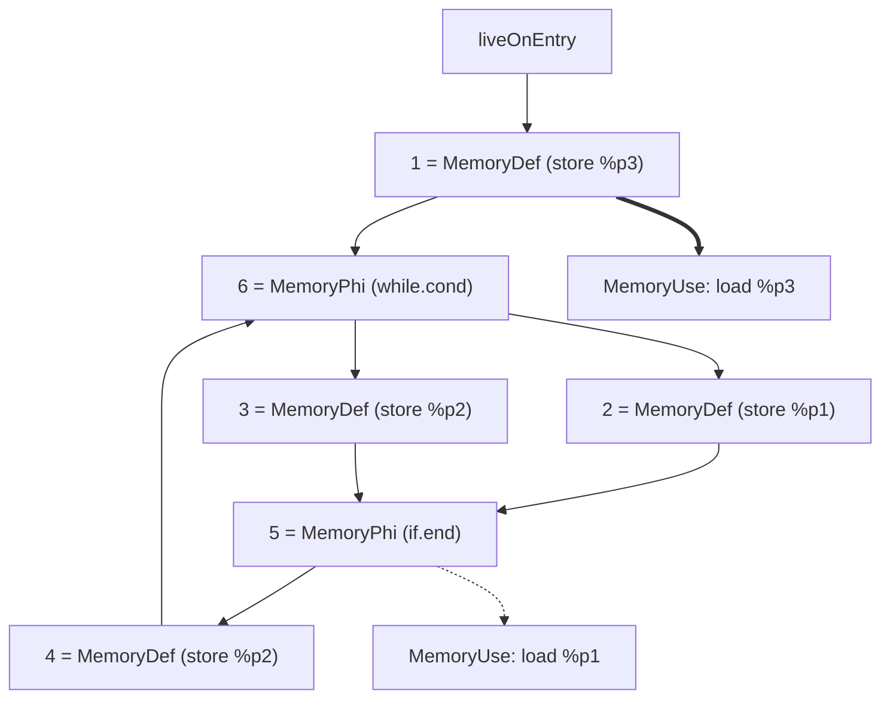
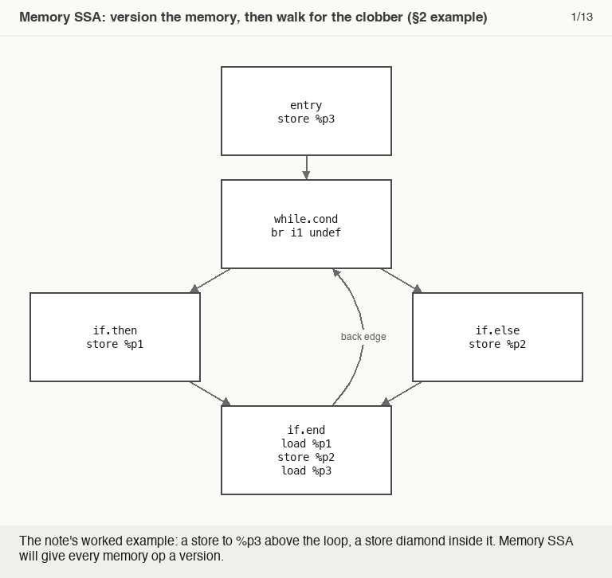

# Memory SSA

> 🧭 **Data structure** · `data-structure · analysis · llvm` · Index [[LLVM.MOC]]
> **Prerequisites:** [[ssa-form]] · **Pairs with:** [[pointer-alias-analysis]] · **Powers:** [[loop-transformations]]

> [!abstract] Chapter map
> Lift SSA's def-use/use-def convenience to *memory* via `MemoryDef` / `MemoryUse` / `MemoryPhi`, so a pass can ask "what could have clobbered this memory?" without re-running a full data-flow analysis.

> [!info]+ From classic compiler theory → LLVM
> | Classic concept | LLVM realization |
> |---|---|
> | SSA is for *scalars*; memory is opaque | **Memory SSA** gives memory the same def-use/use-def chains |
> | May-def / may-use of a memory location | `MemoryDef` / `MemoryUse`, disambiguated against [[pointer-alias-analysis|alias analysis]] |

---

### 1. Definition

> [!note] Definition
> **Memory SSA** = an **SSA-style form for memory**: def-use/use-def chains over memory ops, so a pass can cheaply find the may-defs and may-uses of any access. ([MemorySSA doc](https://llvm.org/docs/MemorySSA.html))

> [!info] ==Clobber==
> An access **clobbers** another when it overwrites part of the memory that the other reads from or writes to. Memory SSA's job is to track, for each access, the most recent thing that could clobber it.

> [!note] Three kinds of memory access
> | Node | Meaning | Examples |
> |---|---|---|
> | **MemoryDef** | may *modify* memory or impose ordering | `store`, calls, `acquire`+ `load`s, `volatile`, fences |
> | **MemoryUse** | reads but does *not* modify memory | `load`, `readonly` call |
> | **MemoryPhi** | φ for memory at CFG merges | merges may-reaching memory versions |
>
> Each `MemoryDef`/`MemoryUse` links to the access it depends on. Initially every `MemoryDef` conservatively clobbers every other; the analysis then disambiguates.

### 2. Worked example

> [!example]- Memory chains in IR (click to expand)
> ```llvm
> define void @foo() {
> entry:
>   %p1 = alloca i8
>   %p2 = alloca i8
>   %p3 = alloca i8
>   ; 1 = MemoryDef(liveOnEntry)
>   store i8 0, ptr %p3
>   br label %while.cond
> while.cond:
>   ; 6 = MemoryPhi({entry,1},{if.end,4})
>   br i1 undef, label %if.then, label %if.else
> if.then:
>   ; 2 = MemoryDef(6)
>   store i8 0, ptr %p1
>   br label %if.end
> if.else:
>   ; 3 = MemoryDef(6)
>   store i8 1, ptr %p2
>   br label %if.end
> if.end:
>   ; 5 = MemoryPhi({if.then,2},{if.else,3})
>   ; MemoryUse(5)
>   %1 = load i8, ptr %p1
>   ; 4 = MemoryDef(5)
>   store i8 2, ptr %p2
>   ; MemoryUse(1)
>   %2 = load i8, ptr %p3
>   br label %while.cond
> }
> ```
>
> Reproduce: `opt -passes='print<memoryssa>' -disable-output foo.ll`

**Figure — the memory-version graph of the example above** (solid = defining access, dashed/thick = what a use depends on; thick = the payoff edge):



==`MemoryUse(1)`== depends only on version **1**, skipping every def in the loop — exactly the fact that lets [[loop-transformations#Loop-invariant code motion (LICM)|LICM]] hoist the load.

> [!figure]+ Animation — version the memory, then walk for the clobber
> 
> Memory SSA versions each store block by block (Defs 1–4, φs 5–6), then one alias-guided walk climbs past 4, φ5 and φ6 to prove nothing in the loop clobbers `%p3` — the load resolves to `MemoryUse(1)`. (Regenerate: `_meta/anim/storyboards/memory-ssa-clobber-walk.json`.)

> [!tip] Where this gets used
> Memory SSA powers memory-aware passes: LICM (is this load invariant?), GVN/DSE, and [[loop-transformations#Fission (distribution)|loop distribution]] — LICM and DSE, for example, query `MemorySSAWalker::getClobberingMemoryAccess(MA)`.

> [!quote] Sources
> - [MemorySSA](https://llvm.org/docs/MemorySSA.html)
