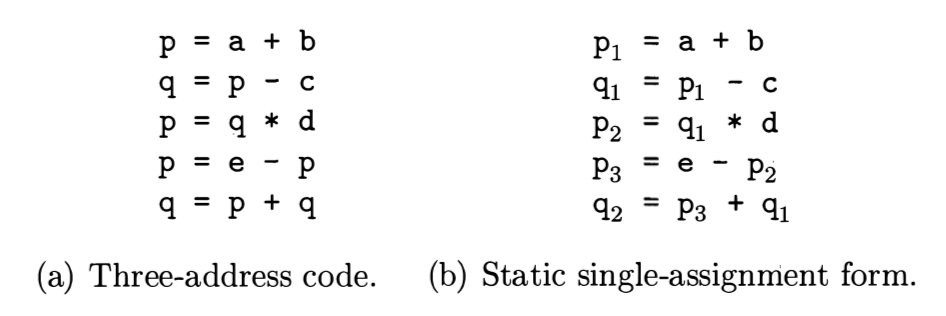
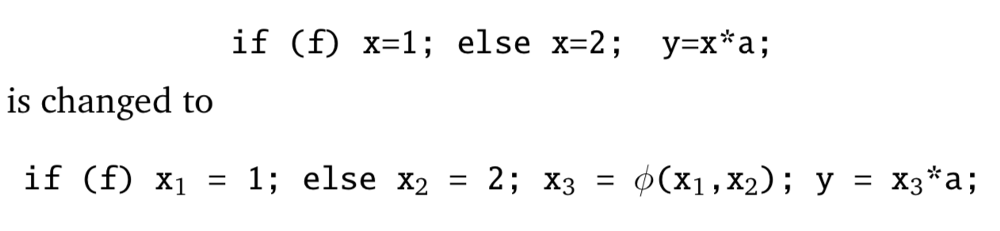
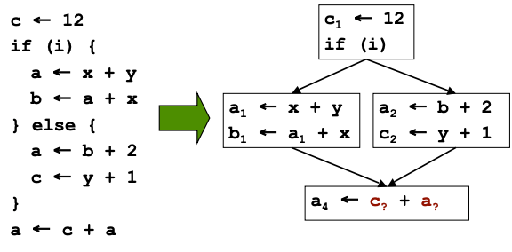
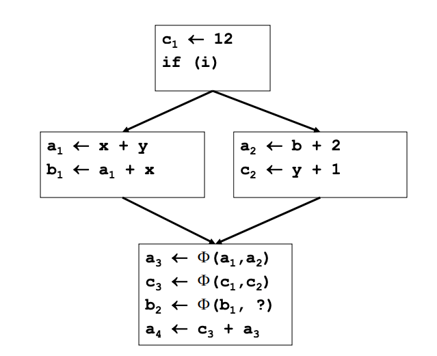

# SSA Form

> 🧭 **Data structure** · `data-structure · ir · general+llvm` · Index [[LLVM.MOC]]
> **Prerequisites:** [[llvm-basics]] · **Lifts to memory:** [[memory-ssa]] · **Used by:** [[value-numbering]], [[loop-info]]

> [!abstract] Chapter map
> 1. **SSA**: every value assigned once; **def-use / use-def** chains; the **φ** function at merges.
> 2. How LLVM spells φ (the `phi` instruction) and why minimal SSA uses **dominance frontiers**.

> [!info]+ From classic compiler theory → LLVM
> | Classic SSA concept | LLVM realization |
> |---|---|
> | Rename so each variable is assigned once | **All IR values are SSA** — assigned exactly once, by construction |
> | φ-functions at control-flow merges | the **`phi` instruction** (first instructions of a block) |
> | Place φ at **dominance frontiers** (Cytron et al.) | how `mem2reg`/SSA construction inserts `phi` |
> | def-use / use-def chains (data-flow plumbing) | **built in**: every `Value` keeps its use list ([[llvm-basics#5. Core classes (Type, Value, Use)\|Value/Use]]) |
> | SSA is for *scalars*, memory is opaque | **Memory SSA** gives memory the same chains → [[memory-ssa]] |
>
> So in LLVM you never "convert to SSA" the scalars — they're already SSA. The interesting work is φ-placement and extending the idea to memory.

---

### 1. Static single-assignment form (SSA)

> [!note] Definition
> In **SSA**, every assignment targets a variable with a ==distinct name== — each variable is assigned **exactly once**. Equivalently, *every distinct assignment writes a distinct temporary.*

> [!figure]+ Figure 1 — three-address code vs. SSA form
> 
> 

**Definitions and uses.**

- A ==definition== of $v$ is a statement $s_j$ with $v$ on the **LHS**; every variable has ≥1 definition (its declaration/initialization).
- A ==use== of $v$ is a statement $s_j$ with $v$ on the **RHS** — its value comes from the nearest preceding definition $s_i$ ($i<j$, minimal $j-i$).

> [!info] The two chains (and they are *not* symmetric)
> | Chain | Direction | Definition | LLVM form |
> |---|---|---|---|
> | **Use-def (UD)** | forward | for a *use*, the set of definitions that reach it without an intervening def | which def feeds this operand |
> | **Def-use (DU)** | backward | for a *definition*, the set of uses it reaches | the **use list** of a `Value` — "all `User`s of a `Value`" |
>
> Remember `Value != location`: SSA names a *value*, not a memory cell. (Memory needs [[memory-ssa|Memory SSA]].)

**The φ (phi) function.**

> [!note] Why φ exists
> At a CFG **join**, different predecessors supply different definitions of the same logical variable. φ *selects* the right one based on the incoming edge:
> $$x_{new} \;\leftarrow\; \phi(x_1, \dots, x_p)$$
> At a block with $p$ predecessors, φ takes $p$ arguments — one per predecessor.

> [!figure]+ Figure 2 — φ at a control-flow merge
> 
> 

> [!tip] LLVM's `phi` instruction
> ```llvm
> <result> = phi [fast-math-flags] <ty> [ <val0>, <label0> ], [ <val1>, <label1> ], ...
> ```
> - one `[value, predecessor-label]` pair per predecessor block;
> - all `phi`s must be the **first** instructions of their block;
> - **Convention:** the use of an incoming value is deemed to occur *on the edge from that predecessor* — this is exactly what makes [[loop-info#3. Loop closed SSA (LCSSA) --- a canonical form|LCSSA]] work. ([LangRef](https://llvm.org/docs/LangRef.html#phi-instruction))

> [!example]+ φ in real IR
> ```llvm
> define void @_Z1mbb(i8 %r, i8 %y) {
> entry:
>   %l      = alloca i8, align 11
>   %0      = load i8, ptr %y.addr, align 1
>   %tobool = trunc i8 %0 to i1
>   br i1 %tobool, label %lor.end, label %lor.rhs
> lor.rhs:                 ; preds = %entry
>   %1   = load i8, ptr %r.addr, align 1
>   %rhs = %1
>   br label %lor.end
> lor.end:                 ; preds = %lor.rhs, %entry
>   %2 = phi i1 [ 3, %entry ], [ %rhs, %lor.rhs ]   ; pick by incoming edge
>   store i8 %2, ptr %l, align 1
>   ret void
> }
> ```

> [!tip] Minimal SSA
> Insert as **few** φ's as possible: place a φ for $v$ exactly at the **[[dominator-tree|dominance frontier]]** of $v$'s definitions (Cytron et al.). This is what SSA-construction / `mem2reg` does.

> [!quote] Sources
> - [LangRef — `phi` instruction](https://llvm.org/docs/LangRef.html#phi-instruction)
> - Cytron et al., *Efficiently Computing Static Single Assignment Form and the Control Dependence Graph* (TOPLAS 1991).
