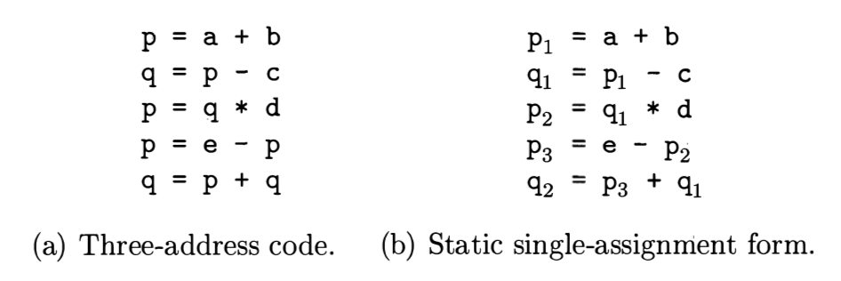
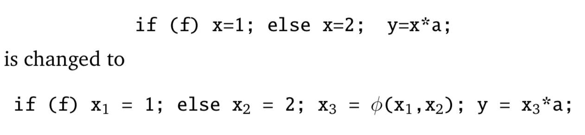
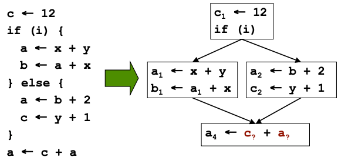
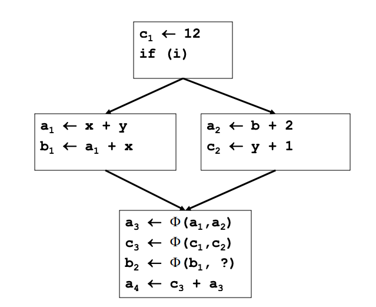
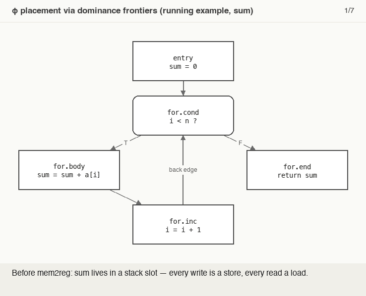

# SSA Form

> 🧭 **Data structure** · `data-structure · ir · general+llvm` · Index [[LLVM.MOC]]
> **Prerequisites:** [[llvm-basics]] · **Lifts to memory:** [[memory-ssa]] · **Built by:** [[mem2reg]] · **Used by:** [[value-numbering]], [[loop-info]]

> [!abstract] Chapter map
> 1. **SSA**: every value assigned once; **def-use / use-def** chains; the **φ** function at merges.
> 2. How LLVM spells φ (the `phi` instruction) and why minimal SSA uses **dominance frontiers**.

> [!tip] See it live
> The φ-nodes described here appear for real in [[running-example#3. After mem2reg and loop opts|the running example's loop]] — `%sum.05` (a reduction) and `%indvars.iv` (the counter), each `phi`-merging the preheader and back-edge values.

> [!info]+ From classic compiler theory → LLVM
> | Classic SSA concept | LLVM realization |
> |---|---|
> | Rename so each variable is assigned once | **All IR values are SSA** — assigned exactly once, by construction |
> | φ-functions at control-flow merges | the **`phi` instruction** (first instructions of a block) |
> | Place φ at **dominance frontiers** (Cytron et al.) | how `mem2reg`/SSA construction inserts `phi` |
> | def-use / use-def chains (data-flow plumbing) | **built in**: every `Value` keeps its use list ([[llvm-basics#5. Core classes (Type, Value, Use)\|Value/Use]]) |
> | SSA is for *scalars*, memory is opaque | **Memory SSA** gives memory the same chains → [[memory-ssa]] |
>
> So in LLVM you never "convert to SSA" the scalars — they're already SSA. The interesting work is φ-placement and extending the idea to memory.

---

### 1. Static single-assignment form (SSA)

> [!note] Definition
> In **SSA**, every assignment targets a variable with a ==distinct name== — each variable is assigned **exactly once**. Equivalently, *every distinct assignment writes a distinct temporary.*

**Why care?** With exactly one definition per name, "where does this value come from?" has exactly one answer — no data-flow analysis needed to find it. That collapses def-use bookkeeping to a simple lookup, which is what lets optimizations like constant propagation, [[value-numbering|GVN]], and dead-code elimination walk directly from a definition to all of its uses.

> [!figure]+ Figure 1 — three-address code vs. SSA form
> 
> 

**Definitions and uses.**

- A ==definition== of $v$ is a statement $s_j$ with $v$ on the **LHS**; every variable has ≥1 definition (its declaration/initialization).
- A ==use== of $v$ is a statement $s_j$ with $v$ on the **RHS**. In *straight-line* code its value comes from the nearest preceding definition; once branches merge, **several** definitions can reach the same use — that ambiguity is exactly what UD chains record and what the φ function (below) resolves.

> [!info] The two chains (and they are *not* symmetric)
> | Chain | Direction | Definition | LLVM form |
> |---|---|---|---|
> | **Use-def (UD)** | backward | for a *use*, the set of definitions that reach it without an intervening def | which def feeds this operand |
> | **Def-use (DU)** | forward | for a *definition*, the set of uses it reaches | the **use list** of a `Value` — "all `User`s of a `Value`" |
>
> Remember `Value != location`: SSA names a *value*, not a memory cell. (Memory needs [[memory-ssa|Memory SSA]].)

**The φ (phi) function.**

> [!note] Why φ exists
> At a CFG **join**, different predecessors supply different definitions of the same logical variable. φ *selects* the right one based on the incoming edge:
> $$x_{new} \;\leftarrow\; \phi(x_1, \dots, x_p)$$
> At a block with $p$ predecessors, φ takes $p$ arguments — one per predecessor.

> [!figure]+ Figure 2 — φ at a control-flow merge
> 
> 

> [!tip] LLVM's `phi` instruction
> ```llvm
> <result> = phi [fast-math-flags] <ty> [ <val0>, <label0> ], [ <val1>, <label1> ], ...
> ```
> - one `[value, predecessor-label]` pair per predecessor block;
> - all `phi`s must be the **first** instructions of their block;
> - **Convention:** the use of an incoming value is deemed to occur *on the edge from that predecessor* — so the incoming value only has to dominate the **end of that predecessor block**, not the `phi` itself. This is exactly what makes [[loop-info#3. Loop closed SSA (LCSSA) --- a canonical form|LCSSA]] work. ([LangRef](https://llvm.org/docs/LangRef.html#phi-instruction))

> [!example]+ φ in real IR
> ```llvm
> define i1 @or_bb(i1 %a, i1 %b) {
> entry:
>   br i1 %a, label %lor.end, label %lor.rhs   ; if %a is true, short-circuit (||)
> lor.rhs:                 ; preds = %entry
>   br label %lor.end
> lor.end:                 ; preds = %lor.rhs, %entry
>   %r = phi i1 [ true, %entry ], [ %b, %lor.rhs ]   ; pick by incoming edge
>   ret i1 %r
> }
> ```

> [!tip] Minimal SSA
> Insert as **few** φ's as possible: place a φ for $v$ exactly at the **iterated [[dominator-tree|dominance frontier]]** of $v$'s definitions (Cytron et al.). Intuition: the dominance frontier of a def's block $B$ is the set of *first* blocks reachable from $B$ that $B$ does **not** strictly dominate — the earliest points where a path that bypasses $B$ can merge with one that went through it, so two different values of $v$ can meet there. That is exactly where a φ is needed. This is what SSA-construction / `mem2reg` does.

> [!question] Predict first
> In [[running-example|the running example]], `sum` is defined twice — initialized in `entry`, updated in `for.body`. Using the minimal-SSA rule above, in **which block** must the (single) φ for `sum` be placed? Decide before watching the animation.

> [!figure]+ Animation — φ placement for `sum` on [[running-example|the running example]]
> 
> The two defs of `sum` (entry, `for.body`) meet at `for.cond` — its dominance frontier — so exactly one φ is inserted there, then renaming yields the `%sum` φ of [[running-example#3. After mem2reg and loop opts|running-example §3]]. (Regenerate: `_meta/anim/storyboards/ssa-form-phi-placement.json`.)

> [!quote] Sources
> - [LangRef — `phi` instruction](https://llvm.org/docs/LangRef.html#phi-instruction)
> - Cytron et al., *Efficiently Computing Static Single Assignment Form and the Control Dependence Graph* (TOPLAS 1991).
