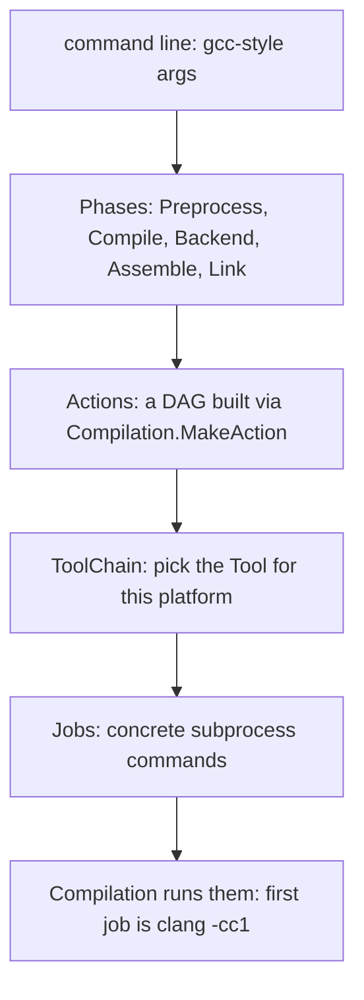

# The Clang Driver (clang → cc1 job orchestration)

> 🧭 **Implementation** · `implementation · frontend · clang` · Index [[LLVM.MOC]]
> **Realizes:** the orchestration *above* the front end — turning a command line into tool invocations · **Prerequisites:** [[clang-frontend-pipeline]] · **Related:** [[clang-frontend-actions]]

> [!abstract] What this note adds
> The part of Clang you actually type, which is *not* the compiler: the **driver** (`clang/lib/Driver`) *"encapsulates logic for constructing compilation processes from a set of gcc-driver-like command line arguments."* It parses `gcc`-style args, expands them into **phases** (Preprocess → Compile → Backend → Assemble → Link), builds a DAG of **`Action`s**, binds each to a **`Tool`** via a platform **`ToolChain`**, and emits **`Job`s** — the commands to run. The crucial fact: the first job it builds is *the same `clang` binary* invoked as **`clang -cc1`**, which is where the [[clang-frontend-actions|actual front end]] runs (in-process by default; a real subprocess under `-fno-integrated-cc1`). `clang` the driver and `clang -cc1` the compiler are one executable with two personalities.

---

## 1. The pass

The **Driver library** (`clang/lib/Driver`) is the outermost layer of Clang: a `gcc`-compatible front-of-house that decides *what tools to run in what order* to get from source to the requested output. It compiles no C itself — it constructs and schedules processes.

## 2. What it realizes (and why promoted)

This note exists because a persistent confusion — *"where does `clang foo.c` actually parse my code?"* — has a precise answer: **not in the driver.** The driver builds a `-cc1` **command**; the parsing, Sema, and CodeGen ([[clang-frontend-pipeline]], [[clang-codegen]]) all happen inside that `-cc1` invocation, managed by the [[clang-frontend-actions|CompilerInstance]]. Whether it runs **in-process or as a separate process** depends on integrated-cc1: the upstream CMake default is `CLANG_SPAWN_CC1=OFF`, and `driver.cpp` then sets `TheDriver.CC1Main` (`if (!UseNewCC1Process)`), so cc1 executes **inside the same process**. `-fno-integrated-cc1` (or a build with `CLANG_SPAWN_CC1=ON`) makes it a real subprocess. Separating the two is the single most useful thing to know about Clang's structure.

## 3. Where it runs — args to jobs

The driver transforms the command line in stages:



The `Phases::ID` enum is `Preprocess, Precompile, Compile, Backend, Assemble, Link` (plus `IfsMerge`, used only by `-emit-interface-stubs`) — the classic compilation pipeline, made explicit.

## 4. How it's built — the four classes

> [!info] Driver vocabulary (confirmed, pinned Clang [[llvm-version]])
>
> | Class | One-line role (header comment) |
> |---|---|
> | `Driver` | *"Encapsulate logic for constructing compilation processes from … gcc-driver-like command line arguments"* |
> | `Compilation` | *"A set of tasks to perform for a single driver invocation"* — owns the `Action`s and `Job`s |
> | `Action` | a node in the phase DAG; *"owned by a Compilation, which creates new actions via MakeAction()"* |
> | `ToolChain` | *"Access to tools for a single platform"* — which assembler/linker, the sysroot, default flags |

`ToolChain` is the portability seam: the same `Action` DAG produces different `Job`s on Darwin vs Linux vs a cross target, because the toolchain picks the platform's `Tool` and its flags.

## 5. Textbook → Clang (the personalities)

> [!info]+ One binary, two modes
>
> | You invoke | Role | What it does |
> |---|---|---|
> | `clang foo.c` | **driver** | parse args → build jobs → run them |
> | `clang -cc1 …` | **frontend** (`-cc1`) | the real compiler: Lex/Parse/Sema/CodeGen via [[clang-frontend-actions\|CompilerInstance]] |

The driver's job for a normal compile is: build one `-cc1` job (compile) and one linker job, then execute both.

## 6. Run it yourself

> [!example]+ `clang -###` prints the jobs without running them
> ```bash
> clang -### -c cg.c        # just the compile job
> ```
> The single job the driver builds is a `-cc1` invocation of clang itself:
>
> ```text
> "/…/clang"  "-cc1"  "-emit-obj"  …  "-x" "c" "cg.c"  "-o" "cg.o"
> ```
> Drop the `-c` and the driver builds *two* jobs — the `-cc1` compile, then a `ld` link job. `-###` is the fastest way to see exactly what flags the driver forwarded into the front end (contrast `-Xclang`, which injects a `-cc1` flag from the driver command line — see [[clang-frontend-actions]] §7).

## 7. Flags & knobs

`-###` (dry-run: print jobs, quote-escaped, don't execute); `-v` (run, but print each job); `-ccc-print-phases` (show the phase/`Action` DAG); `--sysroot`, `-target <triple>`, `-B` (steer the `ToolChain`); `-c` / `-S` / `-E` (final phase = Assemble / **Backend** / Preprocess per `Driver::getFinalPhase` — note `-S` selects `Backend`, *not* `Compile`; `phases::Compile` is what `-fsyntax-only` / `--analyze` / `-emit-ast` select).

## 8. Siblings & variants

- `-cc1` — the frontend "tool" the driver most often spawns; also directly runnable for debugging (`clang -cc1 -ast-dump …`).
- `-cc1as` — the integrated assembler tool.
- Offloading drivers (CUDA/HIP/OpenMP) build multi-toolchain `Action` DAGs from the same machinery.

## 9. Limitations & version notes

> [!warning] What the driver is and isn't
> - **It is `gcc`-bug-for-feature compatible.** The arg-parsing surface is enormous and quirky by design (it emulates `gcc`); that complexity lives here so the front end stays clean.
> - **It reports no *language* errors.** A syntax or type error comes from the `-cc1` invocation, not the driver; the driver only reports *"couldn't build/run the jobs"* (missing file, bad flag, tool not found).
> - **Job scheduling ≠ compilation.** The driver decides *what* to run; correctness of the compile is entirely the front end's ([[clang-frontend-pipeline]]).

> [!summary] The one thing to remember
> `clang foo.c` runs the **driver** (`clang/lib/Driver`): it turns `gcc`-style args into **phases → `Action` DAG → `ToolChain`-bound `Tool`s → `Job`s**, then executes them. The first job is the *same binary* invoked as **`clang -cc1`**, which is where the [[clang-frontend-actions|real front end]] compiles (in-process by default). See it all with `clang -###`.

> [!quote] Sources & confidence
> **Verified 2026-07-20** — every falsifiable claim in this note was enumerated and checked against the pinned Clang source ([[llvm-version]], `llvmorg-22.1.8`) by the `note-correctness-review` pass; refuted claims were corrected (batch error rate 8.6%, 23/269). GitHub links track `main`; the checked revision is the pinned tag.
> - [clang/include/clang/Driver/Driver.h](https://github.com/llvm/llvm-project/blob/main/clang/include/clang/Driver/Driver.h) — *"Encapsulate logic for constructing compilation processes from … gcc-driver-like command line arguments."*
> - [clang/include/clang/Driver/Compilation.h](https://github.com/llvm/llvm-project/blob/main/clang/include/clang/Driver/Compilation.h) — *"A set of tasks … for a single driver invocation."*
> - [clang/include/clang/Driver/Phases.h](https://github.com/llvm/llvm-project/blob/main/clang/include/clang/Driver/Phases.h) — `Preprocess, Precompile, Compile, Backend, Assemble, Link`; [`Action.h`](https://github.com/llvm/llvm-project/blob/main/clang/include/clang/Driver/Action.h) — *"owned by a Compilation … via MakeAction()."*
> - [clang/include/clang/Driver/ToolChain.h](https://github.com/llvm/llvm-project/blob/main/clang/include/clang/Driver/ToolChain.h) — *"Access to tools for a single platform."*
> - Example output produced locally with **Apple clang 17** (Apple's own versioning — *not* an upstream LLVM release number, and not the pinned tag; the toolchain paths are Darwin-specific — cosmetics track the platform and clang version, see [[llvm-version]]). The driver model is version-stable.
> - [Clang — Driver Design & Internals](https://clang.llvm.org/docs/DriverInternals.html) — primary doc.
