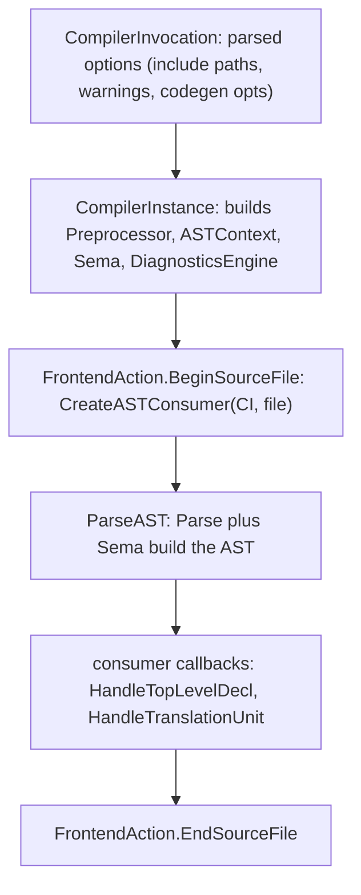

# FrontendActions & the CompilerInstance (running over the AST)

> 🧭 **Implementation** · `implementation · frontend · clang` · Index [[LLVM.MOC]]
> **Realizes:** the harness that *runs* [[clang-frontend-pipeline|Lex → Parse → Sema → AST]] and hands the AST to a consumer · **Prerequisites:** [[clang-frontend-pipeline]], [[ast-traversal]] · **Related:** [[clang-codegen]], [[clang-driver]]

> [!abstract] What this note adds
> The *plumbing* that turns "a bag of options" into "the pipeline actually ran and something consumed the AST." Three roles: **`CompilerInvocation`** (the parsed options — include paths, codegen options, warning flags), **`CompilerInstance`** (*"Helper class for managing a single instance of the Clang compiler"* — it owns the `Preprocessor`, `ASTContext`, `Sema`, `DiagnosticsEngine`), and **`FrontendAction`** (*"Abstract base class for actions which can be performed by the frontend"*) whose job is to supply an **`ASTConsumer`**. Every way you use Clang — `-emit-llvm`, `-ast-dump`, `-fsyntax-only`, a clang-tidy check, a plugin — is one `FrontendAction` + one `ASTConsumer`. This is the seam the [[ast-traversal|RecursiveASTVisitor / matchers]] plug into.

---

## 1. The pass

The **Frontend library** (`clang/lib/Frontend`) is the driver-of-the-front-end: given options, it constructs the objects, runs Lex → Parse → Sema, and feeds the resulting [[clang-ast|AST]] to a pluggable consumer. It is what runs *inside* a single `clang -cc1` invocation (the [[clang-driver|driver]] sets that invocation up).

## 2. What it realizes (and why promoted)

[[clang-frontend-pipeline]] explains *how the AST is built*; this note explains *how that build is invoked and who receives the result*. It is promoted because it is the **universal extension point**: the difference between "compile to IR", "dump the AST", "syntax-check only", and "run my custom checker" is entirely a choice of `FrontendAction` + `ASTConsumer` — the pipeline underneath is identical.

## 3. Where it runs

Inside one `-cc1` invocation, in this order:



## 4. How it's built — the four roles

> [!info] The Frontend contract (confirmed, pinned Clang [[llvm-version]])
>
> | Role | Class | What it is |
> |---|---|---|
> | Options | `CompilerInvocation` | *"an abstract 'invocation' … include paths, the code generation options, the warning flags"* |
> | Object manager | `CompilerInstance` | *"manages the various objects … the preprocessor, the target information, and the AST"* |
> | The task | `FrontendAction` / `ASTFrontendAction` | *"actions which can be performed by the frontend"; ASTFrontendAction* is *"for AST consumer-based frontend actions"* |
> | The callback | `ASTConsumer` | *"abstract interface … implemented by clients that read ASTs … independent of the AST producer"* |

The pivot is `ASTFrontendAction::CreateASTConsumer(CompilerInstance &CI, StringRef File)`: an action's *entire* job is to return the `ASTConsumer` that will receive `HandleTopLevelDecl` (*"Handle the specified top-level declaration"*) as the parser produces each decl, and `HandleTranslationUnit` once the whole TU is built. Because `ASTConsumer` is deliberately decoupled from the producer, the same consumer works whether the AST came from a fresh parse or from a deserialized PCH ([[clang-modules-and-pch]]).

## 5. Textbook → Clang (concrete actions)

> [!info]+ Every front-end use is an action + a consumer
>
> | You run | `FrontendAction` | Its `ASTConsumer` does |
> |---|---|---|
> | `clang -emit-llvm` | `EmitLLVMAction` (a `CodeGenAction`) | the `CodeGenerator` — walks the AST, emits IR ([[clang-codegen]]) |
> | `clang -Xclang -ast-dump` | `ASTDumpAction` (`-ast-print` is the separate `ASTPrintAction`) | `CreateASTDumper` — prints the `TranslationUnitDecl` tree |
> | `clang -fsyntax-only` | `SyntaxOnlyAction` | nothing — just parse + Sema for diagnostics |
> | a clang-tidy check / plugin | a custom `ASTFrontendAction` | a [[ast-traversal\|RecursiveASTVisitor or matcher]] callback |

That `-emit-llvm` and `-ast-dump` share the exact same parse, differing only in the consumer, *is* the design.

## 6. Run it yourself

> [!example]+ Same pipeline, two consumers
> ```bash
> clang -Xclang -ast-dump -fsyntax-only cg.c   # ASTConsumer prints the tree
> clang -O0 -emit-llvm -S cg.c -o -            # ASTConsumer (CodeGenerator) emits IR
> ```
> The first prints `TranslationUnitDecl … FunctionDecl f …`; the second prints `define i32 @f(...)`. Identical front end; different `ASTConsumer`.

## 7. Flags & knobs

`-Xclang <arg>` forwards a `-cc1` flag straight to the frontend (e.g. `-ast-dump`, `-ast-view`, `-emit-llvm-only`); `-fplugin=` / `-Xclang -add-plugin` load a `PluginASTAction`; `-###` (see [[clang-driver]]) shows the `-cc1` invocation the driver built without running it.

## 8. Siblings & variants

- `WrapperFrontendAction` — wraps another action to chain behavior.
- `PluginASTAction` — the out-of-tree action base for `-fplugin`.
- `ASTUnit` — a higher-level "parse and keep the AST around" façade used by libclang / tooling.

## 9. Limitations & version notes

> [!warning] What the harness constrains
> - **One primary action per invocation.** Composing analyses usually means one action delegating (via `WrapperFrontendAction`) or a libTooling tool running actions in sequence — not many actions sharing one parse arbitrarily.
> - **Consumers see decls as they're built.** `HandleTopLevelDecl` streams during parsing; whole-program views must wait for `HandleTranslationUnit` (and still see only one TU — see [[clang-ast]] §Limitations).

> [!summary] The one thing to remember
> Running the front end = **`CompilerInvocation` → `CompilerInstance` → `FrontendAction`**, and the action's whole job is to return an **`ASTConsumer`** that receives `HandleTopLevelDecl` / `HandleTranslationUnit`. `-emit-llvm`, `-ast-dump`, `-fsyntax-only`, and every plugin/clang-tidy check are the *same* pipeline with a *different* consumer. This is where [[ast-traversal|visitors and matchers]] attach.

> [!quote] Sources & confidence
> **Verified 2026-07-20** — every falsifiable claim in this note was enumerated and checked against the pinned Clang source ([[llvm-version]], `llvmorg-22.1.8`) by the `note-correctness-review` pass; refuted claims were corrected (batch error rate 8.6%, 23/269). GitHub links track `main`; the checked revision is the pinned tag.
> - [clang/include/clang/Frontend/CompilerInstance.h](https://github.com/llvm/llvm-project/blob/main/clang/include/clang/Frontend/CompilerInstance.h) — *"Helper class for managing a single instance of the Clang compiler … manages the various objects … the preprocessor, the target information, and the AST."*
> - [clang/include/clang/Frontend/CompilerInvocation.h](https://github.com/llvm/llvm-project/blob/main/clang/include/clang/Frontend/CompilerInvocation.h) — *"an abstract 'invocation' … include paths, code generation options, warning flags."*
> - [clang/include/clang/Frontend/FrontendAction.h](https://github.com/llvm/llvm-project/blob/main/clang/include/clang/Frontend/FrontendAction.h) — `FrontendAction`; `ASTFrontendAction`; `CreateASTConsumer`.
> - [clang/include/clang/AST/ASTConsumer.h](https://github.com/llvm/llvm-project/blob/main/clang/include/clang/AST/ASTConsumer.h) — *"abstract interface … clients that read ASTs … independent of the AST producer";* `HandleTopLevelDecl`.
> - [Clang — RecursiveASTVisitor based ASTFrontendActions](https://clang.llvm.org/docs/RAVFrontendAction.html) — primary how-to.
