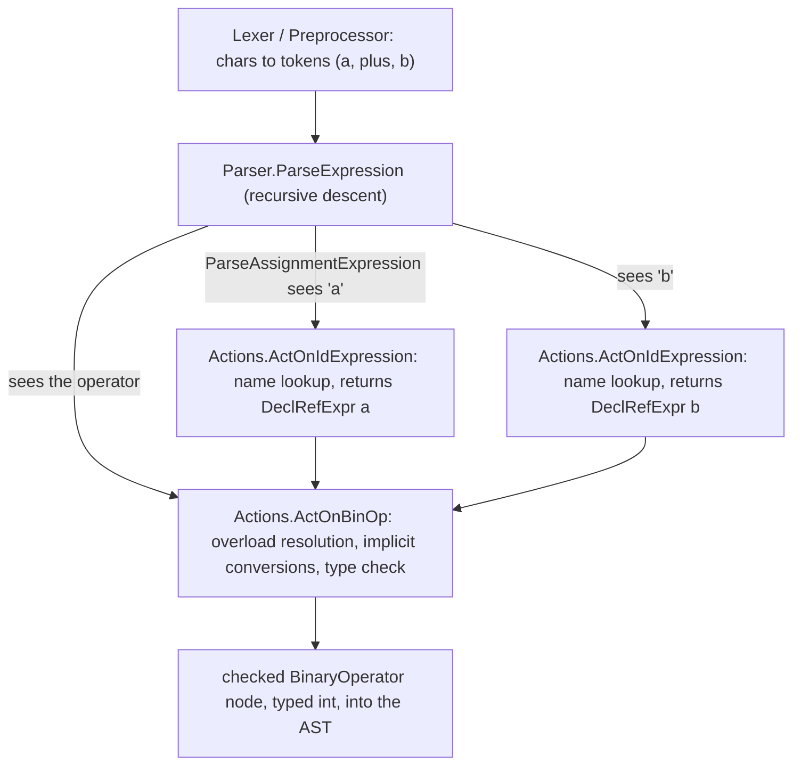

# Clang Front-End Pipeline (Lex → Parse → Sema → AST)

> 🧭 **Implementation** · `implementation · frontend · clang` · Index [[LLVM.MOC]]
> **Realizes:** [[source-level-analysis|source-level analysis]] (builds the substrate) · **Prerequisites:** [[llvm-basics]] · **Produces:** the [[clang-ast|Clang AST]]

> [!abstract] What this note adds
> The engineering specifics of how Clang **builds** the [[clang-ast|AST]]: a four-stage front end — **Lex → Parse → Sema → AST** — whose defining trait is that **parsing and semantic analysis are interleaved, not two passes**. The recursive-descent `Parser` holds a `Sema &Actions` and, as it recognizes each construct, calls a `Sema::ActOn…` action that does name lookup, overload resolution, implicit conversions and type checking and **hands back the checked AST node**. The AST it emits feeds both [[control-flow-translation|CodeGen → LLVM IR]] and every source-level analysis.

---

## 1. The component

The Clang **front end** turns source text into a typed [[clang-ast|AST]] in four stages, then hands that AST to a consumer (CodeGen, or an analysis):

**Lex → Parse → Sema → AST**  → (CodeGen / analysis)

Its defining engineering trait: **parsing and semantic analysis are interleaved, not sequential passes.** There is no "build a raw parse tree, then walk it to type-check" phase. Instead the parser calls semantic-analysis *actions* the instant it recognizes a construct, and those actions build the AST node already checked. The class that implements semantic analysis says so in its own header: *"Sema — This implements semantic analysis and AST building for C"* (`clang/include/clang/Sema/Sema.h`).

This realizes [[source-level-analysis|source-level analysis]] at its root: it is the machinery that produces the source-faithful tree everything else analyzes.

## 2. What it produces

The output is the [[clang-ast|Clang AST]] — the typed, sugar-preserving, source-located tree of `Decl` / `Stmt` (with `Expr` a `Stmt`) / `Type`, all owned by `ASTContext`, rooted at `TranslationUnitDecl`. That one artifact is consumed two ways:

- **Lowering** — [[control-flow-translation|CodeGen]] walks the AST and emits [[control-flow-translation|LLVM IR]] (dropping the source fidelity described in [[clang-ast]]).
- **Source-level analysis** — the Clang CFG, the Static Analyzer, clang-tidy and Sema's own warnings all run on this AST, so their diagnostics point at real source.

## 3. The stages

**(a) Lex — characters → tokens (`clang/lib/Lex`).**
The `Lexer` (`clang/include/clang/Lex/Lexer.h`) scans raw characters into `Token`s (`Token.h`); the `Preprocessor` (`Preprocessor.h`) sits on top, driving `#include` resolution and **macro expansion** so the parser sees a single, already-expanded token stream. Tokens, not characters, are the parser's alphabet.

**(b) Parse — tokens → structure (`clang/lib/Parse`).**
The `Parser` (`clang/include/clang/Parse/Parser.h`, `class Parser`) is a **hand-written recursive-descent parser** — the source comments say so directly (*"our recursive descent parser"*, `clang/lib/Parse/ParseStmt.cpp`). One method per grammar production, mutually recursive: `ParseDeclaration`, `ParseStatement`, `ParseExpression` / `ParseAssignmentExpression`, etc., driven from the top by `ParseFirstTopLevelDecl` / `ParseTopLevelDecl`. The parser does **not** build nodes itself.

**(c) Sema — build + check each node (`clang/lib/Sema`).**
This is where [[type-checking]] happens. When the parser finishes recognizing a construct, it calls a `Sema::ActOn…` **action method** — e.g. `ActOnStartOfFunctionDef`, `ActOnDeclarator`, `ActOnIdExpression`, `ActOnBinOp` (all in `Sema.h`). The action performs the semantics — **name lookup**, **overload resolution** (`ActOnBinOp`'s comment: *"ActOnBinOp handles overloaded operators"*), **implicit conversions**, type checking — and returns the finished, checked AST node (or a diagnostic). Semantics and tree-building are the same step.

## 4. How it's built — the parser drives Sema

The interleaving is concrete in the types: the `Parser` **holds a reference to `Sema`** named `Actions`, taken in its constructor, and calls `Actions.ActOn…` to produce every node.

> [!info] Stage → class → confirming file (pinned Clang, [[llvm-version]])
>
> | Stage | Key class / entry | File (confirmed) |
> |---|---|---|
> | Lex | `Lexer`, `Preprocessor`, `Token` | `clang/include/clang/Lex/{Lexer,Preprocessor,Token}.h` |
> | Parse | `Parser` (recursive descent); `ParseDeclaration`, `ParseStatement`, `ParseExpression` | `clang/include/clang/Parse/Parser.h`; `clang/lib/Parse/` |
> | Sema | `Sema` action methods `ActOnDeclarator`, `ActOnStartOfFunctionDef`, `ActOnIdExpression`, `ActOnBinOp` | `clang/include/clang/Sema/Sema.h`; `clang/lib/Sema/` |
> | AST | `ASTContext`-owned `Decl` / `Stmt` / `Type` | see [[clang-ast]] |

Confirmed in `Parser.h`: the field `Sema &Actions;` and the constructor `Parser(Preprocessor &PP, Sema &Actions, bool SkipFunctionBodies);`, and hundreds of `Actions.ActOn…` call sites (e.g. `Actions.ActOnStartOfTranslationUnit()` in `Parser.cpp`). The relationship is: **parser recognizes → `Actions.ActOnX(...)` checks + builds → node returned.**

**Figure — the interleaved loop for one binary expression `a + b`.** The parser never sees a "raw" tree; each returned node is already name-resolved and type-checked.

The reading: `ActOnBinOp` is where a bad `+` (say, on incompatible types, or an ambiguous overload) is caught — the diagnostic fires *during parsing*, located at the source token, not in a later walk.

## 5. Why interleaved

Two reasons the design fuses parse and semantics rather than separating them:

- **Early, source-located diagnostics.** Because a `Sema` action runs the moment the construct is parsed, errors are reported at the exact `SourceLocation` still in hand, and the compiler can often recover and keep parsing instead of cascading.
- **C/C++ *needs* semantic info to parse at all.** The grammar is not context-free: whether `T * x;` is a multiplication or a pointer declaration depends on whether `T` is a type — a **name-lookup** question. Templates make this sharper: resolving a member or overload during parsing requires types to already be known. So the parser must consult `Sema` mid-parse; a clean two-pass split is not merely inefficient, it is impossible for this language.

## 6. Limitations

> [!warning] What the front end will and won't do
> - **C++ parse ambiguity.** Constructs like the *most vexing parse* and `T * x;` are genuinely ambiguous without semantic context; Clang resolves them with tentative parsing (`clang/lib/Parse/ParseTentative.cpp`) plus Sema lookup, which is why parse and Sema can't be cleanly separated.
> - **Template instantiation cost.** Instantiating templates during Sema is a well-known compile-time expense; heavily templated code is dominated by this phase, not by lexing or CodeGen.
> - **One translation unit at a time.** The front end builds exactly one AST per TU (see [[clang-ast]] §Limitations). Whole-program facts need LTO or cross-TU indexing, not the front end alone.

> [!summary] The one thing to remember
> The Clang front end is **Lex → Parse → Sema → AST** with parse and semantics **interleaved**: a hand-written recursive-descent `Parser` holds a `Sema &Actions` and calls `Actions.ActOn…` as it recognizes each construct, so every AST node comes back already name-resolved, overload-resolved and type-checked — producing the [[clang-ast|AST]] that feeds both CodeGen and every source-level analysis.

> [!quote] Sources & confidence
> Tier-1, confirmed against the pinned Clang source ([[llvm-version]]):
> - [clang/include/clang/Parse/Parser.h](https://github.com/llvm/llvm-project/blob/main/clang/include/clang/Parse/Parser.h) — `class Parser`; field `Sema &Actions`; constructor `Parser(Preprocessor &PP, Sema &Actions, …)`; `ParseDeclaration` / `ParseStatement` / `ParseExpression` / `ParseAssignmentExpression`; "recursive descent parser" comment in `clang/lib/Parse/ParseStmt.cpp`.
> - [clang/include/clang/Sema/Sema.h](https://github.com/llvm/llvm-project/blob/main/clang/include/clang/Sema/Sema.h) — "Sema — This implements semantic analysis and AST building for C"; action methods `ActOnStartOfFunctionDef`, `ActOnDeclarator`, `ActOnIdExpression`, `ActOnBinOp` ("handles overloaded operators"); name-lookup / overload-resolution / implicit-conversion machinery.
> - `clang/include/clang/Lex/{Lexer,Preprocessor,Token}.h` — `Lexer`, `Preprocessor`, `Token` (chars → tokens, macro expansion).
> - [Clang — Introduction to the Clang AST](https://clang.llvm.org/docs/IntroductionToTheClangAST.html) — primary doc.
