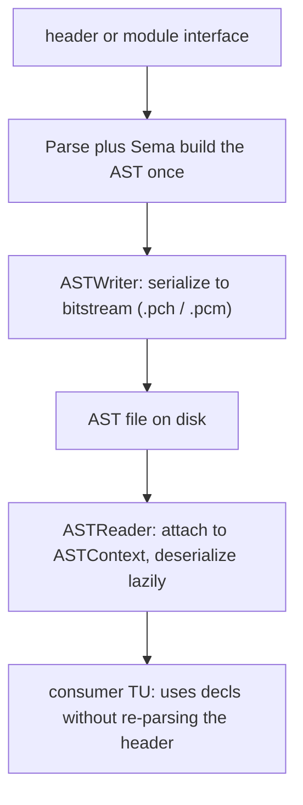

# Precompiled Headers & Clang Modules (AST serialization)

> 🧭 **Implementation** · `implementation · frontend · clang` · Index [[LLVM.MOC]] · v [[llvm-version]]
> **Realizes:** persisting and reloading the [[clang-ast|AST]] instead of re-parsing · **Prerequisites:** [[clang-ast]], [[clang-preprocessor]] · **Related:** [[clang-frontend-actions]]

> [!abstract] What this note adds
> The front end's **persistence layer** (`clang/lib/Serialization`): how a [[clang-ast|Clang AST]] is written to disk and read back instead of re-parsed. **`ASTWriter`** *"produces a bitstream containing the serialized representation of a given abstract syntax tree and its supporting data structures";* **`ASTReader`** reads it back and — the key trick — does so **lazily**: *"Only those AST nodes that are actually required will be de-serialized."* One bitstream format backs three features: **precompiled headers (PCH)**, **Clang modules (`.pcm`)**, and **C++20 modules**. This is what lets `import` replace textual `#include` from [[clang-preprocessor]] — you attach a deserialized AST to the same `ASTContext` rather than re-lexing a header into every TU.

---

## 1. The pass

The **Serialization library** (`clang/lib/Serialization`) is the AST's read/write layer, built on LLVM's bitstream format. It is not a stage of the pipeline so much as a *shortcut around* the early stages: where [[clang-preprocessor]] + [[clang-frontend-pipeline|Parse/Sema]] build an AST from text, the `ASTReader` reconstitutes one from a file.

## 2. What it realizes (and why promoted)

One format, three user-facing features — which is exactly why it deserves a single note:

> [!info] Three features, one bitstream (confirmed, pinned Clang [[llvm-version]])
>
> | Feature | What it is | Win |
> |---|---|---|
> | **PCH** | serialize *one* header's AST, `-include` it into many TUs | skip re-parsing a huge prefix header every TU |
> | **Clang modules** (`.pcm`) | a header set named by a `ModuleMap`, built once, `@import`ed | isolation + sharing across TUs, no macro leakage |
> | **C++20 modules** | standardized `export module` / `import` | the same backbone, language-blessed |

All three go through `ASTWriter` → bitstream → `ASTReader`; PCH is the degenerate case (a module with one client, no map).

## 3. Where it runs

- **Write:** a `-cc1` action (`-emit-pch`, or `-emit-module-interface` / `-emit-header-unit` for C++20 units) runs Parse/Sema and then `ASTWriter` serializes the resulting AST. (`--precompile` is the *driver* spelling that selects one of these, not a cc1 action.)
- **Read:** on a later invocation, the `ASTReader` *"can be attached to an `ASTContext`"* and supplies decls **on demand** as Sema/traversal ask for them.



## 4. How it's built — lazy is the whole point

The `ASTReader` header states the mechanism outright: *"The AST reader provides **lazy de-serialization of declarations**, as required when traversing the AST. Only those AST nodes that are actually required will be de-serialized."* So importing a PCH of `<vector>` does **not** pay to rebuild the whole tree — you pay per node your code actually touches. A **`ModuleManager`** *"manages the set of modules loaded by an AST reader"*, and each **`ModuleFile`** may *"depend on any number of other modules"* — so loaded AST files form a dependency DAG, not a flat list.

Crucially, deserialized decls re-enter the *same* path as parsed ones: they land in the same `ASTContext` ([[clang-ast]]) and flow to the same `HandleTopLevelDecl` consumer ([[clang-frontend-actions]]). A consumer written against `HandleTopLevelDecl` needs no special case for deserialized decls — that is the abstraction `ASTConsumer` was built to provide. (Code that *needs* the distinction still has it: `Decl::isFromASTFile()`; and only *interesting* decls are pushed to the consumer.)

## 5. Textbook → Clang (deviations)

> [!info]+ `#include` vs modules — what changes
>
> | Textual `#include` ([[clang-preprocessor]]) | Modules / PCH (this note) |
> |---|---|
> | Re-lex + re-parse the header in every TU | Parse once, deserialize the AST |
> | Macros leak across the include boundary | Modules are isolated; only exported names cross |
> | Order-sensitive, `O(TUs × header size)` | `O(header size)` once, then lazy reads |

## 6. Run it yourself

> [!example]+ A real PCH round-trip
> ```bash
> clang -x c-header pch_header.h -o pch_header.h.pch   # ASTWriter -> bitstream
> clang -include pch_header.h -fsyntax-only usepch.c   # ASTReader supplies the decls
> ```
> For a one-line header `int shared_fn(int);`, the `.pch` came out ~686 KB on **Apple clang 17 / arm64** (the exact size tracks your clang version, target and flags; the point is only that a serialized AST plus its tables dwarfs the source), and `usepch.c` — which calls `shared_fn` with **no** `#include` — compiles cleanly because the decl arrived via the `ASTReader`. Clang/C++20 modules use the same machinery with a `ModuleMap` (`-fmodules`) or `--precompile foo.cppm -o foo.pcm`.

## 7. Flags & knobs

`-emit-pch` / `-include-pch` (build/consume a PCH); `-fmodules`, `-fmodule-map-file=`, `-fmodules-cache-path=` (implicit Clang modules); `--precompile` + `-fmodule-file=` (explicit / C++20 modules). `-module-file-info file.pcm` dumps what an AST file contains.

## 8. Siblings & variants

- **Implicit vs explicit modules** — implicit lets Clang build `.pcm`s on demand into a cache; explicit has the build system produce and pass them (the scalable path for large builds).
- **`ASTUnit`** — keeps a parsed+serializable AST in memory for tooling/libclang.
- **`GlobalModuleIndex`** — an on-disk index to find which module exports a name.

## 9. Limitations & version notes

> [!warning] What serialization won't give you (version-sensitive → [[llvm-version]])
> - **AST files are compiler-version-locked.** A `.pch`/`.pcm` is tied to the exact Clang version and flags that wrote it; it is a cache, not a portable artifact. This is why the format's specifics are `version-sensitive`.
> - **PCH is monolithic and order-sensitive.** One prefix header, included first; it does not compose the way modules do.
> - **C++20 module *maturity* is a moving target.** Support and ergonomics differ across releases and across upstream vs vendor clang (e.g. the invocation above is upstream-oriented; Apple clang differs) — check against the version you run, not a blog.

> [!summary] The one thing to remember
> `clang/lib/Serialization` writes an AST to a **bitstream** (`ASTWriter`) and reads it back **lazily** (`ASTReader` — *"only … nodes actually required will be de-serialized"*). One format backs **PCH, Clang modules, and C++20 modules**; deserialized decls attach to the same `ASTContext` and hit the same `ASTConsumer` as parsed ones, which is how `import` can replace textual `#include`.

> [!quote] Sources & confidence
> **Verified 2026-07-20** — every falsifiable claim in this note was enumerated and checked against the pinned Clang source ([[llvm-version]], `llvmorg-22.1.8`) by the `note-correctness-review` pass; refuted claims were corrected (batch error rate 8.6%, 23/269). GitHub links track `main`; the checked revision is the pinned tag.
> - [clang/include/clang/Serialization/ASTWriter.h](https://github.com/llvm/llvm-project/blob/main/clang/include/clang/Serialization/ASTWriter.h) — *"produces a bitstream containing the serialized representation of a given abstract syntax tree … de-serialized via … ASTReader."*
> - [clang/include/clang/Serialization/ASTReader.h](https://github.com/llvm/llvm-project/blob/main/clang/include/clang/Serialization/ASTReader.h) — *"attached to an ASTContext";* *"lazy de-serialization of declarations … Only those AST nodes that are actually required will be de-serialized."*
> - [clang/include/clang/Serialization/ModuleManager.h](https://github.com/llvm/llvm-project/blob/main/clang/include/clang/Serialization/ModuleManager.h) — *"Manages the set of modules loaded by an AST reader";* [`ModuleFile.h`](https://github.com/llvm/llvm-project/blob/main/clang/include/clang/Serialization/ModuleFile.h) — *"A module may depend on any number of other modules."*
> - Example produced locally with **Apple clang 17** (Apple's own versioning — *not* an upstream LLVM release number, and not the pinned tag; the `.pch` size and module invocations track the clang version — see [[llvm-version]]).
> - [Clang — Modules](https://clang.llvm.org/docs/Modules.html) — primary doc.
