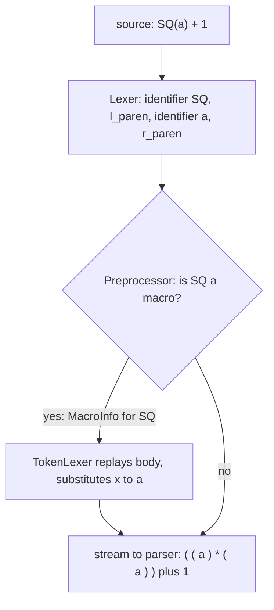

# The Preprocessor & Lexer (chars → tokens, macros, includes)

> 🧭 **Implementation** · `implementation · frontend · clang` · Index [[LLVM.MOC]]
> **Realizes:** the first stage of [[clang-frontend-pipeline|Lex → Parse → Sema → AST]] · **Prerequisites:** [[clang-frontend-pipeline]] · **Produces:** the token stream the [[clang-frontend-pipeline|parser]] consumes

> [!abstract] What this note adds
> The stage *before* [[clang-frontend-pipeline|Parse → Sema]]: how Clang turns raw characters into the **single, already-expanded token stream** the parser sees. Two cooperating classes do it — the **`Lexer`** (`clang/include/clang/Lex/Lexer.h`), which knows only how to slice one buffer into `Token`s, and the **`Preprocessor`** (`Preprocessor.h`), which sits on top and owns everything cross-file: the `#include` stack, **macro expansion**, and conditional (`#if`) directives. The header says it out loud — the preprocessor *"engages in a tight little dance with the lexer"*. The parser never sees `#define`, `#include`, or a macro; by the time a token reaches it, all of that is gone.

---

## 1. The component

The **Lex library** (`clang/lib/Lex`) is stage (a) of the front end. It answers one question — *what is the next token?* — and hides three things from everyone downstream: file boundaries, macros, and conditional compilation.

Two classes split the work by scope, and the split is the whole design:

> [!info] Lexer vs Preprocessor — who knows what (confirmed, pinned Clang [[llvm-version]])
>
> | | `Lexer` (`Lexer.h`) | `Preprocessor` (`Preprocessor.h`) |
> |---|---|---|
> | Scope | **one source buffer** | the whole translation unit |
> | Job | characters → `Token`s (forward-only) | `#include` stack, macro expansion, `#if` |
> | Header comment | *"turns a text buffer into a stream of tokens … relies on the specified Preprocessor object to handle preprocessor directives"* | *"Engages in a tight little dance with the lexer to efficiently preprocess tokens"* |

*"Lexers know only about tokens within a single source file, and don't know anything about preprocessor-level issues like the `#include` stack, token expansion, etc."* — that sentence, from `Preprocessor.h`, is why there are two classes and not one.

## 2. What it produces — the `Token`

The unit handed upward is a `Token` (`clang/include/clang/Lex/Token.h`): a **kind** (`tok::identifier`, `tok::l_paren`, `tok::plus`, …), a `SourceLocation` (see [[source-locations-and-diagnostics]]), a length, and flags such as `StartOfLine` / `LeadingSpace`. A `Token` deliberately does **not** own its text — it points back into the source buffer via its location. That is what lets a diagnostic later underline the exact characters the programmer typed.

See it — `clang -fsyntax-only -Xclang -dump-tokens` prints the stream the parser will consume:

```text
int 'int'         [StartOfLine]   Loc=<ppdemo.c:2:1>
identifier 'f'    [LeadingSpace]  Loc=<ppdemo.c:2:5>
l_paren '('                       Loc=<ppdemo.c:2:6>
int 'int'                         Loc=<ppdemo.c:2:7>
identifier 'a'    [LeadingSpace]  Loc=<ppdemo.c:2:11>
r_paren ')'                       Loc=<ppdemo.c:2:12>
```

Every token carries a `Loc=` — the location is not metadata bolted on later, it is born with the token.

## 3. The three jobs of the preprocessor

**(a) Macro expansion (`PPMacroExpansion.cpp`, `TokenLexer.h`).** A `#define` is stored as a `MacroInfo`. When the preprocessor reads an identifier that names a macro, `HandleMacroExpandedIdentifier` fires and a **`TokenLexer`** is pushed to replay the macro body (its own comment: *"The macro we are expanding from"*), substituting arguments. The parser pulls tokens through this stack and never learns a macro was involved.

**(b) `#include` resolution (`HeaderSearch.h`, `PPDirectives.cpp`).** `HeaderSearch` *"encapsulates the information needed to find the file referenced by a `#include`"* — it walks the search-path list, so the preprocessor can open the file and push a new `Lexer` for it onto the include stack. Tokens from the included file flow inline into the same stream.

**(c) Conditional compilation (`PPExpressions.cpp`).** `#if`/`#elif` expressions are evaluated by `Preprocessor::EvaluateDirectiveExpression`; skipped branches are lexed but discarded, so their tokens never reach the parser.

**Figure — one macro call, flattened into the token stream.** With `#define SQ(x) ((x)*(x))`, the call `SQ(a)` is gone before Parse:



Confirm it — `clang -E ppdemo.c` prints the post-preprocessor text, macro already flattened:

```text
int f(int a) { return ((a)*(a)) + 1; }
```

The parser that runs next (see [[clang-frontend-pipeline]]) sees exactly this — no `SQ`.

## 4. Why the front end fuses this with lexing, not parsing

The preprocessor is a **token-stream rewriter**, deliberately kept *below* the grammar: it is textual and macro-blind to types, so it can run without any parse tree. That is why C's grammar quirks (e.g. `T * x;`) are a **Parse/Sema** problem (see [[clang-frontend-pipeline]] §5), not a preprocessor one — by the time Sema needs to know whether `T` is a type, preprocessing is long finished. The clean layering is: *Lexer knows one file; Preprocessor knows all files and macros; neither knows any semantics.*

## 5. Limitations

> [!warning] What the preprocessor will and won't do
> - **No semantic knowledge.** Macros are token substitution, not functions — they don't respect scope or types, which is the root of classic macro hazards (`#define SQ(x) x*x` then `SQ(a+1)`). Clang does **not** diagnose this particular precedence hazard at all — the expansion is simply what you wrote — and it cannot make a macro hygienic.
> - **Locations get a second dimension.** A token produced by macro expansion has both a *spelling* location (inside the `#define`) and an *expansion* location (the call site). Untangling them is the `SourceManager`'s job — see [[source-locations-and-diagnostics]].
> - **Modules change the model.** With Clang/C++20 modules, textual `#include` is partly replaced by importing a serialized AST; the preprocessor cooperates with `ModuleMap` and the serialization layer — see [[clang-modules-and-pch]].

> [!summary] The one thing to remember
> Clang's front end starts with **two cooperating classes**: the `Lexer` slices *one* buffer into `Token`s, the `Preprocessor` owns *everything cross-file* — the `#include` stack, macro expansion (`TokenLexer` over a `MacroInfo`), and `#if`. The parser receives a single, fully-expanded token stream and never sees a `#define` or `#include`.

> [!quote] Sources & confidence
> **Verified 2026-07-20** — every falsifiable claim in this note was enumerated and checked against the pinned Clang source ([[llvm-version]], `llvmorg-22.1.8`) by the `note-correctness-review` pass; refuted claims were corrected (batch error rate 8.6%, 23/269). GitHub links track `main` for navigation — the checked revision is the pinned tag.
> - [clang/include/clang/Lex/Lexer.h](https://github.com/llvm/llvm-project/blob/main/clang/include/clang/Lex/Lexer.h) — `class Lexer : public PreprocessorLexer`; *"turns a text buffer into a stream of tokens … relies on the specified Preprocessor object."*
> - [clang/include/clang/Lex/Preprocessor.h](https://github.com/llvm/llvm-project/blob/main/clang/include/clang/Lex/Preprocessor.h) — *"Engages in a tight little dance with the lexer";* `EvaluateDirectiveExpression`.
> - [clang/include/clang/Lex/Token.h](https://github.com/llvm/llvm-project/blob/main/clang/include/clang/Lex/Token.h) — `class Token` holds a `SourceLocation`.
> - [clang/lib/Lex/PPMacroExpansion.cpp](https://github.com/llvm/llvm-project/blob/main/clang/lib/Lex/PPMacroExpansion.cpp) — `HandleMacroExpandedIdentifier`; [`TokenLexer.h`](https://github.com/llvm/llvm-project/blob/main/clang/include/clang/Lex/TokenLexer.h) — *"The macro we are expanding from."*
> - [clang/include/clang/Lex/HeaderSearch.h](https://github.com/llvm/llvm-project/blob/main/clang/include/clang/Lex/HeaderSearch.h) — *"the information needed to find the file referenced by a `#include`."*
> - Example output produced locally with **Apple clang 17** (Apple's own versioning — *not* an upstream LLVM release number, and not the pinned tag; cosmetics track the clang version — see [[llvm-version]]). The mechanism described is version-stable.
> - [Clang Internals Manual — Lexer and Preprocessor](https://clang.llvm.org/docs/InternalsManual.html#the-lexer-and-preprocessor-library) — primary doc.
